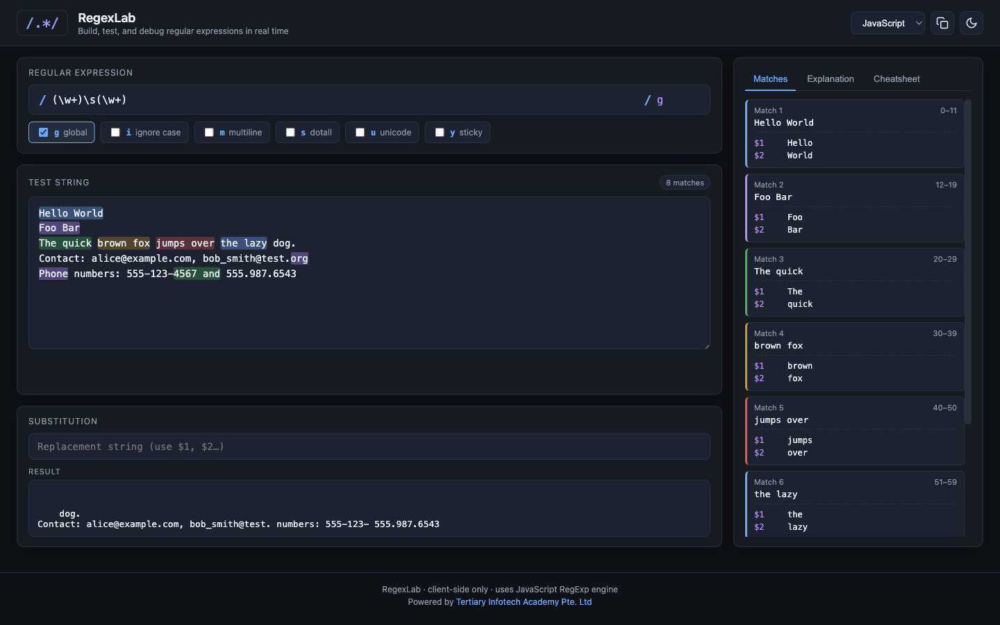

# CompTIA Certified A+ Training (Core 1 and Core 2) — Learner Guide

**WSQ Course Code:** TGS-2024048317  |  **Conducted by:** Tertiary Infotech Academy Pte Ltd (UEN 201200696W)  |  **Version v7.0 · 19 August 2026**

## Contents

- [Introduction](#introduction)
- [Course Learning Outcomes](#course-learning-outcomes)
- [Skills Framework Alignment](#skills-framework-alignment)
- [CompTIA A+ Exam Domains and Weightings](#comptia-a-exam-domains-and-weightings)
- [Before You Start — Your Lab Toolkit](#before-you-start--your-lab-toolkit)
- [Topic 01 — Mobile Devices  (Core 1, 13% of Core 1)](#topic-01--mobile-devices--core-1-13-of-core-1)
  - [Lab 1 — Laptop Teardown and Field-Replaceable Unit Identification](#lab-1--laptop-teardown-and-field-replaceable-unit-identification)
  - [Lab 2 — Mobile Display Technology and Digitizer Fault Diagnosis](#lab-2--mobile-display-technology-and-digitizer-fault-diagnosis)
  - [Lab 3 — Mobile Connectivity — Bluetooth, NFC, Hotspot and Cellular Configuration](#lab-3--mobile-connectivity--bluetooth-nfc-hotspot-and-cellular-configuration)
  - [Lab 4 — MDM Policy Design and Mobile Synchronisation](#lab-4--mdm-policy-design-and-mobile-synchronisation)
- [Topic 02 — Networking  (Core 1, 23% of Core 1)](#topic-02--networking--core-1-23-of-core-1)
  - [Lab 5 — Protocols and Ports — Building the A+ Port Reference](#lab-5--protocols-and-ports--building-the-a-port-reference)
  - [Lab 6 — IPv4 Subnetting and Address Planning with IP Calculator](#lab-6--ipv4-subnetting-and-address-planning-with-ip-calculator)
  - [Lab 7 — Network Devices and Traffic Behaviour Analysis](#lab-7--network-devices-and-traffic-behaviour-analysis)
  - [Lab 8 — Wireless Standards, Channel Planning and Interference](#lab-8--wireless-standards-channel-planning-and-interference)
  - [Lab 9 — SOHO Network Configuration — DHCP, DNS, NAT and Port Forwarding](#lab-9--soho-network-configuration--dhcp-dns-nat-and-port-forwarding)
  - [Lab 10 — Network Cabling — Termination, Testing and Tool Selection](#lab-10--network-cabling--termination-testing-and-tool-selection)
  - [Lab 11 — Packet Capture Analysis — Reading Real Network Traffic](#lab-11--packet-capture-analysis--reading-real-network-traffic)
- [Topic 03 — Hardware  (Core 1, 25% of Core 1)](#topic-03--hardware--core-1-25-of-core-1)
  - [Lab 12 — Cables and Connectors — Identification and Selection](#lab-12--cables-and-connectors--identification-and-selection)
  - [Lab 13 — RAM Identification, Installation and Channel Configuration](#lab-13--ram-identification-installation-and-channel-configuration)
  - [Lab 14 — Storage Devices and RAID Level Selection](#lab-14--storage-devices-and-raid-level-selection)
  - [Lab 15 — Motherboard, BIOS/UEFI and CMOS Configuration](#lab-15--motherboard-biosuefi-and-cmos-configuration)
  - [Lab 16 — CPU Architecture, Sockets and Cooling Solutions](#lab-16--cpu-architecture-sockets-and-cooling-solutions)
  - [Lab 17 — Power Supply Sizing, Connectors and Safety](#lab-17--power-supply-sizing-connectors-and-safety)
  - [Lab 18 — Printer Installation, Configuration and the Laser Imaging Process](#lab-18--printer-installation-configuration-and-the-laser-imaging-process)
- [Topic 04 — Virtualization and Cloud Computing  (Core 1, 11% of Core 1)](#topic-04--virtualization-and-cloud-computing--core-1-11-of-core-1)
  - [Lab 19 — Hypervisor Types and Virtual Machine Resource Planning](#lab-19--hypervisor-types-and-virtual-machine-resource-planning)
  - [Lab 20 — Building and Configuring a Linux Virtual Machine](#lab-20--building-and-configuring-a-linux-virtual-machine)
  - [Lab 21 — Cloud Service and Deployment Model Selection](#lab-21--cloud-service-and-deployment-model-selection)
- [Topic 05 — Hardware and Network Troubleshooting  (Core 1, 28% of Core 1)](#topic-05--hardware-and-network-troubleshooting--core-1-28-of-core-1)
  - [Lab 22 — Applying the CompTIA Six-Step Troubleshooting Methodology](#lab-22--applying-the-comptia-six-step-troubleshooting-methodology)
  - [Lab 23 — POST, Boot and Power Fault Diagnosis](#lab-23--post-boot-and-power-fault-diagnosis)
  - [Lab 24 — Storage and RAID Fault Diagnosis with S.M.A.R.T.](#lab-24--storage-and-raid-fault-diagnosis-with-smart)
  - [Lab 25 — Display and Projector Fault Diagnosis](#lab-25--display-and-projector-fault-diagnosis)
  - [Lab 26 — Mobile Device Hardware Fault Diagnosis](#lab-26--mobile-device-hardware-fault-diagnosis)
  - [Lab 27 — Printer Fault Diagnosis from Print Defects](#lab-27--printer-fault-diagnosis-from-print-defects)
  - [Lab 28 — Network Fault Diagnosis — Command Line to Packet Level](#lab-28--network-fault-diagnosis--command-line-to-packet-level)
- [Topic 06 — Operating Systems  (Core 2, 28% of Core 2)](#topic-06--operating-systems--core-2-28-of-core-2)
  - [Lab 29 — Windows Editions, Installation Types and Partitioning](#lab-29--windows-editions-installation-types-and-partitioning)
  - [Lab 30 — Windows Command Line — Navigation, Files and Copy Operations](#lab-30--windows-command-line--navigation-files-and-copy-operations)
  - [Lab 31 — Windows Networking and Repair Commands](#lab-31--windows-networking-and-repair-commands)
  - [Lab 32 — Windows Management Tools — Task Manager, MMC and Snap-ins](#lab-32--windows-management-tools--task-manager-mmc-and-snap-ins)
  - [Lab 33 — File Systems, Permissions and Share Configuration](#lab-33--file-systems-permissions-and-share-configuration)
  - [Lab 34 — Linux Command Line Essentials on Killercoda](#lab-34--linux-command-line-essentials-on-killercoda)
  - [Lab 35 — Linux Permissions, Ownership and User Management](#lab-35--linux-permissions-ownership-and-user-management)
  - [Lab 36 — macOS Tools and Cross-Platform File System Compatibility](#lab-36--macos-tools-and-cross-platform-file-system-compatibility)
- [Topic 07 — Security  (Core 2, 28% of Core 2)](#topic-07--security--core-2-28-of-core-2)
  - [Lab 37 — Physical and Logical Security Control Design](#lab-37--physical-and-logical-security-control-design)
  - [Lab 38 — Password Strength Analysis and Authentication Policy](#lab-38--password-strength-analysis-and-authentication-policy)
  - [Lab 39 — Phishing Recognition and Social Engineering Defence](#lab-39--phishing-recognition-and-social-engineering-defence)
  - [Lab 40 — Malware Types, Symptoms and the Seven-Step Removal Procedure](#lab-40--malware-types-symptoms-and-the-seven-step-removal-procedure)
  - [Lab 41 — Network Attack Recognition — Injection, XSS and Data Leakage](#lab-41--network-attack-recognition--injection-xss-and-data-leakage)
  - [Lab 42 — Wireless Security and SOHO Router Hardening](#lab-42--wireless-security-and-soho-router-hardening)
  - [Lab 43 — Windows Security Configuration and BitLocker Encryption](#lab-43--windows-security-configuration-and-bitlocker-encryption)
  - [Lab 44 — Data Destruction, Disposal and Regulated Data Handling](#lab-44--data-destruction-disposal-and-regulated-data-handling)
- [Topic 08 — Software Troubleshooting  (Core 2, 23% of Core 2)](#topic-08--software-troubleshooting--core-2-23-of-core-2)
  - [Lab 45 — Windows OS Symptom Diagnosis and Recovery Tools](#lab-45--windows-os-symptom-diagnosis-and-recovery-tools)
  - [Lab 46 — Log Analysis with Regular Expressions](#lab-46--log-analysis-with-regular-expressions)
  - [Lab 47 — Malware Symptom Response and Browser Problem Resolution](#lab-47--malware-symptom-response-and-browser-problem-resolution)
  - [Lab 48 — Mobile OS and Application Troubleshooting](#lab-48--mobile-os-and-application-troubleshooting)
  - [Lab 49 — System Restore, Backup Verification and Recovery Testing](#lab-49--system-restore-backup-verification-and-recovery-testing)
- [Topic 09 — Operational Procedures  (Core 2, 21% of Core 2)](#topic-09--operational-procedures--core-2-21-of-core-2)
  - [Lab 50 — Ticketing, Documentation and Knowledge Base Authoring](#lab-50--ticketing-documentation-and-knowledge-base-authoring)
  - [Lab 51 — Change Management and Asset Management](#lab-51--change-management-and-asset-management)
  - [Lab 52 — Backup Strategy Design and the 3-2-1 Rule](#lab-52--backup-strategy-design-and-the-3-2-1-rule)
  - [Lab 53 — Safety Procedures, ESD Control and Environmental Compliance](#lab-53--safety-procedures-esd-control-and-environmental-compliance)
  - [Lab 54 — Professional Communication, Scripting and Remote Access](#lab-54--professional-communication-scripting-and-remote-access)
- [Exam Preparation](#exam-preparation)
- [Glossary](#glossary)


## Introduction

This Learner Guide accompanies the WSQ course CompTIA Certified A+ Training (Core 1 and Core 2) (TGS-2024048317), conducted by Tertiary Infotech Academy Pte Ltd (UEN 201200696W). It provides the full step-by-step instructions for all 54 hands-on labs, organised by the nine official CompTIA A+ exam domains across Core 1 (220-1101) and Core 2 (220-1102).

The slide deck used in class presents the concepts, the process maps and the verification criteria. The detailed procedure for every lab lives in this guide and in the corresponding lab folder in the course repository, so that you can work at your own pace in class and repeat every lab afterwards.

The course is aligned to the Skills Framework Technical Skill and Competency Infrastructure Support (ICT-OUS-3007-1.1), and to the published CompTIA A+ exam objectives, so that completing the course prepares you for both the WSQ assessment and the certification exams.

> **Note:** Safety first. Several labs involve opening computer equipment. Always disconnect mains power, hold the power button for 15 seconds to discharge, and wear an anti-static strap. Never open a power supply unit or a CRT monitor — both retain a lethal charge after being unplugged.


## Course Learning Outcomes

- LO1: Diagnose technical issues in network operations and implement procedures to resolve root causes.
- LO2: Troubleshoot technical issues and perform advanced infrastructure configurations.
- LO3: Develop action plans for upgrades and propose improvement ideas based on user needs.
- LO4: Test infrastructure systems and organise information for developing user guides.


## Skills Framework Alignment

TSC Title: Infrastructure Support    TSC Code: ICT-OUS-3007-1.1

**Knowledge**

- K1 Diagnostic tools and processes to identify technical issues or disruptions in network infrastructure
- K2 Infrastructure and network configuration techniques
- K3 Troubleshooting techniques for infrastructure technical issues and problems
- K4 Potential benefits and impact of infrastructure upgrades and improvements
- K5 Documentation and user-guide development practices for infrastructure systems

**Abilities**

- A1 Diagnose technical issues in network operations
- A2 Implement procedures to resolve root causes of technical issues
- A3 Perform advanced infrastructure configurations
- A4 Develop action plans for infrastructure upgrades
- A5 Test infrastructure systems against operating requirements
- A6 Organise information for the development of user guides


## CompTIA A+ Exam Domains and Weightings

The course covers both A+ exams. You must pass both to earn the certification. The domain weightings below are the official CompTIA weightings and determine how much of each exam is drawn from each domain.

**Core 1 (220-1101)**

| Domain | Weighting |
| --- | --- |
| 1.0 Mobile Devices | 13% |
| 2.0 Networking | 23% |
| 3.0 Hardware | 25% |
| 4.0 Virtualization and Cloud Computing | 11% |
| 5.0 Hardware and Network Troubleshooting | 28% |

**Core 2 (220-1102)**

| Domain | Weighting |
| --- | --- |
| 1.0 Operating Systems | 28% |
| 2.0 Security | 28% |
| 3.0 Software Troubleshooting | 23% |
| 4.0 Operational Procedures | 21% |


## Before You Start — Your Lab Toolkit

Every lab in this course runs either on training hardware provided in class or in your web browser. There is nothing to install and nothing to license. Bookmark these five tools now — you will use them throughout the course and they remain free afterwards.

| Tool | Link | What it is used for |
| --- | --- | --- |
| IP Calculator | https://alfredang.github.io/ipcalculator/ | Browser subnet calculator for IPv4 and IPv6 — CIDR, netmask, network and broadcast addresses, usable host ranges and batch processing with CSV export. |
| PCAP Analyzer | https://alfredang.github.io/pcapanalyzer/ | Browser packet-capture analyser — protocol distribution, top talkers, top conversations and a packet table with per-packet detail. Files are parsed locally and never uploaded. |
| Cybersecurity Simulator | https://alfredang.github.io/cybersecuritysimulator/ | Safe threat-simulation lab covering phishing, XSS, SQL injection, password strength, malware, ransomware, social engineering and data leakage. |
| RegexLab | https://alfredang.github.io/regexgenerator/ | Live regular-expression tester with flags, match explanation and substitution — used to filter and parse support logs. |
| Killercoda Ubuntu Playground | https://killercoda.com/playgrounds/scenario/ubuntu | Free browser-based Ubuntu terminal with root access — no install required. Used for every Linux command-line lab in this course. |

**The tools at a glance**

Each figure below maps the panels and fields you will actually use. They are reproduced again inside every lab that needs them, so you never have to page back to find one.


*IP Calculator — https://alfredang.github.io/ipcalculator/*


*PCAP Analyzer — https://alfredang.github.io/pcapanalyzer/*


*Cybersecurity Simulator — https://alfredang.github.io/cybersecuritysimulator/*



*RegexLab — https://alfredang.github.io/regexgenerator/*


*Killercoda Ubuntu Playground — https://killercoda.com/playgrounds/scenario/ubuntu*

**Killercoda Ubuntu Playground — how it works**

Killercoda gives you a real Ubuntu machine with root access, running in a browser tab. It is used for every Linux command-line lab in this course. Open the playground, wait for the terminal prompt, and type commands directly. The environment is temporary: if you leave it idle it will reset, so re-run the setup commands at the start of the lab if that happens.

```bash
# Every Killercoda lab starts with these two lines
apt-get update -qq
apt-get install -y <the packages that lab needs>
```

**Conventions used in every lab**

- Commands shown in a code block are typed exactly as written unless they contain a <placeholder>.
- Placeholders such as <TARGET>, <domain> and <gateway> are replaced with values from your own environment.
- Windows commands are run from an elevated Command Prompt or PowerShell where the step says so.
- Linux commands are run in the Killercoda Ubuntu playground unless the lab states otherwise.
- Every lab ends with a 'Test it' criterion — complete it before moving on, as it is what the Practical Performance assessment mirrors.
- Record your evidence (screenshots, command output, completed tables) as you go; several assessment tasks ask you to reproduce them.


## Topic 01 — Mobile Devices  (Core 1, 13% of Core 1)

Laptop hardware · display components · accessories and ports · cellular and wireless · MDM and synchronisation

**Key concepts**

- Laptop hardware replacement covers the battery, keyboard and keys, RAM (SODIMM), HDD/SSD migration and replacement, and the wireless cards — each is a field-replaceable unit with its own removal sequence and anti-static precautions.
- LCD panels do not produce their own light: they need a backlight, historically a CCFL driven by an inverter, and today a strip of LEDs. Flickering or a dim image on an older panel points at the inverter or the backlight rather than the panel itself.
- LCD panel technologies trade off against each other. TN is fast with poor colour, IPS gives excellent colour and viewing angles, and VA sits between them with the best contrast. OLED needs no backlight at all, giving the deepest blacks and the highest contrast ratio.
- A digitizer converts analog touch or pen input into digital coordinates. When touch stops working but the image is perfect, the digitizer has failed, not the display panel — on many laptops the two are bonded and replaced as one unit.
- Connection methods differ in reach and purpose: USB-C, micro-USB and mini-USB for data and power, Lightning on older Apple devices, NFC for payments within about 4 cm, Bluetooth for peripheral pairing, and hotspot tethering to share a cellular connection.
- A port replicator reproduces a laptop's existing ports, while a docking station adds capability the laptop never had — full-size drive bays, expansion slots, optical drives and additional display outputs.
- Cellular generations step up in capability: 2G (GSM and CDMA) carried voice and SMS, 3G added mobile internet and video calling, 4G LTE reached hundreds of megabits per second, and 5G targets multi-gigabit speeds with very low latency.
- Bluetooth pairing follows a fixed sequence every time — enable Bluetooth, enable pairing mode, discover the device, enter the PIN or confirm the passkey, then test connectivity. Troubleshooting almost always means restarting that sequence.
- Mobile device management (MDM) and mobile application management (MAM) let an organisation push corporate email profiles, enforce two-factor authentication, deploy corporate applications and remotely wipe a lost device.
- Synchronisation binds a device to an account — Microsoft 365, Google Workspace or iCloud — and replicates mail, photos, calendar and contacts. Always check the data cap before enabling a full photo sync over a cellular connection.


### Lab 1 — Laptop Teardown and Field-Replaceable Unit Identification

Exam objective: Identify and safely replace laptop field-replaceable units — battery, RAM, storage, keyboard and wireless card — with correct ESD precautions (Core 1 objective 1.1).

Goal: Working on a training laptop or a high-resolution teardown reference, you identify every field-replaceable unit, record the removal order, and document the anti-static precautions each step requires. You then build a replacement runbook a colleague could follow without supervision.

**What you'll produce**

A completed FRU inventory table and a written replacement runbook for one component, with ESD precautions stated at every step.

**Tools and equipment**

Training laptop or teardown reference, anti-static strap and mat, Phillips #00 screwdriver, plastic spudger, parts tray

**Step-by-step**

1. Put on the anti-static strap and clip it to an unpainted metal point on the chassis. Confirm the mat is earthed before you touch any component.
2. Shut the laptop down completely — not sleep or hibernate — then disconnect the AC adapter and remove the external battery if the model has one.
3. Press and hold the power button for 15 seconds to drain residual charge from the capacitors before opening the case.
4. Remove the bottom cover screws into a parts tray, laying them out in the same pattern as the chassis so each screw returns to its own hole.
5. Locate and photograph each field-replaceable unit: battery, SODIMM slots, M.2 or 2.5-inch storage, wireless card, cooling fan and keyboard ribbon connector.
6. Disconnect the internal battery connector FIRST — before any other component — so the board is fully de-energised for the rest of the work.
7. Record for each FRU in your inventory table: component name, form factor, connector or socket type, removal order position, and the specific ESD or safety risk.
8. Note the two antenna leads on the wireless card and which is main and which is auxiliary, then photograph their routing before disturbing them.
9. Reassemble in exact reverse order, reconnecting the internal battery connector LAST, and confirm every screw is returned to its original hole.
10. Write a replacement runbook for one FRU of your choice with numbered steps, required tools, ESD precautions and a post-replacement verification test.

**Test it**

Your FRU inventory lists at least six components with form factor and socket type; the runbook states the internal battery is disconnected first and reconnected last; and the laptop powers on and completes POST after reassembly.

> **Note:** This lab also has its own folder in the course repository: labs/lab-01-laptop-teardown-and-field-replaceable-unit-identification/ — it contains the same procedure in Markdown plus a README and a worksheet you can fill in.

---


### Lab 2 — Mobile Display Technology and Digitizer Fault Diagnosis

Exam objective: Compare LCD, IPS, VA and OLED panel technologies and correctly distinguish a display panel fault from a backlight, inverter or digitizer fault (Core 1 objective 1.2).

Goal: You compare the four panel technologies on the criteria that matter in support work, then work through a set of display symptoms and decide, for each, which component has actually failed. The output is a diagnostic decision table you can use on the job.

**What you'll produce**

A panel technology comparison table and a symptom-to-component diagnostic decision table covering eight display faults.

**Tools and equipment**

Reference displays or specification sheets, a torch, a smartphone with an OLED screen, a laptop with an LCD panel

**Step-by-step**

1. Build a comparison table with rows for TN, IPS, VA and OLED and columns for backlight required, colour accuracy, viewing angle, response time, contrast ratio and typical use.
2. Shine a torch at a dark area of a powered-off LCD panel and then an OLED panel, and record which one reflects a visible backlight layer.
3. Display a full-black image on both an LCD and an OLED screen in a dark room and record the difference in black level, then explain it from the backlight architecture.
4. For the symptom 'image is visible only under a bright torch', identify the failed component and justify it — the panel is working, so the backlight or inverter has failed.
5. For the symptom 'image is perfect but touch does not respond anywhere', identify the failed component as the digitizer and note that on bonded assemblies it is replaced with the panel.
6. For the symptom 'flickering that worsens as the machine warms up on an older CCFL laptop', identify the inverter as the probable cause.
7. Work through the remaining symptoms — dead pixels, burn-in, wrong colours, no image with a lit backlight, and intermittent image when the lid moves — and assign a component to each.
8. For the 'intermittent image when the lid moves' symptom, note the display cable running through the hinge as the classic cause and add a physical inspection step.
9. Complete the decision table with a column for the confirming test you would run before ordering a replacement part.
10. Write a customer-facing explanation of one fault in plain language with no jargon, suitable for reading aloud to a non-technical user.

**Test it**

Your decision table covers all eight symptoms with a named component and a confirming test for each, and correctly separates the backlight, inverter, panel and digitizer as four distinct failure points.

> **Note:** This lab also has its own folder in the course repository: labs/lab-02-mobile-display-technology-and-digitizer-fault-diagnosis/ — it contains the same procedure in Markdown plus a README and a worksheet you can fill in.

---


### Lab 3 — Mobile Connectivity — Bluetooth, NFC, Hotspot and Cellular Configuration

Exam objective: Configure and troubleshoot mobile connection methods including Bluetooth pairing, NFC, hotspot tethering and cellular data settings (Core 1 objectives 1.3 and 1.4).

Goal: Using your own mobile device, you work through the full configuration sequence for each connection method, deliberately break each one, and record the symptom and the fix. The output is a connectivity troubleshooting flowchart covering all four methods.

**What you'll produce**

A completed configuration log for four connection methods and a troubleshooting flowchart mapping symptoms to fixes.

**Tools and equipment**

Android or iOS device, a second Bluetooth device, a laptop, IP Calculator (https://alfredang.github.io/ipcalculator/)


*IP Calculator — the panels and fields this lab uses. Open it at https://alfredang.github.io/ipcalculator/*

**Step-by-step**

1. On your mobile device, open Settings and record the exact menu path to Bluetooth, hotspot, NFC and mobile data settings.
2. Complete the five-step Bluetooth pairing sequence with a second device: enable Bluetooth, enable pairing mode, discover, enter the PIN or confirm the passkey, then test that data actually flows.
3. Break the pairing by disabling pairing mode on the target device mid-discovery, record the exact symptom, then re-pair and note which step recovered it.
4. Enable the mobile hotspot, connect the laptop to it, and record the SSID, the security type in use and the IP address the laptop receives.
5. Open IP Calculator at https://alfredang.github.io/ipcalculator/ and enter the laptop's hotspot IP address with its netmask in the IPv4 tab.
6. Record from the calculator output the network address, broadcast address, usable host range and total usable hosts, and confirm the hotspot is using a private RFC 1918 range.
7. Enable airplane mode, then selectively re-enable Wi-Fi only, and record which connection methods survive and which do not.
8. Check the cellular data settings and record the APN, the network type currently in use (LTE, 5G) and whether data roaming is enabled.
9. If your device supports NFC, enable it and record the maximum working distance you observe, then compare it against the 4 cm specification.
10. Build the troubleshooting flowchart: for each of 'no Bluetooth pairing', 'hotspot connects but no internet', 'NFC not detected' and 'no cellular data', give the checks in the order you would run them.

**Test it**

IP Calculator confirms the hotspot address is in a private range with the correct usable host count; your flowchart gives an ordered check sequence for all four symptoms; and each broken-and-fixed cycle is documented with its symptom.

> **Note:** This lab also has its own folder in the course repository: labs/lab-03-mobile-connectivity-bluetooth-nfc-hotspot-and-cellular-configuration/ — it contains the same procedure in Markdown plus a README and a worksheet you can fill in.

---


### Lab 4 — MDM Policy Design and Mobile Synchronisation

Exam objective: Design a mobile device management policy and configure account synchronisation for corporate email, calendar and contacts, accounting for data caps (Core 1 objective 1.4).

Goal: You design an MDM policy for a small organisation issuing corporate devices, then configure and verify account synchronisation on a real device. You finish by calculating the data cost of a full photo sync so you can advise a user before they exceed their cap.

**What you'll produce**

A written MDM policy covering eight control areas, plus a verified synchronisation configuration and a data-cap impact calculation.

**Tools and equipment**

Mobile device, a Microsoft 365 or Google Workspace account, IP Calculator, organisational policy template


*IP Calculator — the panels and fields this lab uses. Open it at https://alfredang.github.io/ipcalculator/*

**Step-by-step**

1. List the eight MDM control areas your policy must cover: device enrolment, screen lock, encryption, corporate email profile, two-factor authentication, application whitelisting, remote wipe and location services.
2. For each control area, write the specific rule your policy enforces and one sentence on the risk it mitigates.
3. Distinguish MDM from MAM in your policy: MDM controls the whole device, while MAM controls only the corporate applications and data on it.
4. Write the BYOD section covering what the organisation may and may not wipe on a personally owned device, and why a full remote wipe is inappropriate there.
5. On the device, add a Microsoft 365 or Google Workspace account and select which data types to synchronise: mail, calendar, contacts and photos.
6. Verify synchronisation by creating a calendar entry on the device and confirming it appears in the web client within one minute.
7. Open the device's data usage screen and record the current billing-period total and the configured data cap or warning threshold.
8. Estimate the size of a full photo library sync, then calculate what percentage of a 5 GB monthly cap it would consume and state whether it should run on cellular.
9. Configure the account to synchronise photos on Wi-Fi only, and record the exact setting path so it can be included in a user guide.
10. Write the user-facing section of the guide: how to enrol, what the organisation can see, and what to do if the device is lost or stolen.

**Test it**

Your policy covers all eight control areas with a rule and a risk for each, clearly separates MDM from MAM and corporate from BYOD, synchronisation is verified end to end within one minute, and the data-cap calculation supports a stated Wi-Fi-only recommendation.

> **Note:** This lab also has its own folder in the course repository: labs/lab-04-mdm-policy-design-and-mobile-synchronisation/ — it contains the same procedure in Markdown plus a README and a worksheet you can fill in.

---


## Topic 02 — Networking  (Core 1, 23% of Core 1)

Protocols and ports · network devices · wireless standards · SOHO networks · IP addressing · networking tools

**Key concepts**

- TCP is connection-oriented, sequenced and acknowledged with a 20–60 byte header, so it is used where delivery must be guaranteed. UDP is connectionless with an 8-byte header, so it is used where speed matters more than certainty — DNS queries, streaming and VoIP.
- The A+ exam tests a fixed list of ports by number: FTP 20/21, SSH and SFTP 22, Telnet 23, SMTP 25, DNS 53, DHCP 67/68, HTTP 80, POP3 110, NetBIOS 137–139, IMAP 143, SNMP 161/162, LDAP 389, HTTPS 443, SMB/CIFS 445 and RDP 3389.
- Insecure legacy protocols have secure replacements you should be able to name on sight: Telnet gives way to SSH, FTP to SFTP, HTTP to HTTPS, and SNMPv1/v2 to SNMPv3, which is the first version to encrypt its traffic.
- Network devices sit at different layers. A hub blindly repeats traffic to every port, a switch forwards frames by MAC address, a router forwards packets between broadcast domains by IP address, and a firewall filters traffic by rule.
- A SOHO router collapses several devices into one box: router, switch, wireless access point, firewall and DHCP server, and often adds content filtering, port forwarding and a VPN endpoint.
- Power over Ethernet carries both data and electrical power over one Ethernet cable, powering access points, IP cameras and VoIP phones. A PoE switch powers many devices, while a PoE injector powers a single device where no PoE switch exists.
- The 2.4 GHz band travels further and penetrates walls better but is slower and more congested, offering only three non-overlapping channels — 1, 6 and 11. The 5 GHz band is faster with far more non-overlapping channels but has a shorter usable range.
- IPv4 addresses are split by a subnet mask into a network portion and a host portion. The number of host bits determines how many usable addresses a subnet provides — always two fewer than the block size, because the network and broadcast addresses are reserved.
- Private address ranges (10.0.0.0/8, 172.16.0.0/12 and 192.168.0.0/16) are not routable on the internet and must be translated by NAT. An APIPA address in 169.254.0.0/16 means the client asked for DHCP and got no answer.
- A VPN builds an encrypted tunnel across the public internet so a remote host can reach private LAN resources, while a VLAN partitions one physical switch into several isolated logical networks that each need a router to talk to one another.
- Networking tools each answer one question: a crimper terminates RJ45 plugs, a cable tester confirms the pinout end to end, a toner probe finds which cable is which in a bundle, a punch-down tool seats wires into a patch panel, a loopback plug proves a port works, and a Wi-Fi analyser shows channel congestion.
- Common server roles you must recognise are DNS, DHCP, file share, print server, mail server, syslog, web server, proxy, spam gateway, unified threat management appliance and load balancer.


### Lab 5 — Protocols and Ports — Building the A+ Port Reference

Exam objective: Identify the TCP/UDP ports, transport protocol and secure replacement for every protocol on the CompTIA A+ Core 1 objective 2.1 list.

Goal: You build the complete A+ port reference table from live evidence rather than memorisation: you query each service on a Killercoda Ubuntu playground, observe which transport it uses, and record the secure alternative where the protocol is insecure. The table becomes your revision sheet.

**What you'll produce**

A complete 16-row port reference table with port number, transport, purpose, security status and secure replacement.

**Tools and equipment**

Killercoda Ubuntu Playground (https://killercoda.com/playgrounds/scenario/ubuntu), ss, nmap, /etc/services


*Killercoda Ubuntu Playground — the panels and fields this lab uses. Open it at https://killercoda.com/playgrounds/scenario/ubuntu*

**Step-by-step**

1. Open https://killercoda.com/playgrounds/scenario/ubuntu in your browser and wait for the terminal prompt to appear. You have root access and nothing is installed on your own machine.
2. Update the package list and install the networking tools you need for this lab.

   ```bash
   apt-get update -qq && apt-get install -y net-tools iproute2 nmap dnsutils curl netcat-openbsd
   ```

3. Look up each A+ protocol in the system services database to confirm its official port and transport.

   ```bash
   grep -wE 'ftp|ssh|telnet|smtp|domain|bootps|bootpc|http|pop3|netbios-ssn|imap2|snmp|ldap|https|microsoft-ds' /etc/services
   ```

4. Record the port numbers for the file transfer and remote access group: FTP 20/21, SSH and SFTP 22, Telnet 23, RDP 3389.

   ```bash
   grep -wE 'ftp-data|ftp|ssh|telnet' /etc/services | head -20
   ```

5. Record the mail group: SMTP 25, POP3 110, IMAP 143, and note the secure TLS variants SMTPS 587/465, POP3S 995 and IMAPS 993.

   ```bash
   grep -wE 'smtp|pop3|imap2|imaps|pop3s|submission' /etc/services
   ```

6. Record the infrastructure group: DNS 53, DHCP 67 server and 68 client, and note that DNS uses UDP for queries and TCP for zone transfers.

   ```bash
   grep -wE 'domain|bootps|bootpc' /etc/services
   ```

7. Prove DNS runs over UDP by querying a public resolver and observing the transport used.

   ```bash
   dig +noall +stats google.com @8.8.8.8
   ```

8. Confirm HTTP on 80 and HTTPS on 443 by requesting headers from a live site and reading the response code.

   ```bash
   curl -sI https://www.tertiarycourses.com.sg | head -5
   ```

9. List every listening socket on the playground with its protocol, port and owning process, and identify which are TCP and which are UDP.

   ```bash
   ss -tulnp
   ```

10. Start a listener on a chosen port, then scan it from the same host to see how a scanner reports an open port.

   ```bash
   nc -l -p 8080 & sleep 1 && nmap -sT -p 8080 127.0.0.1
   ```

11. Complete the reference table with a Security column marking FTP, Telnet, HTTP, SNMPv1/v2 and POP3 as insecure, each with its secure replacement named.
12. Add the final rows for NetBIOS 137–139, SNMP 161/162, LDAP 389 and SMB/CIFS 445, then verify your table has all 16 protocols.

**Test it**

Your table lists all 16 protocols with the correct port, transport and purpose; every insecure protocol has its secure replacement named; and ss -tulnp output confirms at least one live listening socket with its transport.

> **Note:** This lab also has its own folder in the course repository: labs/lab-05-protocols-and-ports-building-the-a-port-reference/ — it contains the same procedure in Markdown plus a README and a worksheet you can fill in.

---


### Lab 6 — IPv4 Subnetting and Address Planning with IP Calculator

Exam objective: Calculate subnet masks, network and broadcast addresses, usable host ranges and CIDR notation, and design an address plan for a SOHO network (Core 1 objective 2.5).

Goal: You use IP Calculator to work subnetting from both directions — decoding a given address and designing a plan to meet a host requirement — then verify every result by hand so you can reproduce it in an exam where no calculator is allowed.

**What you'll produce**

A verified subnetting worksheet and a complete four-subnet SOHO address plan exported as CSV.

**Tools and equipment**

IP Calculator (https://alfredang.github.io/ipcalculator/), Killercoda Ubuntu Playground, ipcalc


*IP Calculator — the panels and fields this lab uses. Open it at https://alfredang.github.io/ipcalculator/*


*Killercoda Ubuntu Playground — the panels and fields this lab uses. Open it at https://killercoda.com/playgrounds/scenario/ubuntu*

**Step-by-step**

1. Open IP Calculator at https://alfredang.github.io/ipcalculator/ and select the IPv4 tab.
2. Enter 192.168.10.75/24 and record the network address, broadcast address, first and last usable host, netmask in dotted decimal, and the usable host count.
3. Change the prefix to /26 with the same address and record how the network address, broadcast address and usable host count change.
4. Verify the /26 result by hand: 32 minus 26 leaves 6 host bits, 2 to the power 6 is 64 addresses per block, minus 2 reserved gives 62 usable hosts. Confirm this matches the tool.
5. Enter 172.16.0.0/12 and 10.0.0.0/8 in turn, and confirm from the output that all three RFC 1918 private ranges are non-routable on the internet.
6. Enter 169.254.14.9/16 and record what this range signifies — an APIPA address assigned when no DHCP server answered.
7. Design a SOHO plan from the 192.168.20.0/24 block for four departments needing 50, 25, 10 and 5 hosts. Choose the smallest prefix that satisfies each requirement.
8. Verify each chosen prefix in IP Calculator: /26 gives 62 usable for the 50-host subnet, /27 gives 30 for the 25-host subnet, /28 gives 14 for the 10-host subnet and /29 gives 6 for the 5-host subnet.
9. Switch to the Batch tab, paste all four subnets one per line with a comment naming each department, and process them together.
10. Export the batch results to CSV using the export control, and keep the file as the address-plan deliverable.
11. Open the Killercoda Ubuntu playground and install ipcalc to cross-check your work with an independent tool.

   ```bash
   apt-get update -qq && apt-get install -y ipcalc
   ```

12. Cross-check the first subnet on the command line and confirm the network, broadcast and host range match IP Calculator exactly.

   ```bash
   ipcalc 192.168.20.0/26
   ```


**Test it**

Every subnet in your plan satisfies its host requirement with no wasted block larger than necessary, the hand calculation matches the IP Calculator output for the /26 case, ipcalc agrees with the browser tool, and the CSV export contains all four subnets.

> **Note:** This lab also has its own folder in the course repository: labs/lab-06-ipv4-subnetting-and-address-planning-with-ip-calculator/ — it contains the same procedure in Markdown plus a README and a worksheet you can fill in.

---


### Lab 7 — Network Devices and Traffic Behaviour Analysis

Exam objective: Distinguish hub, switch, router, firewall and access point by the layer they operate at and the traffic behaviour each produces (Core 1 objectives 2.2 and 2.3).

Goal: Rather than reading device descriptions, you infer device behaviour from captured traffic. Using PCAP Analyzer you examine a capture, identify the MAC and IP conversations, and reason about which device forwarded each frame and why.

**What you'll produce**

A device comparison matrix and a written traffic analysis identifying the forwarding decision at each layer.

**Tools and equipment**

PCAP Analyzer (https://alfredang.github.io/pcapanalyzer/), device reference diagrams


*PCAP Analyzer — the panels and fields this lab uses. Open it at https://alfredang.github.io/pcapanalyzer/*

**Step-by-step**

1. Open PCAP Analyzer at https://alfredang.github.io/pcapanalyzer/ and click the Sample button to generate a demonstration capture. Nothing is uploaded — parsing happens in your browser.
2. Record the four dashboard metrics: packet count, total bytes, capture duration and average packet size.
3. Open the protocol distribution view and list every protocol present with its share of the capture.
4. Open Top talkers and record the three most active endpoints by traffic volume, noting their addresses.
5. Open Top conversations and identify which pairs of hosts exchange the most data, then state what kind of session each pair most likely represents.
6. Select an individual packet in the packets table and open its detail view to read the source, destination, protocol and length.
7. From the packet detail, identify the Layer 2 MAC addresses and the Layer 3 IP addresses, and explain which one a switch uses to forward and which one a router uses.
8. Build the device comparison matrix with rows for hub, switch, router, firewall and access point and columns for OSI layer, forwarding basis, collision domains, broadcast domains and typical use.
9. Explain in writing why a hub creates one collision domain across all ports while a switch creates one per port, and what that means for network performance.
10. Explain why a switch forwards a broadcast frame out of every port but a router does not forward it at all, and connect this to why VLANs are needed.
11. Apply the protocol filter in the packets table to isolate one protocol, and record how the packet count changes.
12. Write a short conclusion stating what the capture reveals about the network — how many broadcast domains are visible, and whether a router is present in the path.

**Test it**

Your matrix correctly assigns each of the five devices to its OSI layer and forwarding basis; your analysis names the specific MAC and IP addresses observed; and the conclusion is supported by evidence from the capture rather than from theory alone.

> **Note:** This lab also has its own folder in the course repository: labs/lab-07-network-devices-and-traffic-behaviour-analysis/ — it contains the same procedure in Markdown plus a README and a worksheet you can fill in.

---


### Lab 8 — Wireless Standards, Channel Planning and Interference

Exam objective: Compare 802.11 standards and frequency bands, and design a channel plan that avoids co-channel and adjacent-channel interference (Core 1 objective 2.3).

Goal: You compare the 2.4 GHz and 5 GHz bands on the criteria that decide real deployments, then design a channel plan for a three-access-point office and justify every channel choice against the non-overlapping channel constraint.

**What you'll produce**

An 802.11 standards comparison table and a justified three-AP channel plan with a coverage sketch.

**Tools and equipment**

Wi-Fi analyser application on a mobile device or laptop, 802.11 standards reference, floor plan sketch

**Step-by-step**

1. Build the standards table with rows for 802.11a, b, g, n, ac and ax and columns for frequency band, maximum theoretical throughput, channel width and backward compatibility.
2. Record that 2.4 GHz offers only three non-overlapping channels — 1, 6 and 11 — and explain from channel width why any other choice overlaps.
3. Record that 5 GHz offers around 24 non-overlapping 20 MHz channels, and note the trade-off: more channels and more speed, but shorter range and poorer wall penetration.
4. Open a Wi-Fi analyser on your device and record every visible SSID with its channel, band and signal strength in dBm.
5. Identify from your scan which 2.4 GHz channels are most congested in your location and which of 1, 6 or 11 is least used.
6. Interpret the signal strengths you recorded: better than -50 dBm is excellent, -60 is good, -70 is usable and worse than -80 is unreliable.
7. Sketch a three-room office floor plan and place three access points to give overlapping coverage with no dead zones.
8. Assign 2.4 GHz channels 1, 6 and 11 to the three access points so that no two adjacent cells share a channel, and mark each on the sketch.
9. Explain the difference between co-channel interference, where cells share a channel and must take turns, and adjacent-channel interference, where overlapping channels corrupt each other's transmissions.
10. List five physical sources of 2.4 GHz interference in a typical office — microwave ovens, cordless phones, Bluetooth devices, fluorescent ballasts and thick or metal-reinforced walls.
11. State the security configuration for all three access points: WPA3 where supported, WPA2 with AES-CCMP as the minimum, and never WEP or WPA with TKIP.
12. Write the justification paragraph explaining why your channel assignment minimises interference, referencing the non-overlapping constraint explicitly.

**Test it**

Your channel plan uses only channels 1, 6 and 11 in the 2.4 GHz band with no adjacent cells sharing a channel; the scan records real SSIDs with channel and dBm; and the justification correctly distinguishes co-channel from adjacent-channel interference.

> **Note:** This lab also has its own folder in the course repository: labs/lab-08-wireless-standards-channel-planning-and-interference/ — it contains the same procedure in Markdown plus a README and a worksheet you can fill in.

---


### Lab 9 — SOHO Network Configuration — DHCP, DNS, NAT and Port Forwarding

Exam objective: Configure a SOHO router including DHCP scope, DNS, NAT, DHCP reservations and port forwarding, and verify each service from a client (Core 1 objective 2.5).

Goal: You configure the full service set a SOHO router provides, then verify each one from a client using the command line. Where physical hardware is unavailable you use the Killercoda playground to inspect and reason about the same configuration from the client side.

**What you'll produce**

A documented SOHO configuration with DHCP scope, reservation, DNS and port-forwarding rule, each verified from a client.

**Tools and equipment**

SOHO router or router emulator, Killercoda Ubuntu Playground, IP Calculator, ipconfig/ip, nslookup/dig


*IP Calculator — the panels and fields this lab uses. Open it at https://alfredang.github.io/ipcalculator/*


*Killercoda Ubuntu Playground — the panels and fields this lab uses. Open it at https://killercoda.com/playgrounds/scenario/ubuntu*

**Step-by-step**

1. Plan the addressing before touching the router: choose 192.168.50.0/24, reserve .1 for the gateway, .2 to .99 for static assignments and .100 to .250 for the DHCP scope.
2. Verify the plan in IP Calculator by entering 192.168.50.0/24 and confirming the usable host range covers every allocation you made.
3. Configure the DHCP scope on the router with the start and end addresses from your plan, and set the lease time.
4. Define the exclusion range covering .2 to .99 so the DHCP server never hands out an address reserved for static assignment.
5. Create a DHCP reservation binding a printer's MAC address to a fixed address such as 192.168.50.20, so it always receives the same IP.
6. Set the DNS servers the router hands to clients, and record whether you used the ISP resolver or a public one such as 8.8.8.8 or 1.1.1.1.
7. On a client, release and renew the DHCP lease and record the address, mask, gateway and DNS servers received.

   ```bash
   ipconfig /release && ipconfig /renew && ipconfig /all
   ```

8. On the Killercoda playground, inspect the equivalent client-side configuration and identify the interface address, mask and default route.

   ```bash
   ip addr show && ip route show && cat /etc/resolv.conf
   ```

9. Verify DNS resolution works through the configured resolver and record the answer section of the response.

   ```bash
   dig +noall +answer www.tertiarycourses.com.sg
   ```

10. Explain how NAT lets many private hosts share one public address, and identify from the router status page what your public address is.
11. Create a port-forwarding rule directing external TCP 3389 to an internal host, and state the security risk of exposing RDP directly to the internet.
12. Document the complete configuration in a table a colleague could use to rebuild the router from scratch after a factory reset.

**Test it**

The client receives an address inside the DHCP scope and outside the exclusion range, the reservation returns the same address after a release and renew, DNS resolves successfully through the configured resolver, and the port-forwarding rule is documented with its security risk stated.

> **Note:** This lab also has its own folder in the course repository: labs/lab-09-soho-network-configuration-dhcp-dns-nat-and-port-forwarding/ — it contains the same procedure in Markdown plus a README and a worksheet you can fill in.

---


### Lab 10 — Network Cabling — Termination, Testing and Tool Selection

Exam objective: Terminate twisted-pair cable to T568B, test it end to end, and select the correct tool for each cabling task (Core 1 objectives 2.3 and 3.1).

Goal: You terminate a patch cable to the T568B standard, test it with a cable tester, and deliberately create a fault to see how the tester reports it. You then build a tool selection guide matching each networking tool to the single question it answers.

**What you'll produce**

A terminated and tested patch cable, a fault-injection test record, and a tool selection guide.

**Tools and equipment**

Crimper, RJ45 plugs, Cat 5e/6 cable, cable stripper, cable tester, toner probe, punch-down tool, loopback plug

**Step-by-step**

1. Write out the T568B colour order from memory before you begin: white-orange, orange, white-green, blue, white-blue, green, white-brown, brown.
2. Strip about 25 mm of the outer jacket with the cable stripper, taking care not to nick the insulation of the individual conductors.
3. Untwist and straighten the four pairs, then arrange all eight conductors flat in the T568B order you wrote down.
4. Trim the conductors square to about 12 mm so they will all reach the end of the plug while the jacket still enters the strain relief.
5. Insert the conductors fully into the RJ45 plug, confirm through the clear plastic that each wire reaches the end and the order is still correct, then crimp firmly.
6. Terminate the far end to T568B as well, which makes this a straight-through patch cable rather than a crossover.
7. Test the cable with the cable tester and confirm the lights advance 1 through 8 in sequence on both the main unit and the remote.
8. Deliberately make a second cable with two conductors swapped, test it, and record how the tester reports the crossed pair.
9. Make a third cable with one conductor not fully seated, test it, and record how the tester reports the open circuit.
10. Use the toner probe on a bundle: attach the tone generator to one known end and use the probe to find the matching far end.
11. Terminate a cable to a patch panel or keystone jack with the punch-down tool, noting that the blade trims the excess conductor as it seats.
12. Build the tool selection guide: crimper terminates plugs, stripper removes the jacket, cable tester verifies the pinout, toner probe identifies a cable in a bundle, punch-down seats wires in a block, loopback plug tests a port, and a Wi-Fi analyser shows channel congestion.

**Test it**

Your good cable passes the tester with all eight lights in sequence on both ends; the two faulty cables produce distinctly different tester results that you have recorded; and the tool guide matches all seven tools to the specific question each answers.

> **Note:** This lab also has its own folder in the course repository: labs/lab-10-network-cabling-termination-testing-and-tool-selection/ — it contains the same procedure in Markdown plus a README and a worksheet you can fill in.

---


### Lab 11 — Packet Capture Analysis — Reading Real Network Traffic

Exam objective: Analyse a packet capture to identify protocols, conversations and anomalies, and use the evidence to support a network diagnosis (Core 1 objectives 2.1 and 5.7).

Goal: You work a capture the way a support engineer does: start from the summary statistics, narrow by protocol, follow the largest conversation, and read individual packets only once you know which ones matter. The output is a written diagnosis supported by named evidence.

**What you'll produce**

A written traffic analysis report with protocol breakdown, conversation analysis and a supported diagnosis.

**Tools and equipment**

PCAP Analyzer (https://alfredang.github.io/pcapanalyzer/), Killercoda Ubuntu Playground, tcpdump


*PCAP Analyzer — the panels and fields this lab uses. Open it at https://alfredang.github.io/pcapanalyzer/*


*Killercoda Ubuntu Playground — the panels and fields this lab uses. Open it at https://killercoda.com/playgrounds/scenario/ubuntu*

**Step-by-step**

1. Open the Killercoda Ubuntu playground and install tcpdump so you can generate your own capture rather than only using sample data.

   ```bash
   apt-get update -qq && apt-get install -y tcpdump curl
   ```

2. Start a capture on the default interface, writing to a file, and limit it to 200 packets so the capture ends by itself.

   ```bash
   tcpdump -i any -c 200 -w /root/capture.pcap &
   ```

3. While the capture runs, generate varied traffic so the capture contains several protocols to analyse.

   ```bash
   sleep 2; curl -s https://example.com > /dev/null; curl -s http://neverssl.com > /dev/null; getent hosts google.com
   ```

4. Wait for the capture to finish and confirm the file exists with a non-zero size.

   ```bash
   wait; ls -lh /root/capture.pcap
   ```

5. Read the capture summary on the command line to see what was captured before moving to the browser tool.

   ```bash
   tcpdump -r /root/capture.pcap -nn -c 20
   ```

6. Download the capture file from the playground, or if download is unavailable, open PCAP Analyzer and use the Sample button instead.
7. Open https://alfredang.github.io/pcapanalyzer/ and load the capture by dragging the file onto the drop area or using the file browser.
8. Record the four dashboard statistics and the detected file format, then state what the average packet size suggests about the traffic mix.
9. Examine the protocol distribution and record each protocol with its share, then identify which protocols are encrypted and which are in clear text.
10. Open Top conversations, select the pair exchanging the most data, and state what kind of session it represents based on the ports involved.
11. Filter the packets table to a single protocol, select a packet, and read its detail and hex view to identify the source port, destination port and payload length.
12. Write the diagnosis: state one observation about the network that the capture supports, name the specific packets or conversations that evidence it, and state what you would capture next to confirm it.

**Test it**

tcpdump produces a capture file containing at least three distinct protocols, PCAP Analyzer loads it and reports the protocol distribution, and your written diagnosis cites specific addresses, ports and packet numbers as evidence rather than general statements.

> **Note:** This lab also has its own folder in the course repository: labs/lab-11-packet-capture-analysis-reading-real-network-traffic/ — it contains the same procedure in Markdown plus a README and a worksheet you can fill in.

---


## Topic 03 — Hardware  (Core 1, 25% of Core 1)

Cables and connectors · RAM · storage and RAID · motherboards · CPUs and cooling · power supplies · printers

**Key concepts**

- Copper cable carries electrical signals and is cheap and easy to terminate but is limited to about 100 metres per run and is susceptible to electromagnetic interference. Fibre carries light, is immune to EMI, and reaches tens of kilometres at far higher speeds.
- Twisted-pair categories set the speed ceiling: Cat 5e carries 1 Gbps, Cat 6 carries 10 Gbps to 55 m, and Cat 6a carries 10 Gbps to the full 100 m. Shielded twisted pair adds a foil or braid screen for use near motors and fluorescent lighting.
- T568A and T568B are the two RJ45 pinouts. Matching both ends makes a straight-through patch cable; using A at one end and B at the other makes a crossover. Modern switch ports auto-negotiate with Auto-MDIX, so crossover cables are now rare.
- Display connectors differ in what they can carry. HDMI and DisplayPort carry digital video and audio, DVI carries digital and sometimes analog video only, and VGA is analog only. A passive adapter can change the plug shape but can never convert analog to digital.
- RAM comes as DIMMs in desktops and SODIMMs in laptops, and DDR generations are physically keyed so they cannot be mixed. Populating channels in matched pairs enables dual-channel mode and measurably improves memory bandwidth.
- ECC memory detects and corrects single-bit errors, which makes a server more stable but not faster. It requires a CPU and motherboard that explicitly support it, and it cannot be mixed with non-ECC modules.
- Storage is chosen on the trade-off between cost and speed. A hard disk drive gives the lowest cost per terabyte but has moving parts, a SATA SSD is far faster with no moving parts, and an NVMe M.2 drive on PCIe lanes is faster still.
- RAID trades disks for speed or safety. RAID 0 stripes for speed with no redundancy, RAID 1 mirrors for redundancy, RAID 5 stripes with distributed parity and survives one disk failure, and RAID 10 mirrors then stripes for both speed and redundancy.
- Motherboard form factors — ATX, micro-ATX, Mini-ITX — set the physical size and how many expansion slots are available. The chipset and CPU socket together decide which processors, memory types and features the board supports.
- BIOS/UEFI firmware initialises hardware and starts the boot process; CMOS backed by a coin cell stores the settings. A clock that resets to a default date on every boot is the classic sign of a dead CMOS battery.
- A Trusted Platform Module is a hardware chip that generates and stores cryptographic keys, and it is what BitLocker binds a drive to so the disk cannot simply be moved to another machine and read.
- A power supply must be sized on total wattage and must supply the right connectors — 24-pin ATX for the board, EPS 4/8-pin for the CPU, PCIe 6/8-pin for the graphics card, and SATA power for drives.
- The laser printing process runs in a fixed seven-step order — processing, charging, exposing, developing, transferring, fusing and cleaning — and knowing the order is what lets you turn a print defect into a specific failed component.
- Printer types suit different jobs: laser for fast, low-cost mono volume, inkjet for affordable colour, impact for multi-part carbon forms, thermal for receipts, and 3D printers using FDM filament or SLA resin for prototyping.


### Lab 12 — Cables and Connectors — Identification and Selection

Exam objective: Identify every cable and connector on the A+ objective list by sight and select the correct one for a stated requirement (Core 1 objectives 3.1 and 3.2).

Goal: You identify cables and connectors from physical samples or high-resolution references, record the specification that limits each one, and then solve a set of selection scenarios where choosing the wrong cable would fail. The output is a selection guide organised by the question it answers.

**What you'll produce**

A completed cable and connector identification table and a solved set of eight selection scenarios.

**Tools and equipment**

Cable and connector samples or reference images, specification sheets, measuring tape

**Step-by-step**

1. Build the identification table with columns for connector name, cable type, what it carries, maximum speed, maximum distance and typical use.
2. Identify the network group: RJ45 for Ethernet, RJ11 for telephone, F-type for coaxial, LC, SC and ST for fibre, and record what distinguishes each visually.
3. Record the twisted-pair categories with their speed and distance limits: Cat 5e at 1 Gbps to 100 m, Cat 6 at 10 Gbps to 55 m, Cat 6a at 10 Gbps to the full 100 m.
4. Identify the video group: HDMI, DisplayPort, DVI and VGA, and record for each whether it carries digital or analog video and whether it carries audio.
5. Identify the peripheral group: USB-A, USB-B, USB-C, micro-USB, mini-USB, Lightning and Thunderbolt, and record the speed each generation supports.
6. Identify the storage group: SATA data and power, eSATA, M.2, and the legacy IDE/PATA 40-pin and SCSI 80-pin ribbon connectors.
7. Solve scenario one: a 120-metre run between two buildings needs 1 Gbps. Copper cannot exceed 100 m, so fibre is the only correct answer — record your justification.
8. Solve scenario two: a cable run passes beside fluorescent lighting and a motor room. Record why shielded twisted pair or fibre is required and unshielded is not.
9. Solve scenario three: a user needs to connect a modern laptop with only USB-C to an old VGA projector. Record why an active adapter is required, since VGA is analog and USB-C is digital.
10. Solve scenario four: a 4K display at 120 Hz is needed. Record which connector versions support this and which do not.
11. Solve the remaining scenarios covering an external drive at maximum speed, a multi-monitor daisy chain, a legacy serial console connection and a PoE camera run.
12. Complete the selection guide organised by the question asked: how far, how fast, digital or analog, and does it carry power.

**Test it**

Your identification table covers at least 20 connectors with speed and distance limits; every scenario answer names a specific cable or connector and justifies it against a stated limit rather than a preference.

> **Note:** This lab also has its own folder in the course repository: labs/lab-12-cables-and-connectors-identification-and-selection/ — it contains the same procedure in Markdown plus a README and a worksheet you can fill in.

---


### Lab 13 — RAM Identification, Installation and Channel Configuration

Exam objective: Identify RAM types and form factors, install modules correctly and configure dual-channel operation, verifying the result in firmware and the OS (Core 1 objective 3.3).

Goal: You identify memory by its physical keying and label, install modules into the correct slots for dual-channel operation, and then verify from both firmware and the operating system that the configuration took effect. You also read a module label the way a technician ordering a replacement must.

**What you'll produce**

A RAM specification decode, a verified dual-channel installation and a memory upgrade recommendation for a stated workload.

**Tools and equipment**

Training PC or laptop, DIMM and SODIMM modules, anti-static strap, Task Manager, CPU-Z or equivalent

**Step-by-step**

1. Put on the anti-static strap, power down the machine, disconnect it from the mains and hold the power button for 15 seconds to discharge.
2. Remove a memory module by pressing the retaining clips outward at both ends simultaneously, then lift the module by its edges without touching the gold contacts.
3. Read the module label and decode every field: capacity, DDR generation, speed rating, CAS latency and whether it is ECC or non-ECC.
4. Identify the form factor: a full-length DIMM for desktops and servers, or a shorter SODIMM for laptops and small-form-factor systems.
5. Locate the notch in the module's contact edge and confirm it aligns with the key in the slot — DDR3, DDR4 and DDR5 are keyed differently and cannot be interchanged.
6. Consult the motherboard manual or its silkscreen to identify which slot pairs form the dual-channel banks, typically slots 1 and 3 or the colour-matched pair.
7. Install two matched modules into the correct channel pair, pressing straight down at both ends until the retaining clips snap closed by themselves.
8. Boot into BIOS/UEFI and record the total memory detected, the operating speed and whether the system reports single or dual channel.
9. Boot into Windows, open Task Manager, go to Performance then Memory, and record total capacity, speed, form factor, slots used and hardware reserved.

   ```bash
   taskmgr
   ```

10. Compare the reported speed against the module's rated speed and explain any difference — a module rated above the chipset's supported speed runs at the lower rate unless XMP is enabled.
11. Explain what ECC memory does, that it makes a system more stable rather than faster, and why it requires explicit CPU and motherboard support.
12. Write a memory upgrade recommendation for a stated workload, naming the capacity, generation, speed and slot configuration, and justify it against the chipset's maximum.

**Test it**

The system POSTs and reports the full installed capacity, Task Manager confirms the correct speed and slot usage, dual channel is confirmed in firmware, and your upgrade recommendation names a specific module that the chipset actually supports.

> **Note:** This lab also has its own folder in the course repository: labs/lab-13-ram-identification-installation-and-channel-configuration/ — it contains the same procedure in Markdown plus a README and a worksheet you can fill in.

---


### Lab 14 — Storage Devices and RAID Level Selection

Exam objective: Compare HDD, SSD, NVMe and hybrid storage, and select the correct RAID level for a stated capacity, performance and redundancy requirement (Core 1 objectives 3.3 and 3.4).

Goal: You compare storage technologies on the trade-offs that decide real purchases, then work a set of RAID selection scenarios where the wrong level means either lost data or wasted money. You finish by calculating usable capacity and fault tolerance for each level.

**What you'll produce**

A storage comparison table, a RAID capacity and fault-tolerance calculation sheet, and four justified RAID selections.

**Tools and equipment**

Storage device samples or references, Killercoda Ubuntu Playground, lsblk, RAID reference diagrams


*Killercoda Ubuntu Playground — the panels and fields this lab uses. Open it at https://killercoda.com/playgrounds/scenario/ubuntu*

**Step-by-step**

1. Build the storage comparison table with rows for HDD, SATA SSD, NVMe M.2 SSD and SSHD and columns for interface, typical speed, cost per terabyte, moving parts and best use.
2. Record the form factors: 3.5-inch for desktop and server HDDs, 2.5-inch for laptop drives and SATA SSDs, and M.2 for the smallest SSDs.
3. Explain why NVMe is faster than SATA — it runs over PCIe lanes directly rather than through the SATA controller and its command queue.
4. Note that M.2 slots are keyed, that an M.2 slot may support SATA, NVMe or both, and that checking this before ordering avoids buying an incompatible drive.
5. Open the Killercoda Ubuntu playground and list the block devices present with their sizes and mount points.

   ```bash
   lsblk -o NAME,SIZE,TYPE,MOUNTPOINT,FSTYPE
   ```

6. Inspect the filesystem usage and free space on the playground to see how a technician confirms available capacity.

   ```bash
   df -hT
   ```

7. Build the RAID table for levels 0, 1, 5 and 10 with columns for minimum disks, usable capacity formula, fault tolerance, read performance and write performance.
8. Calculate usable capacity for four 2 TB disks in each level: RAID 0 gives 8 TB, RAID 1 gives 2 TB with two mirrored pairs or 4 TB total, RAID 5 gives 6 TB, and RAID 10 gives 4 TB.
9. Record fault tolerance for each: RAID 0 tolerates none, RAID 1 tolerates one per mirror, RAID 5 tolerates one, and RAID 10 tolerates one per mirrored pair.
10. Solve the scenario of a video editing scratch disk needing maximum speed where the data is reproducible — RAID 0 is correct because redundancy is not required.
11. Solve the scenario of a small business file server needing redundancy and reasonable capacity — RAID 5 is correct because it gives redundancy with only one disk of parity overhead.
12. Solve the remaining scenarios of a database needing both write performance and redundancy, and a boot volume in a two-disk workstation, and justify each choice.

**Test it**

Your capacity calculations for four 2 TB disks are correct for all four RAID levels, every scenario selection is justified against the stated requirement, and the comparison table correctly ranks the four storage types on speed and cost per terabyte.

> **Note:** This lab also has its own folder in the course repository: labs/lab-14-storage-devices-and-raid-level-selection/ — it contains the same procedure in Markdown plus a README and a worksheet you can fill in.

---


### Lab 15 — Motherboard, BIOS/UEFI and CMOS Configuration

Exam objective: Identify motherboard form factors, expansion slots and headers, and configure BIOS/UEFI settings including boot order, virtualization support, Secure Boot and TPM (Core 1 objectives 3.4 and 3.5).

Goal: You map a motherboard component by component, then enter firmware and configure the settings that matter in support work — boot order, virtualization support, Secure Boot and the TPM — recording where each lives so you can find it again on an unfamiliar board.

**What you'll produce**

An annotated motherboard map and a documented BIOS/UEFI configuration record with the menu path for each setting.

**Tools and equipment**

Training PC, motherboard reference or physical board, BIOS/UEFI setup utility, msinfo32

**Step-by-step**

1. Identify the form factor from the board's dimensions and mounting holes: ATX at 305 by 244 mm, micro-ATX at 244 by 244 mm, or Mini-ITX at 170 by 170 mm.
2. Locate and label the CPU socket, and record its type — LGA where the pins are on the board, or PGA where the pins are on the processor.
3. Locate the memory slots, count them, and record their colour pairing which indicates the dual-channel banks.
4. Locate the expansion slots and record each as PCIe x16, x8, x4 or x1, noting that a shorter card fits a longer slot but not the reverse.
5. Locate the storage connectors — SATA ports and M.2 slots — and record how many of each the board provides.
6. Locate the power connectors: the 24-pin ATX for the board and the 4 or 8-pin EPS for the CPU, and note that omitting the EPS connector is a common no-boot cause.
7. Locate the front-panel header, the CMOS battery and the clear-CMOS jumper, and record the procedure for resetting firmware to defaults.
8. Enter BIOS/UEFI by pressing Delete or F2 during POST and record which key this board uses.
9. Record the current boot order, then change it to boot from USB first and record the exact menu path where this setting lives.
10. Find and enable hardware virtualization support — Intel VT-x or AMD-V — and record the menu path, since this is required before any 64-bit VM will start.
11. Locate the Secure Boot and TPM settings, record their current state, and note that BitLocker requires the TPM to be enabled.
12. Save and exit, boot into Windows, and confirm the firmware mode and Secure Boot state from system information.

   ```bash
   msinfo32
   ```


**Test it**

msinfo32 reports the expected BIOS mode and Secure Boot state, virtualization support is enabled and confirmed, and your configuration record gives the exact menu path for boot order, virtualization, Secure Boot and TPM.

> **Note:** This lab also has its own folder in the course repository: labs/lab-15-motherboard-bios-uefi-and-cmos-configuration/ — it contains the same procedure in Markdown plus a README and a worksheet you can fill in.

---


### Lab 16 — CPU Architecture, Sockets and Cooling Solutions

Exam objective: Compare CPU architectures, socket types and cooling solutions, and diagnose thermal problems from observed behaviour (Core 1 objectives 3.4 and 5.2).

Goal: You compare x86-64 and ARM on the criteria that decide platform choice, match processors to sockets, and then work the thermal chain from paste to airflow — because most CPU problems in the field are thermal rather than electrical.

**What you'll produce**

A CPU and socket compatibility matrix, a cooling comparison, and a thermal fault diagnostic sequence.

**Tools and equipment**

Training PC, CPU and cooler samples or references, thermal paste, Task Manager, hardware monitoring utility

**Step-by-step**

1. Compare x86-64 and ARM on power consumption, heat output, software compatibility and typical device class, and record which dominates desktops and which dominates mobile.
2. Record the socket types: LGA with pins on the motherboard used by Intel, PGA with pins on the processor still used by some AMD parts, and BGA soldered permanently in mobile devices.
3. Explain why a BGA processor in a laptop cannot be upgraded, and what that means when advising a customer on a slow machine.
4. Define core count, thread count and simultaneous multithreading, and explain why an eight-core processor may report sixteen logical processors.
5. Open Task Manager, go to Performance then CPU, and record the reported cores, logical processors, base speed, current speed and virtualization state.

   ```bash
   taskmgr
   ```

6. Explain thermal throttling: a processor reduces its clock speed when it exceeds its temperature limit, which protects the silicon but degrades performance.
7. Explain the difference between throttling and overclocking, and note that Intel Turbo Boost and AMD Precision Boost are sanctioned automatic overclocking within thermal headroom.
8. Compare passive cooling — heatsink, thermal paste and heat pipes with no moving parts — against active cooling with a fan, and note where each is appropriate.
9. Explain the role of thermal paste: it fills the microscopic gaps between the processor's heat spreader and the cooler base so heat can actually transfer, and record that too much is as bad as too little.
10. Compare air cooling against liquid cooling on cooling capacity, noise, cost and failure mode, noting that a liquid cooler leak can destroy the whole system.
11. Build the thermal fault diagnostic sequence: confirm all fans spin, check intakes and heatsink fins for dust, verify the cooler is properly seated, check paste condition, then check ambient temperature and case airflow.
12. Monitor processor temperature under load and record the idle temperature, the load temperature and whether the clock speed dropped, then state whether the cooling is adequate.

**Test it**

Task Manager confirms the core and logical processor counts and the virtualization state; your diagnostic sequence orders the checks from cheapest to most invasive; and the temperature record supports a stated conclusion about cooling adequacy.

> **Note:** This lab also has its own folder in the course repository: labs/lab-16-cpu-architecture-sockets-and-cooling-solutions/ — it contains the same procedure in Markdown plus a README and a worksheet you can fill in.

---


### Lab 17 — Power Supply Sizing, Connectors and Safety

Exam objective: Select a power supply by wattage, form factor, efficiency and connector complement, and apply electrical safety rules when working with power (Core 1 objectives 3.5 and 4.5).

Goal: You calculate the wattage a build actually requires, select a supply with the right connectors and headroom, and record the safety rules that apply. The safety section is not optional background — a power supply retains a lethal charge after disconnection.

**What you'll produce**

A power budget calculation, a justified PSU selection with connector checklist, and a written electrical safety procedure.

**Tools and equipment**

PSU samples or specification sheets, PSU wattage calculator, training PC, multimeter (demonstration only)

**Step-by-step**

1. Record the absolute safety rule first: never open a power supply unit. Its capacitors hold a lethal charge long after it is unplugged, and there are no user-serviceable parts inside.
2. Record the second safety rule: disconnect the mains lead and hold the power button for 15 seconds before working inside any machine.
3. Build the power budget by listing each component with its typical and peak draw: CPU, GPU, motherboard, each drive, each fan and any PCIe card.
4. Sum the peak figures to get total system draw, then add 30 percent headroom for capacitor ageing, transient spikes and future upgrades.
5. Record the connector complement your build requires: 24-pin ATX for the board, 4 or 8-pin EPS for the CPU, 6 or 8-pin PCIe for the graphics card, SATA power for each drive and Molex for legacy devices.
6. Match the form factor to the case: ATX for standard and micro-ATX cases, SFX for Mini-ITX and small-form-factor builds.
7. Compare the 80 PLUS efficiency tiers from Bronze through Titanium, and explain that a higher tier wastes less power as heat and runs cooler and quieter.
8. Explain the difference between a modular, semi-modular and non-modular supply, and why modular improves airflow in a small case.
9. Record the standard voltage rails — plus 12 V, plus 5 V and plus 3.3 V — and note that the 12 V rail carries the CPU and GPU load and is the one that matters most.
10. Observe a demonstration of testing a supply with a multimeter or a PSU tester, and record the acceptable tolerance of plus or minus 5 percent on each rail.
11. List the symptoms of a failing power supply: no power at all, random shutdowns under load, a burning smell, a fan that does not spin and repeated POST failures.
12. Write the final selection with its wattage, form factor, efficiency tier and connector list, and justify the wattage against your calculated budget plus headroom.

**Test it**

Your power budget sums every component and adds stated headroom, the selected supply provides every connector the build requires, and the safety procedure explicitly forbids opening the PSU and requires discharge before internal work.

> **Note:** This lab also has its own folder in the course repository: labs/lab-17-power-supply-sizing-connectors-and-safety/ — it contains the same procedure in Markdown plus a README and a worksheet you can fill in.

---


### Lab 18 — Printer Installation, Configuration and the Laser Imaging Process

Exam objective: Install and share a printer, configure its settings and security, and map each stage of the laser imaging process to the print defect its failure produces (Core 1 objectives 3.6 and 3.7).

Goal: You install and share a printer, configure the settings users actually ask about, then learn the seven-step laser process in order — because knowing the order is exactly what converts a print defect into a named failed component.

**What you'll produce**

A configured and shared printer, a printer settings reference, and a laser process defect map linking each stage to its symptom.

**Tools and equipment**

Printer or printer emulator, Windows print management, laser printer reference diagram, PCL/PostScript drivers

**Step-by-step**

1. Unbox and site the printer correctly: adequate clearance for paper paths and covers, a suitable power source and the right connection — USB, Ethernet or wireless.
2. Install the printer driver, choosing between PCL, developed by HP and most common, and PostScript, developed by Adobe and used in graphics and industrial work.
3. Add the printer in Windows and print a test page to confirm the driver and connection work end to end.

   ```bash
   control printers
   ```

4. Configure the default settings users ask about most: duplex printing, orientation, paper tray selection and print quality.
5. Share the printer and record the difference between a printer share, where a workstation shares its own printer and must stay on, and a print server, which is a dedicated always-on host.
6. Configure printer security: user authentication so only authorised staff may print, badging where supported, audit logging and secured or held print release.
7. Record the seven stages of the laser imaging process in order: processing, charging, exposing, developing, transferring, fusing and cleaning.
8. Map stage failures to defects: a scratched imaging drum produces vertical lines down every page, and a failed primary corona produces entirely blank or entirely black pages.
9. Continue the map: a failed fuser leaves toner that smudges when rubbed because it was never melted onto the paper, and failed cleaning produces repeated ghost images at the drum's circumference.
10. Record the maintenance kit contents — fuser unit, transfer roller, paper feed and separation rollers and pickup rollers — and note that the printer must be calibrated after fitting one.
11. Compare the other printer types on cost, speed and use: inkjet for affordable colour, impact for multi-part carbon forms, thermal for receipts, and 3D printers using FDM filament or SLA resin.
12. Record the safety rules: avoid inhaling toner, never use a normal vacuum on toner because it passes through the filter, and let the fuser cool before touching it as it operates above 180 degrees Celsius.

**Test it**

The printer prints a test page and is shared successfully, your defect map correctly links at least four print defects to the specific laser stage that failed, and the safety rules include the toner vacuum and hot fuser warnings.

> **Note:** This lab also has its own folder in the course repository: labs/lab-18-printer-installation-configuration-and-the-laser-imaging-process/ — it contains the same procedure in Markdown plus a README and a worksheet you can fill in.

---


## Topic 04 — Virtualization and Cloud Computing  (Core 1, 11% of Core 1)

Hypervisors · virtual machines · resource requirements · cloud models · shared resources and metered use

**Key concepts**

- Virtualization runs several operating systems on one physical machine through a hypervisor, cutting hardware cost, power and rack space while letting you snapshot and roll back a whole machine in seconds.
- A Type 1 (bare-metal) hypervisor such as ESXi or Hyper-V runs directly on the hardware and is used in data centres. A Type 2 (hosted) hypervisor such as VirtualBox or VMware Workstation runs as an application on top of a desktop OS.
- Each virtual machine needs the same resources a physical machine would — its own vCPU allocation, RAM, disk and network adapter. Over-committing RAM across many VMs is the most common cause of a host grinding to a halt.
- Hardware virtualization support (Intel VT-x or AMD-V) must be enabled in BIOS/UEFI before a 64-bit guest will start. A hypervisor refusing to launch a VM is very often this setting rather than a software fault.
- Virtual desktop infrastructure hosts user desktops centrally and streams them to thin clients, which simplifies patching and secures data by keeping it in the data centre rather than on the endpoint.
- Cloud characteristics that define the model are shared resources, rapid elasticity, high availability, file synchronisation and metered utilisation — you pay for what you consume rather than for the capacity you provisioned.
- Deployment models describe who owns the infrastructure: public cloud is shared multi-tenant, private cloud is dedicated to one organisation, community cloud is shared by organisations with common requirements, and hybrid cloud spans private and public.
- Service models describe how much you manage. With IaaS you manage the OS and everything above it, with PaaS you manage only your application and data, and with SaaS the provider manages everything and you simply use the software.


### Lab 19 — Hypervisor Types and Virtual Machine Resource Planning

Exam objective: Distinguish Type 1 from Type 2 hypervisors, plan virtual machine resource allocation and identify the firmware prerequisite for virtualization (Core 1 objective 4.2).

Goal: You compare the two hypervisor types on where they run and what they are for, verify that hardware virtualization support is enabled, then plan resource allocation for several VMs on one host — the calculation that decides whether a host performs or crawls.

**What you'll produce**

A hypervisor comparison table, a verified virtualization-enabled host and a resource allocation plan for four VMs.

**Tools and equipment**

Windows host, Task Manager, systeminfo, BIOS/UEFI, VirtualBox or Hyper-V, hypervisor references

**Step-by-step**

1. Build the comparison table with rows for Type 1 and Type 2 and columns for where it runs, examples, typical use, performance and management overhead.
2. Record that a Type 1 bare-metal hypervisor such as VMware ESXi, Microsoft Hyper-V Server or Citrix Hypervisor runs directly on hardware with no host OS beneath it.
3. Record that a Type 2 hosted hypervisor such as VirtualBox, VMware Workstation or Parallels runs as an application on top of a desktop operating system.
4. Explain why Type 1 performs better — there is no host operating system competing for CPU and memory or adding a scheduling layer.
5. Check whether hardware virtualization support is enabled on your host, since no 64-bit guest will start without it.

   ```bash
   systeminfo | findstr /C:"Hyper-V"
   ```

6. Confirm the same from Task Manager by opening Performance then CPU and reading the Virtualization field.

   ```bash
   taskmgr
   ```

7. If virtualization is disabled, record the exact BIOS/UEFI menu path where Intel VT-x or AMD-V is enabled, and note that this is the single most common cause of a VM refusing to start.
8. Record the host's total physical resources: CPU cores and logical processors, total RAM, and free disk space.

   ```bash
   systeminfo | findstr /C:"Total Physical Memory" /C:"Processor"
   ```

9. Plan four VMs — a Windows desktop, a Linux server, a Windows server and a test machine — assigning vCPU, RAM and disk to each based on the guest OS minimum plus a working margin.
10. Sum the planned RAM across all four VMs and confirm the total leaves at least 4 GB for the host, since over-committing RAM is the fastest way to bring a host to a halt.
11. Explain the difference between a thick-provisioned disk, which claims all its space immediately, and a thin-provisioned disk, which grows as it fills, and state the risk of over-committing thin disks.
12. Explain what a snapshot does, why it is not a backup, and why leaving snapshots in place for weeks degrades performance and consumes disk.

**Test it**

Virtualization support is confirmed enabled on the host, your allocation plan's total RAM leaves at least 4 GB for the host, and every VM is allocated at or above its guest OS minimum with the margin stated.

> **Note:** This lab also has its own folder in the course repository: labs/lab-19-hypervisor-types-and-virtual-machine-resource-planning/ — it contains the same procedure in Markdown plus a README and a worksheet you can fill in.

---


### Lab 20 — Building and Configuring a Linux Virtual Machine

Exam objective: Provision, configure and verify a Linux virtual machine, and perform the post-installation tasks a technician must complete on any new guest (Core 1 objective 4.2).

Goal: You provision a working Linux environment and complete the full post-installation checklist — updates, networking, users, storage and a snapshot — using the Killercoda Ubuntu playground so that no local install or licence is required and every learner gets an identical environment.

**What you'll produce**

A configured Linux environment with verified networking, a created user, installed packages and a documented build record.

**Tools and equipment**

Killercoda Ubuntu Playground (https://killercoda.com/playgrounds/scenario/ubuntu)


*Killercoda Ubuntu Playground — the panels and fields this lab uses. Open it at https://killercoda.com/playgrounds/scenario/ubuntu*

**Step-by-step**

1. Open https://killercoda.com/playgrounds/scenario/ubuntu and wait for the terminal to become available. This is a real Ubuntu machine with root access, running in your browser.
2. Record the guest's identity: distribution, version, kernel and architecture — the first thing to establish on any unfamiliar machine.

   ```bash
   cat /etc/os-release && uname -a
   ```

3. Record the allocated resources: CPU count, total and available memory, and disk capacity and usage.

   ```bash
   nproc && free -h && df -h /
   ```

4. Update the package index and apply available upgrades, the mandatory first post-installation task on any new guest.

   ```bash
   apt-get update -qq && apt-get upgrade -y -qq
   ```

5. Install the tool set this course uses across the Linux labs.

   ```bash
   apt-get install -y net-tools iproute2 dnsutils curl vim tree htop
   ```

6. Record the network configuration: interface addresses, the default route and the configured DNS resolvers.

   ```bash
   ip -brief addr show && ip route show && cat /etc/resolv.conf
   ```

7. Verify outbound connectivity and DNS resolution in one test, then record the result.

   ```bash
   ping -c 3 8.8.8.8 && dig +short www.tertiarycourses.com.sg
   ```

8. Create a standard non-root user for daily work, following the principle of least privilege.

   ```bash
   useradd -m -s /bin/bash aplus && echo 'aplus:Training2026!' | chpasswd
   ```

9. Grant that user administrative rights through sudo rather than by using the root account directly.

   ```bash
   usermod -aG sudo aplus && groups aplus
   ```

10. Create a working directory structure for the course labs and confirm it was created as expected.

   ```bash
   mkdir -p /home/aplus/labs/{core1,core2,evidence} && tree /home/aplus
   ```

11. Set correct ownership on the new directories so the standard user, not root, owns their own files.

   ```bash
   chown -R aplus:aplus /home/aplus/labs && ls -ld /home/aplus/labs
   ```

12. Write the build record capturing the OS version, resources, installed packages, created user and network settings, so the machine could be rebuilt identically.

   ```bash
   echo "Built $(date) on $(cat /etc/os-release | grep PRETTY | cut -d'\"' -f2)" > /home/aplus/labs/build-record.txt && cat /home/aplus/labs/build-record.txt
   ```


**Test it**

The OS version and resources are recorded, updates complete without error, ping and dig both succeed, the aplus user exists in the sudo group, and the labs directory tree is owned by aplus rather than root.

> **Note:** This lab also has its own folder in the course repository: labs/lab-20-building-and-configuring-a-linux-virtual-machine/ — it contains the same procedure in Markdown plus a README and a worksheet you can fill in.

---


### Lab 21 — Cloud Service and Deployment Model Selection

Exam objective: Compare IaaS, PaaS and SaaS and the public, private, community and hybrid deployment models, and select the correct combination for a stated business requirement (Core 1 objective 4.1).

Goal: You build the responsibility matrix that separates the three service models, compare the four deployment models on the concerns that decide them, and then solve selection scenarios where the wrong choice creates either a compliance breach or an unnecessary cost.

**What you'll produce**

A shared-responsibility matrix, a deployment model comparison and six justified service and deployment selections.

**Tools and equipment**

Cloud provider documentation, IaaS/PaaS/SaaS reference material, organisational scenario briefs

**Step-by-step**

1. Build the shared-responsibility matrix with rows for networking, storage, servers, virtualization, operating system, middleware, runtime, data and applications.
2. Mark for on-premises that the customer manages every layer, which is the baseline the three cloud models are measured against.
3. Mark for IaaS that the provider manages up to virtualization and the customer manages the operating system and everything above it — examples are AWS EC2, Azure Virtual Machines and Google Compute Engine.
4. Mark for PaaS that the provider manages up to the runtime and the customer manages only applications and data — examples are Azure App Service, Google App Engine and Heroku.
5. Mark for SaaS that the provider manages every layer and the customer manages only their own data and users — examples are Microsoft 365, Google Workspace and Salesforce.
6. Compare the four deployment models on cost, control, security, compliance and typical use: public, private, community and hybrid.
7. Record the five cloud characteristics that define the model: shared resources, rapid elasticity, high availability, file synchronisation and metered utilisation.
8. Explain metered utilisation and why it changes budgeting — you pay for what you consume, so an idle over-provisioned resource is pure waste.
9. Solve the scenario of a hospital storing patient records under strict data residency rules, and justify why private cloud is correct and public is not.
10. Solve the scenario of a startup needing email and document collaboration with no IT staff, and justify why SaaS on public cloud is correct.
11. Solve the scenario of a retailer with steady baseline load and extreme seasonal peaks, and justify why hybrid cloud with cloud bursting is correct.
12. Solve the remaining scenarios — several hospitals sharing a compliance platform, a development team needing full OS control, and a team deploying code without managing servers — and justify each.

**Test it**

Your responsibility matrix correctly divides all nine layers across on-premises, IaaS, PaaS and SaaS; every scenario names both a service model and a deployment model; and each justification cites the specific requirement that ruled the alternatives out.

> **Note:** This lab also has its own folder in the course repository: labs/lab-21-cloud-service-and-deployment-model-selection/ — it contains the same procedure in Markdown plus a README and a worksheet you can fill in.

---


## Topic 05 — Hardware and Network Troubleshooting  (Core 1, 28% of Core 1)

The CompTIA troubleshooting methodology · POST and boot faults · storage and RAID · display faults · printer and network symptoms

**Key concepts**

- The CompTIA six-step methodology is examinable in order: identify the problem, establish a theory of probable cause, test the theory to determine the cause, establish a plan of action and implement the solution, verify full system functionality and implement preventive measures, then document findings, actions and outcomes.
- Always question the obvious first and ask what changed. Most faults in the field are a recent change — a new driver, a moved cable, an installed update — rather than a spontaneous hardware failure.
- When a theory is not confirmed, you establish a new theory or escalate. Escalation is a legitimate step in the methodology, not an admission of failure, and it belongs in the documentation.
- POST beep codes and diagnostic LEDs report faults before any video output exists. A repeating beep pattern usually indicates RAM or graphics, and reseating the module is the correct first action.
- A blue screen of death or a macOS pinwheel points at a driver, failing RAM or a failing disk. Read the stop code, note what changed immediately before it, and test memory before replacing anything.
- Symptom clusters point at causes: a burning smell means shut down and unplug immediately, a grinding noise means a failing fan or drive, capacitor swelling means the motherboard is finished, and a date that resets each boot means the CMOS battery is dead.
- Overheating shows as thermal throttling, random reboots or shutdown under load. Check that fans spin, that intakes and heatsink fins are free of dust, that ambient airflow is adequate, and that thermal paste has not dried out.
- S.M.A.R.T. reports a drive's own health data — reallocated sectors, pending sectors and read error rate. A S.M.A.R.T. warning means back up the data now and replace the drive; it does not mean you have time.
- RAID recovery depends on the level. RAID 1, 5 and 10 survive a single disk failure and rebuild after you replace the drive, but RAID 0 has no redundancy at all and any single failure means restoring from backup.
- Display faults follow a short checklist: wrong input source, a physical cable fault, a dead backlight or projector bulb producing a dim image, burn-in from a static image, dead pixels, and colour problems from a wrong or damaged cable.
- Print defects map to components in the laser process — vertical lines mean a scratched drum, garbled output means the wrong driver, toner that wipes off means the fuser has failed, and repeated ghost images mean the drum is not being cleaned.
- Network symptoms have distinct signatures: an APIPA address means DHCP failed, high latency and jitter degrade VoIP and need QoS, port flapping points at a physical cable or connector fault, and intermittent wireless usually means distance, interference or channel overlap.


### Lab 22 — Applying the CompTIA Six-Step Troubleshooting Methodology

Exam objective: Apply the CompTIA six-step troubleshooting methodology in order to a real fault, documenting each step (Core 1 objective 5.1).

Goal: The methodology is examinable in order and is the framework every other troubleshooting lab in this course hangs from. You apply all six steps to a fault, writing the evidence at each step, and produce the documentation that step six actually requires.

**What you'll produce**

A completed six-step troubleshooting record for one fault, with evidence and a preventive measure at each step.

**Tools and equipment**

Training PC with an injected fault, ticketing template, Killercoda Ubuntu Playground


*Killercoda Ubuntu Playground — the panels and fields this lab uses. Open it at https://killercoda.com/playgrounds/scenario/ubuntu*

**Step-by-step**

1. Write the six steps in order before you start, because the order itself is examinable: identify the problem; establish a theory of probable cause; test the theory; establish a plan of action and implement it; verify full functionality and implement preventive measures; document findings, actions and outcomes.
2. Step 1 — identify the problem. Interview the user with open questions: what exactly happens, when did it start, what changed, and can you reproduce it on demand.
3. Step 1 continued — always ask what changed, because most faults follow a recent change: a new driver, an update, a moved cable or new software.
4. Step 1 continued — back up user data before making any change, so that your troubleshooting can never be the cause of data loss.
5. Step 2 — establish a theory of probable cause, questioning the obvious first and listing at least three candidate causes ranked by likelihood.
6. Step 3 — test the theory. Design a test that will disprove the theory if it is wrong, not merely one that confirms what you already believe.
7. Step 3 continued — if the theory is not confirmed, establish a new theory or escalate. Record that escalation is a legitimate step in the methodology, not a failure.
8. Step 4 — establish a plan of action, referring to vendor documentation, and state the rollback position before you implement anything.
9. Step 5 — verify full system functionality, testing not only the reported fault but the functions around it that your change might have affected.
10. Step 5 continued — implement preventive measures so the same fault does not recur, and state the specific measure you applied.
11. Step 6 — document findings, actions and outcomes in the ticket, in language a colleague could follow without speaking to you.
12. Practise the discipline on the Killercoda playground by diagnosing a deliberately broken DNS configuration through all six steps and recording your evidence.

   ```bash
   cp /etc/resolv.conf /root/resolv.backup && echo 'nameserver 192.0.2.1' > /etc/resolv.conf && (dig +short +time=2 +tries=1 google.com || echo 'STEP 1: resolution FAILS - symptom confirmed') && cp /root/resolv.backup /etc/resolv.conf && dig +short google.com
   ```


**Test it**

Your record contains all six steps in the correct order, each with written evidence; a rollback position is stated before implementation; a specific preventive measure is named; and the DNS exercise shows the fault reproduced and then resolved.

> **Note:** This lab also has its own folder in the course repository: labs/lab-22-applying-the-comptia-six-step-troubleshooting-methodology/ — it contains the same procedure in Markdown plus a README and a worksheet you can fill in.

---


### Lab 23 — POST, Boot and Power Fault Diagnosis

Exam objective: Diagnose no-power, no-POST and no-boot faults using beep codes, diagnostic LEDs and a systematic elimination sequence (Core 1 objective 5.2).

Goal: A machine that will not start gives you almost no information, so you need a fixed elimination sequence rather than guesswork. You build that sequence, learn to read the signals the board does give — beep codes and LEDs — and separate the three distinct failure classes.

**What you'll produce**

A three-branch diagnostic flowchart for no-power, no-POST and no-boot, plus a beep code and LED reference.

**Tools and equipment**

Training PC, motherboard manual, POST diagnostic references, PSU tester or multimeter

**Step-by-step**

1. Separate the three failure classes precisely, because they have different causes: no power means nothing happens at all, no POST means fans spin but nothing appears on screen, and no boot means POST completes but the OS does not load.
2. Build the no-power branch: check the wall socket and the mains lead, check the PSU switch, check the case power switch header, test or substitute the PSU, then suspect the motherboard.
3. Build the no-POST branch: listen for beep codes, read diagnostic LEDs or the POST code display, reseat RAM, reseat the graphics card, disconnect all non-essential devices, then clear CMOS.
4. Record the beep code principle: patterns are manufacturer-specific and must be read from that board's manual, but a repeating pattern most commonly indicates RAM or graphics.
5. Record the reseating principle: reseating RAM and expansion cards costs nothing and resolves a large share of no-POST faults caused by vibration, thermal cycling or transport.
6. Build the no-boot branch: check the boot order, remove any bootable USB device, confirm the drive is detected in firmware, then repair the boot record from the recovery environment.
7. Record the minimum configuration test: strip the system to CPU, one RAM stick, integrated graphics and the PSU. If it POSTs, add components back one at a time until the fault returns.
8. Map the remaining hardware symptoms to causes: a burning smell means shut down and unplug immediately, a grinding noise means a failing fan or drive, and capacitor swelling means the board must be replaced.
9. Record that an inaccurate system date and time that resets on every boot means the CMOS battery is dead, and that this is a two-dollar part rather than a board fault.
10. Record the intermittent shutdown checklist: overheating, a failing PSU, a loose power connector, or a short from a misplaced standoff behind the board.
11. Record the sluggish performance checklist: insufficient RAM, a failing or nearly full disk, thermal throttling, malware, or too many startup applications.
12. Assemble the three branches into one flowchart with a clear entry question that routes a technician to the correct branch within two questions.

**Test it**

Your flowchart routes to the correct branch from the entry symptom in no more than two questions, each branch orders its checks from cheapest and least invasive to most, and the minimum configuration test is included in the no-POST branch.

> **Note:** This lab also has its own folder in the course repository: labs/lab-23-post-boot-and-power-fault-diagnosis/ — it contains the same procedure in Markdown plus a README and a worksheet you can fill in.

---


### Lab 24 — Storage and RAID Fault Diagnosis with S.M.A.R.T.

Exam objective: Diagnose storage faults using S.M.A.R.T. data, symptom analysis and RAID status, and choose the correct recovery action for each RAID level (Core 1 objective 5.3).

Goal: Storage faults are the ones where a wrong move destroys the data permanently, so the order of actions matters more than in any other troubleshooting lab. You read S.M.A.R.T. attributes, interpret the warning signs, and decide the recovery action per RAID level.

**What you'll produce**

A S.M.A.R.T. attribute interpretation record, a storage symptom map and a RAID recovery decision table.

**Tools and equipment**

Training PC, Killercoda Ubuntu Playground, smartctl, chkdsk, Disk Management, wmic


*Killercoda Ubuntu Playground — the panels and fields this lab uses. Open it at https://killercoda.com/playgrounds/scenario/ubuntu*

**Step-by-step**

1. Record the first rule of storage troubleshooting: if the data matters and the drive is failing, back it up before you do anything else. Diagnostics can be the final straw for a dying drive.
2. Check drive health on Windows using the built-in interface and record the status reported for each physical disk.

   ```bash
   wmic diskdrive get model,status,size
   ```

3. Open Disk Management and record each volume's file system, capacity, free space and status.

   ```bash
   diskmgmt.msc
   ```

4. Open the Killercoda Ubuntu playground and install the S.M.A.R.T. monitoring tools to read raw drive attributes.

   ```bash
   apt-get update -qq && apt-get install -y smartmontools
   ```

5. List the block devices available so you know which device names to query.

   ```bash
   lsblk -o NAME,SIZE,TYPE,MOUNTPOINT
   ```

6. Read the S.M.A.R.T. attributes for a device and record the overall health self-assessment result.

   ```bash
   smartctl -H /dev/sda || echo 'Virtual device - review the attribute reference instead'
   ```

7. Record the S.M.A.R.T. attributes that matter most: reallocated sector count, current pending sector count, offline uncorrectable and read error rate — any non-zero value on the first three is a replace signal.
8. Record the correct response to a S.M.A.R.T. warning: back up immediately and replace the drive. S.M.A.R.T. reports a drive that is already failing, not one that might fail eventually.
9. Map the audible and behavioural symptoms: clicking or grinding means imminent mechanical failure, and extended read and write times or falling IOPS mean the drive is retrying failing sectors.
10. Map 'bootable device not found' to its three causes: wrong boot order in firmware, a dead drive, or a corrupt boot record — and give the test that distinguishes them.
11. Build the RAID recovery table: RAID 1, 5 and 10 survive one disk failure and rebuild after replacement, while RAID 0 has no redundancy so any failure means a full restore from backup.
12. Record the RAID rebuild warning: a rebuild puts every remaining disk under sustained full load, which is exactly when a second ageing disk in the same batch tends to fail — so verify the backup before starting one.

**Test it**

Your record names at least four S.M.A.R.T. attributes and states the correct action for a non-zero reallocated sector count; the recovery table gives a distinct action for all four RAID levels; and the rebuild risk is stated explicitly.

> **Note:** This lab also has its own folder in the course repository: labs/lab-24-storage-and-raid-fault-diagnosis-with-s-m-a-r-t/ — it contains the same procedure in Markdown plus a README and a worksheet you can fill in.

---


### Lab 25 — Display and Projector Fault Diagnosis

Exam objective: Diagnose display and projector faults by isolating source, cable, panel, backlight and settings as distinct failure points (Core 1 objective 5.4).

Goal: Display faults are frequently misdiagnosed as a dead monitor when the real cause is a wrong input, a failing cable or a dead backlight. You build the isolation sequence that identifies which of the five components has actually failed before any part is ordered.

**What you'll produce**

A display fault isolation sequence and a symptom-to-cause map covering twelve display and projector faults.

**Tools and equipment**

Monitor, projector, spare display cables, training PC, torch, display settings

**Step-by-step**

1. Build the isolation sequence with five distinct check points: the source device, the cable, the input selection, the panel and backlight, and the display settings.
2. Check the source first: confirm the machine is actually on and producing output, using its own status lights and any secondary display.
3. Check the input selection second, because a monitor showing 'no signal' while set to the wrong input is the single most common display complaint and costs nothing to fix.
4. Check the cable third by substituting a known-good cable of the same type, and record that a cable can fail intermittently while looking perfectly intact.
5. Diagnose 'no image but the backlight is clearly on' as a signal problem — source, cable or input — rather than a panel fault.
6. Diagnose 'a very faint image visible only under a torch' as a dead backlight or, on older CCFL panels, a failed inverter. The panel itself is working.
7. Diagnose a dim projector image as a bulb nearing end of life, and record that projector bulbs are rated in hours and dim progressively rather than failing suddenly.
8. Diagnose a fuzzy or blurry image as either a resolution that is not the panel's native resolution, or a poor analog cable connection on VGA.
9. Diagnose display burn-in as a persistent ghost of a static image, note that it affects OLED and plasma most, and record that mitigation is a moving image or a pixel refresh cycle.
10. Diagnose dead pixels as permanently black or stuck-colour dots, and record that manufacturers replace a panel only above a threshold count stated in the warranty.
11. Diagnose intermittent projector shutdown as either overheating from a blocked filter or intake, or an eco or standby mode triggering on a static image.
12. Complete the map with flashing screen, incorrect colour display, audio not passing over HDMI and an image that flickers when the laptop lid is moved, giving the component and confirming test for each.

**Test it**

Your isolation sequence checks input selection before substituting any hardware, the map covers all twelve faults with a named component and a confirming test, and the backlight, panel and signal path are treated as three separate failure points.

> **Note:** This lab also has its own folder in the course repository: labs/lab-25-display-and-projector-fault-diagnosis/ — it contains the same procedure in Markdown plus a README and a worksheet you can fill in.

---


### Lab 26 — Mobile Device Hardware Fault Diagnosis

Exam objective: Diagnose mobile device hardware faults including battery, charging, screen, digitizer, port and overheating problems, applying the correct safety response (Core 1 objective 5.5).

Goal: Mobile faults carry a safety dimension that desktop faults do not: a swollen lithium battery is a fire and chemical hazard. You build the diagnostic map and, for each fault, record both the technical response and the safety response.

**What you'll produce**

A mobile fault diagnostic map with a technical and a safety response for each of ten faults.

**Tools and equipment**

Mobile device, charging cables, battery health screens, device settings

**Step-by-step**

1. Record the safety rule that governs this entire lab: a swollen battery must never be punctured, compressed or charged. Power the device down, isolate it from flammable material and follow the organisation's hazardous disposal procedure.
2. Check battery health from the device's own settings, recording the maximum capacity percentage and the cycle count where the operating system exposes them.
3. Diagnose poor battery life by separating its causes: a genuinely degraded battery, background applications, a weak cellular signal forcing the radio to full transmit power, or high screen brightness.
4. Diagnose a swollen battery from its physical signs — a lifting screen, a bulging back cover or a device that no longer sits flat — and apply the safety response immediately.
5. Diagnose improper or intermittent charging by testing in a fixed order: substitute the cable, substitute the charger, inspect the port for lint and damage, then suspect the battery.
6. Record that a charging port packed with pocket lint is extremely common and is cleared with a wooden or plastic pick on a powered-off device — never a metal tool.
7. Diagnose a broken screen by distinguishing cracked glass with a working display, a working digitizer with a dead display, and a working display with a dead digitizer.
8. Diagnose digitizer failure as touch that is unresponsive, offset from where you press, or registering phantom touches, while the image remains perfect.
9. Diagnose overheating from its causes: sustained high load, a faulty charging circuit, an ambient heat source, or a failing battery — and record that persistent overheating with a swollen battery is an immediate safety stop.
10. Diagnose liquid damage, record that the device must be powered off and not charged, and note that visible corrosion means board-level damage requiring specialist repair.
11. Diagnose physically damaged ports and record the repair options in order of cost: port replacement by a specialist, board replacement, or device replacement.
12. Complete the map with poor or no connectivity, cursor drift requiring touch recalibration, and malware symptoms, giving a technical and a safety response for each.

**Test it**

Every fault in your map has both a technical and a safety response; the swollen battery entry forbids puncturing, compressing and charging; and the charging diagnosis substitutes cable and charger before the battery is suspected.

> **Note:** This lab also has its own folder in the course repository: labs/lab-26-mobile-device-hardware-fault-diagnosis/ — it contains the same procedure in Markdown plus a README and a worksheet you can fill in.

---


### Lab 27 — Printer Fault Diagnosis from Print Defects

Exam objective: Diagnose printer faults by reading the physical defect on the page and mapping it to the failed component in the print process (Core 1 objective 5.6).

Goal: A printed page is diagnostic evidence: the defect's pattern tells you which component failed and often where in the paper path. You build the defect-to-component map, then work through paper handling, connectivity and driver faults that produce no defect at all.

**What you'll produce**

A print defect diagnostic map covering twelve defects, plus a paper-path and connectivity fault checklist.

**Tools and equipment**

Laser and inkjet printers or reference defect images, maintenance kit reference, print management console

**Step-by-step**

1. Record the diagnostic principle: the pattern of the defect identifies the component, and a repeating defect's spacing identifies which rotating part by its circumference.
2. Diagnose vertical lines running down every page on a laser printer as a scratched imaging drum, and record that the fix is drum or cartridge replacement.
3. Diagnose toner that smudges or wipes off the page as a failed fuser — the toner was placed correctly but never melted onto the paper.
4. Diagnose repeated ghost or echo images as a drum that is not being cleaned between cycles, and record that replacing the toner cartridge usually resolves it.
5. Diagnose faded print as low toner or ink, and record the field workaround of gently rocking a laser cartridge to redistribute remaining toner.
6. Diagnose garbled or nonsense output as the wrong print driver language — a PostScript driver sending to a PCL-only printer, or a corrupt driver.
7. Diagnose entirely blank or entirely black pages as a primary corona or charging failure, since the drum is either never charged or never discharged.
8. Diagnose paper jams by location: the pickup area points at worn pickup rollers or separation pads, the fuser area points at the fuser or wrong paper weight.
9. Diagnose multi-page misfeeds as worn separation pads or paper that is damp, curled or of the wrong weight for the tray.
10. Diagnose incorrect colour output on an inkjet by checking cartridge seating, checking for third-party ink, running head cleaning and running a colour calibration.
11. Diagnose incorrect paper size or orientation as an application, driver or tray configuration mismatch rather than a hardware fault, and record all three places to check.
12. Build the connectivity checklist for a printer that prints nothing at all: check the print queue for stalled jobs, restart the print spooler, verify network reachability and confirm the correct printer is selected.

   ```bash
   net stop spooler && net start spooler
   ```


**Test it**

Your map covers all twelve defects with a named component and a corrective action; the fuser, drum and corona faults are correctly distinguished; and the connectivity checklist includes clearing the queue and restarting the spooler.

> **Note:** This lab also has its own folder in the course repository: labs/lab-27-printer-fault-diagnosis-from-print-defects/ — it contains the same procedure in Markdown plus a README and a worksheet you can fill in.

---


### Lab 28 — Network Fault Diagnosis — Command Line to Packet Level

Exam objective: Diagnose network faults by working the layers in order, from physical connectivity through addressing and DNS to application behaviour (Core 1 objective 5.7).

Goal: Network faults are diagnosed layer by layer, because testing at the wrong layer wastes time and misleads. You work a fixed bottom-up sequence with a specific command at each layer, then use packet analysis to resolve what the commands alone cannot.

**What you'll produce**

A layered network diagnostic sequence with a command per layer, and a symptom-to-cause map for eight network faults.

**Tools and equipment**

Killercoda Ubuntu Playground, PCAP Analyzer, IP Calculator, ping, traceroute, dig, ss, tcpdump


*IP Calculator — the panels and fields this lab uses. Open it at https://alfredang.github.io/ipcalculator/*


*PCAP Analyzer — the panels and fields this lab uses. Open it at https://alfredang.github.io/pcapanalyzer/*


*Killercoda Ubuntu Playground — the panels and fields this lab uses. Open it at https://killercoda.com/playgrounds/scenario/ubuntu*

**Step-by-step**

1. Build the diagnostic sequence bottom-up: physical link, IP addressing, default gateway, DNS resolution, then the application itself. Testing out of order produces misleading results.
2. Open the Killercoda Ubuntu playground and install the diagnostic tool set.

   ```bash
   apt-get update -qq && apt-get install -y iproute2 dnsutils traceroute net-tools tcpdump curl
   ```

3. Layer 1 — confirm the interface is physically up and has carrier, since every layer above depends on it.

   ```bash
   ip -brief link show
   ```

4. Layer 2 and 3 — record the interface addresses and identify whether the address is valid, or an APIPA 169.254 address meaning DHCP failed.

   ```bash
   ip -brief addr show
   ```

5. Verify the address and mask in IP Calculator at https://alfredang.github.io/ipcalculator/ and confirm the host sits inside its own subnet's usable range.
6. Layer 3 — confirm a default route exists, then test reachability to the gateway. No default route means no traffic can leave the subnet.

   ```bash
   ip route show && ping -c 3 $(ip route | awk '/default/ {print $3}')
   ```

7. Test reachability beyond the gateway by IP address, which isolates routing from DNS entirely.

   ```bash
   ping -c 3 8.8.8.8
   ```

8. Layer 7 — test DNS resolution separately, because a machine that pings an IP but not a name has a DNS fault and nothing else.

   ```bash
   dig +short www.tertiarycourses.com.sg && cat /etc/resolv.conf
   ```

9. Trace the path to identify where latency is introduced or where the path stops.

   ```bash
   traceroute -m 12 8.8.8.8
   ```

10. Check active connections and listening sockets to confirm the application layer is actually working.

   ```bash
   ss -tunap | head -20
   ```

11. Capture traffic and analyse it in PCAP Analyzer when the commands are inconclusive, since the packets show what the tools only summarise.

   ```bash
   tcpdump -i any -c 100 -w /root/netfault.pcap & sleep 3; curl -s https://example.com > /dev/null; wait; tcpdump -r /root/netfault.pcap -nn | head -20
   ```

12. Build the symptom map for APIPA address, no default gateway, pings IP but not name, high latency, jitter degrading VoIP, port flapping, intermittent wireless and limited connectivity — giving the layer, the test and the fix for each.

**Test it**

Every command in the sequence runs successfully on the playground, the sequence tests layers strictly bottom-up, IP Calculator confirms the host address sits within its usable range, and the symptom map assigns a layer and a specific test to all eight faults.

> **Note:** This lab also has its own folder in the course repository: labs/lab-28-network-fault-diagnosis-command-line-to-packet-level/ — it contains the same procedure in Markdown plus a README and a worksheet you can fill in.

---


## Topic 06 — Operating Systems  (Core 2, 28% of Core 2)

Windows editions and installation · command line · Windows tools and MMC · file systems · macOS and Linux

**Key concepts**

- Windows editions differ in capability, and choosing correctly avoids paying for features nobody needs. Home has no domain join or BitLocker, Pro adds domain join, BitLocker, Group Policy and Remote Desktop hosting, and Enterprise adds large-scale management features.
- Installation types serve different situations: a clean install wipes and starts fresh, an in-place upgrade keeps files and applications, a network deployment images many machines at once over the wire, and cloning duplicates a prepared reference image.
- MBR partitioning is limited to four primary partitions and 2 TB disks, while GPT supports far more partitions and much larger disks and is required for UEFI Secure Boot. Getting this wrong is a common cause of an installer refusing to proceed.
- Windows file systems differ in what they can do. NTFS supports permissions, encryption, compression, journaling and very large files. FAT32 is limited to 4 GB files but is universally readable, and exFAT lifts the size limit for removable media.
- Navigation and file commands you must know are cd, dir, md, rd, copy, xcopy and robocopy — where robocopy is the resilient choice for large or resumable transfers and is what you use in real migrations.
- Networking commands each answer a specific question: ipconfig /all shows the full configuration, ping tests reachability, tracert shows the path, nslookup queries DNS directly, netstat lists active connections and pathping combines ping and tracert.
- Repair commands fix specific damage. sfc /scannow repairs protected system files, chkdsk /f fixes file system errors while /r also locates bad sectors, and DISM repairs the component store that sfc itself depends on.
- Task Manager is the first stop for performance triage — Processes shows what is consuming CPU, memory, disk and network, Performance graphs the trend, and Startup shows what is slowing the boot.
- The Microsoft Management Console hosts snap-ins you must be able to launch by name: eventvwr.msc, diskmgmt.msc, taskschd.msc, devmgmt.msc, lusrmgr.msc, perfmon.msc and gpedit.msc.
- Additional utilities cover the rest of the toolkit: msconfig for boot and startup, cleanmgr for disk cleanup, dfrgui to optimise drives, regedit for the registry and resmon for detailed resource analysis.
- A workgroup is a decentralised peer-to-peer arrangement using local accounts and is right for a SOHO, while a domain centralises authentication and policy in Active Directory and is what any organisation of scale uses.
- macOS provides Time Machine for backup, Disk Utility for partitioning and First Aid, FileVault for full-disk encryption, Keychain for credentials, Mission Control for window and desktop management, and Gatekeeper to control what may install.
- Linux command-line essentials are ls, cd, pwd, cp, mv, rm, mkdir, cat, grep, find, df, du, ps, top, chmod, chown, sudo, apt and man. These appear directly in Core 2 objective 1.11.
- Linux permissions are read, write and execute applied to owner, group and others, expressed either symbolically (rwxr-xr--) or numerically (754). chmod changes the permission bits and chown changes ownership.


### Lab 29 — Windows Editions, Installation Types and Partitioning

Exam objective: Select the correct Windows edition and installation type for a requirement, and plan MBR or GPT partitioning to match the firmware mode (Core 2 objectives 1.1 and 1.9).

Goal: You match Windows editions to requirements, choose the right installation type for each situation, and plan the partition scheme — the decision that determines whether the installer will even proceed, since UEFI Secure Boot requires GPT.

**What you'll produce**

An edition selection matrix, four justified installation-type selections and a partition plan matched to the firmware mode.

**Tools and equipment**

Windows installation media or reference, Disk Management, diskpart, msinfo32

**Step-by-step**

1. Build the edition matrix with rows for Home, Pro, Pro for Workstations and Enterprise, and columns for domain join, BitLocker, Group Policy, Remote Desktop host and maximum RAM.
2. Record the decisive difference: Home cannot join a domain and has no BitLocker or Group Policy, which rules it out for almost every business deployment.
3. Compare the installation types — clean install, in-place upgrade, network deployment and cloning — on what each preserves, what it requires and how long it takes per machine.
4. Record the valid upgrade paths: Windows 7 and 8.1 upgrade in place to Windows 10, and Windows 10 upgrades in place to Windows 11 where the hardware requirements are met.
5. Record the Windows 11 hardware requirements that block many upgrades: TPM 2.0, UEFI with Secure Boot, a 64-bit supported processor, 4 GB RAM and 64 GB storage.
6. Record the pre-upgrade checklist: back up files and preferences, verify application and driver compatibility, verify hardware compatibility, and confirm the rollback window.
7. Compare MBR and GPT on maximum disk size, partition count and firmware requirement, and record that UEFI Secure Boot requires GPT while legacy BIOS uses MBR.
8. Confirm your own machine's firmware mode and Secure Boot state, since this determines which partition scheme is valid.

   ```bash
   msinfo32
   ```

9. Open Disk Management and record each disk's partition style, its volumes, their file systems and their free space.

   ```bash
   diskmgmt.msc
   ```

10. Inspect the same information from the command line, which is what you use when Windows will not boot into the GUI.

   ```bash
   diskpart /? && echo list disk | diskpart
   ```

11. Distinguish primary, extended and logical partitions under MBR, and record why the four-primary limit forces an extended partition when more volumes are needed.
12. Compare a full format, which checks every sector for bad sectors, against a quick format, which only rewrites the file system table, and state when each is appropriate.

**Test it**

Your edition matrix correctly identifies which editions support domain join and BitLocker, each installation-type selection is justified against its requirement, and the partition plan matches the firmware mode confirmed in msinfo32.

> **Note:** This lab also has its own folder in the course repository: labs/lab-29-windows-editions-installation-types-and-partitioning/ — it contains the same procedure in Markdown plus a README and a worksheet you can fill in.

---


### Lab 30 — Windows Command Line — Navigation, Files and Copy Operations

Exam objective: Use the Windows command line for navigation, file management and resilient copy operations, choosing correctly between copy, xcopy and robocopy (Core 2 objective 1.2).

Goal: You work the Windows command line the way a technician does during a migration or a repair, when the GUI is unavailable or too slow. The lab ends on robocopy, because it is the tool that actually survives a large real-world file migration.

**What you'll produce**

A command reference sheet and a completed file migration performed with robocopy, verified against the source.

**Tools and equipment**

Windows PC, Command Prompt, PowerShell

**Step-by-step**

1. Open Command Prompt as administrator and confirm your starting location and the commands available.

   ```bash
   cd && help | more
   ```

2. Practise navigation: move between directories, move up one level, and return to the drive root.

   ```bash
   cd C:\Users && cd .. && cd \
   ```

3. List directory contents with the switches that matter: all files including hidden, and a recursive listing.

   ```bash
   dir /a && dir /s /b C:\Windows\System32\*.msc
   ```

4. Create a directory structure for the exercise and confirm it exists.

   ```bash
   md C:\aplus-lab\source && md C:\aplus-lab\dest && dir C:\aplus-lab
   ```

5. Create test files with content so the copy operations have something real to move.

   ```bash
   echo Test file one > C:\aplus-lab\source\file1.txt && echo Test file two > C:\aplus-lab\source\file2.txt
   ```

6. Use copy for a single file and record its limitation — it copies files only and cannot handle directory trees.

   ```bash
   copy C:\aplus-lab\source\file1.txt C:\aplus-lab\dest\ && dir C:\aplus-lab\dest
   ```

7. Use xcopy with the switches for subdirectories including empty ones, and record that it handles trees but cannot resume.

   ```bash
   xcopy C:\aplus-lab\source C:\aplus-lab\dest /E /I /Y
   ```

8. Use robocopy to mirror the source to the destination, which is the correct tool for a real migration.

   ```bash
   robocopy C:\aplus-lab\source C:\aplus-lab\dest /MIR /R:2 /W:2 /LOG:C:\aplus-lab\copy.log
   ```

9. Read the robocopy log and record the files copied, skipped and failed, and the total bytes transferred.

   ```bash
   type C:\aplus-lab\copy.log
   ```

10. Record why robocopy is the right choice for migrations: it retries failed files, resumes interrupted transfers, preserves attributes and timestamps, and logs everything.
11. Warn on the /MIR switch: it makes the destination identical to the source, which means it deletes files in the destination that are not in the source. Verify the destination before every mirror.
12. Verify the migration by comparing both directories, then clean up the exercise files.

   ```bash
   dir C:\aplus-lab\source /b && dir C:\aplus-lab\dest /b && rd /s /q C:\aplus-lab
   ```


**Test it**

Every command executes without error, the robocopy log confirms the expected file count copied, your reference sheet states the specific limitation of copy and xcopy that robocopy overcomes, and the /MIR deletion warning is recorded.

> **Note:** This lab also has its own folder in the course repository: labs/lab-30-windows-command-line-navigation-files-and-copy-operations/ — it contains the same procedure in Markdown plus a README and a worksheet you can fill in.

---


### Lab 31 — Windows Networking and Repair Commands

Exam objective: Use Windows networking and repair commands to diagnose connectivity and repair system file corruption (Core 2 objective 1.2).

Goal: You run the diagnostic and repair commands that appear directly in the Core 2 objectives, interpreting the output of each rather than merely executing it — because in support work the output is the diagnosis.

**What you'll produce**

A command output interpretation record and a completed system file integrity check with results explained.

**Tools and equipment**

Windows PC, Command Prompt as administrator, PowerShell

**Step-by-step**

1. Display the full network configuration and record the IP address, subnet mask, default gateway, DNS servers, DHCP server and MAC address.

   ```bash
   ipconfig /all
   ```

2. Release and renew the DHCP lease, recording the address before and after to confirm the DHCP server responded.

   ```bash
   ipconfig /release && ipconfig /renew
   ```

3. Display and then clear the DNS resolver cache, and record when clearing it is the correct fix — after a DNS record changes but the old answer is still cached.

   ```bash
   ipconfig /displaydns | more && ipconfig /flushdns
   ```

4. Test the loopback address first to confirm the TCP/IP stack itself is working before testing anything external.

   ```bash
   ping 127.0.0.1
   ```

5. Test the default gateway to separate a local network fault from an internet fault.

   ```bash
   ping -n 4 %GATEWAY%
   ```

6. Test an external IP address and then an external name, and record that success on the IP but failure on the name isolates the fault to DNS.

   ```bash
   ping -n 4 8.8.8.8 && ping -n 4 www.tertiarycourses.com.sg
   ```

7. Trace the route to a destination and identify where latency increases sharply or where the path stops.

   ```bash
   tracert -h 12 www.tertiarycourses.com.sg
   ```

8. Query DNS directly and record the resolver used and the addresses returned.

   ```bash
   nslookup www.tertiarycourses.com.sg
   ```

9. List active connections with the owning process ID so you can identify what is actually using the network.

   ```bash
   netstat -ano | findstr ESTABLISHED
   ```

10. Run the system file checker to scan and repair protected system files, and record the result it reports.

   ```bash
   sfc /scannow
   ```

11. Repair the component store that sfc itself depends on, and record why DISM must be run first when sfc reports it cannot fix the files.

   ```bash
   DISM /Online /Cleanup-Image /RestoreHealth
   ```

12. Check the disk for file system errors, and record the difference between /f which fixes errors and /r which also locates bad sectors and takes far longer.

   ```bash
   chkdsk C: /scan
   ```


**Test it**

Every command produces output you have interpreted in writing; ipconfig /all output identifies all six required fields; you correctly state that ping to IP succeeding while ping to name fails means DNS; and the sfc result is recorded with its meaning.

> **Note:** This lab also has its own folder in the course repository: labs/lab-31-windows-networking-and-repair-commands/ — it contains the same procedure in Markdown plus a README and a worksheet you can fill in.

---


### Lab 32 — Windows Management Tools — Task Manager, MMC and Snap-ins

Exam objective: Use Task Manager, the Microsoft Management Console and its snap-ins to diagnose performance, inspect logs and manage devices, disks, users and tasks (Core 2 objectives 1.3 and 1.4).

Goal: You work through every Windows administrative tool named in the Core 2 objectives, launching each by its executable name — because in an exam and on a locked-down machine you need the name, not the Start menu path.

**What you'll produce**

A tool reference table with the launch command and primary use for each, plus a performance triage record from Task Manager.

**Tools and equipment**

Windows PC, Task Manager, MMC snap-ins, Control Panel, Windows Settings

**Step-by-step**

1. Open Task Manager and record what each tab tells you: Processes, Performance, App history, Startup, Users, Details and Services.

   ```bash
   taskmgr
   ```

2. Perform a performance triage: sort Processes by CPU, then by memory, then by disk, and record the top consumer in each category.
3. Open the Startup tab, record every high-impact startup item, and state which you would disable to improve boot time and why.
4. Open Event Viewer and examine the System and Application logs, filtering to errors and critical events from the last 24 hours.

   ```bash
   eventvwr.msc
   ```

5. Record the three main Windows log categories and what each contains: System for operating system events, Security for audit events, and Application for software events.
6. Open Disk Management and record each volume with its file system, capacity, free space and status.

   ```bash
   diskmgmt.msc
   ```

7. Open Device Manager and identify any device showing a warning triangle or an unknown device, and record how you would resolve it.

   ```bash
   devmgmt.msc
   ```

8. Open Task Scheduler and examine a scheduled task's trigger, action and conditions, then record how you would create a nightly backup task.

   ```bash
   taskschd.msc
   ```

9. Open Local Users and Groups, list the local accounts and their group memberships, and record which accounts hold administrative rights.

   ```bash
   lusrmgr.msc
   ```

10. Open Performance Monitor, add a counter for processor time and available memory, and record the values observed over one minute.

   ```bash
   perfmon.msc
   ```

11. Open System Configuration and record what each tab controls, then explain when a diagnostic startup is the correct troubleshooting step.

   ```bash
   msconfig
   ```

12. Build the reference table listing every tool with its launch command and its primary use, and add cleanmgr, dfrgui, regedit and resmon to complete it.

   ```bash
   cleanmgr && dfrgui && resmon
   ```


**Test it**

Your table lists at least twelve tools with the correct launch command for each; the Task Manager triage names the top CPU, memory and disk consumer; and the Event Viewer record cites at least one real error with its source and event ID.

> **Note:** This lab also has its own folder in the course repository: labs/lab-32-windows-management-tools-task-manager-mmc-and-snap-ins/ — it contains the same procedure in Markdown plus a README and a worksheet you can fill in.

---


### Lab 33 — File Systems, Permissions and Share Configuration

Exam objective: Compare NTFS, FAT32 and exFAT, and configure NTFS and share permissions correctly, applying the most-restrictive rule (Core 2 objectives 1.9 and 2.5).

Goal: You compare the Windows file systems on the limits that decide which to use, then configure both NTFS and share permissions on the same folder and prove the most-restrictive rule — the single most misunderstood permission behaviour in Windows.

**What you'll produce**

A file system comparison table and a configured share demonstrating the effective permission when NTFS and share permissions differ.

**Tools and equipment**

Windows PC, File Explorer, icacls, net share, Disk Management

**Step-by-step**

1. Build the comparison table for NTFS, FAT32 and exFAT with columns for maximum file size, maximum volume size, permissions support, encryption, journaling and compatibility.
2. Record the decisive limits: FAT32 cannot hold a file larger than 4 GB, exFAT removes that limit but has no permissions, and NTFS supports permissions, encryption, compression and journaling.
3. Record which file system to choose for a USB drive shared with macOS, an internal Windows system drive, and a drive holding files larger than 4 GB.
4. Confirm the file system on your own volumes.

   ```bash
   wmic logicaldisk get name,filesystem,size,freespace
   ```

5. Create a test folder structure for the permissions exercise.

   ```bash
   md C:\aplus-share\data && echo Sensitive content > C:\aplus-share\data\test.txt
   ```

6. Display the current NTFS permissions and identify which are inherited from the parent folder.

   ```bash
   icacls C:\aplus-share
   ```

7. Grant a specific user read-only NTFS permission on the folder and confirm the change.

   ```bash
   icacls C:\aplus-share /grant Users:(OI)(CI)R && icacls C:\aplus-share
   ```

8. Record the standard NTFS permission levels in increasing order: Read, Read and Execute, List Folder Contents, Write, Modify and Full Control.
9. Explain inheritance: child files and folders inherit permissions from the parent unless inheritance is explicitly broken, and record why breaking inheritance must be deliberate.
10. Share the folder over the network and set a share permission that differs from the NTFS permission.

   ```bash
   net share aplusshare=C:\aplus-share /grant:Everyone,FULL && net share aplusshare
   ```

11. State the effective permission for a user with Full Control at the share level and Read at the NTFS level, and confirm the most-restrictive rule gives Read.
12. Record that NTFS permissions apply both locally and over the network while share permissions apply only over the network, then remove the share and clean up.

   ```bash
   net share aplusshare /delete && rd /s /q C:\aplus-share
   ```


**Test it**

Your comparison table states the 4 GB FAT32 file size limit and identifies which file systems support permissions; icacls confirms the granted permission; and you correctly state that Share Full Control combined with NTFS Read yields an effective permission of Read.

> **Note:** This lab also has its own folder in the course repository: labs/lab-33-file-systems-permissions-and-share-configuration/ — it contains the same procedure in Markdown plus a README and a worksheet you can fill in.

---


### Lab 34 — Linux Command Line Essentials on Killercoda

Exam objective: Use the Linux commands named in Core 2 objective 1.11 for navigation, file management, searching, process control and package management (Core 2 objective 1.11).

Goal: You work every Linux command the A+ objectives name, on a real Ubuntu machine in the browser. Each command is run against real files and real output so the behaviour, not just the syntax, is what you take away.

**What you'll produce**

A verified Linux command reference with real output recorded for each command in the objective list.

**Tools and equipment**

Killercoda Ubuntu Playground (https://killercoda.com/playgrounds/scenario/ubuntu)


*Killercoda Ubuntu Playground — the panels and fields this lab uses. Open it at https://killercoda.com/playgrounds/scenario/ubuntu*

**Step-by-step**

1. Open https://killercoda.com/playgrounds/scenario/ubuntu and wait for the terminal. Confirm where you are and who you are running as.

   ```bash
   pwd && whoami && id
   ```

2. Install the packages this lab uses and note that apt is the package manager on Debian and Ubuntu.

   ```bash
   apt-get update -qq && apt-get install -y tree htop nano less
   ```

3. Create a working directory tree and confirm its structure visually.

   ```bash
   mkdir -p ~/aplus/{docs,logs,scripts} && tree ~/aplus
   ```

4. Create files with content so the later commands have real data to operate on.

   ```bash
   echo 'ERROR: disk full on /dev/sda1' > ~/aplus/logs/system.log && echo 'INFO: service started' >> ~/aplus/logs/system.log && echo 'ERROR: network timeout' >> ~/aplus/logs/system.log
   ```

5. List files with the long format showing permissions, ownership, size and modification time, including hidden files.

   ```bash
   ls -la ~/aplus/logs
   ```

6. Display file contents with cat, then page through a longer file with less to see how each is used.

   ```bash
   cat ~/aplus/logs/system.log && ls -la /etc | less -E -X | head -20
   ```

7. Search file contents with grep, which is the command you use to find an error in a log.

   ```bash
   grep -n 'ERROR' ~/aplus/logs/system.log && grep -c 'ERROR' ~/aplus/logs/system.log
   ```

8. Find files by name and by type across a directory tree.

   ```bash
   find /etc -name '*.conf' -type f 2>/dev/null | head -10
   ```

9. Copy, move and rename files, then confirm the result of each operation.

   ```bash
   cp ~/aplus/logs/system.log ~/aplus/docs/backup.log && mv ~/aplus/docs/backup.log ~/aplus/docs/archived.log && ls -l ~/aplus/docs
   ```

10. Check storage and memory usage, which are the first two things to check on a Linux machine reported as slow.

   ```bash
   df -h && du -sh ~/aplus && free -h
   ```

11. List running processes and identify the top consumers, then record how you would terminate a runaway process.

   ```bash
   ps aux --sort=-%mem | head -8 && echo 'Terminate with: kill <PID> or kill -9 <PID>'
   ```

12. Change file permissions and ownership, then verify both, and record the numeric meaning of the mode you set.

   ```bash
   chmod 640 ~/aplus/logs/system.log && ls -l ~/aplus/logs/system.log && echo '640 = owner rw-, group r--, others ---'
   ```


**Test it**

Every command runs without error on the playground; grep returns exactly two ERROR lines from the log; ls -l confirms the 640 permission as rw-r-----; and your reference records real output for each command rather than expected output.

> **Note:** This lab also has its own folder in the course repository: labs/lab-34-linux-command-line-essentials-on-killercoda/ — it contains the same procedure in Markdown plus a README and a worksheet you can fill in.

---


### Lab 35 — Linux Permissions, Ownership and User Management

Exam objective: Apply the Linux permission model to users, groups and others using symbolic and numeric notation, and manage users and sudo rights (Core 2 objective 1.11).

Goal: You work the permission model until numeric notation is automatic, then apply it to a real access-control problem: giving a group shared write access to a directory without giving everyone else access. This is exactly what the exam tests and what the job requires.

**What you'll produce**

A permission notation conversion table and a working shared group directory with verified access control.

**Tools and equipment**

Killercoda Ubuntu Playground


*Killercoda Ubuntu Playground — the panels and fields this lab uses. Open it at https://killercoda.com/playgrounds/scenario/ubuntu*

**Step-by-step**

1. Open the Killercoda playground and examine a file's permission string, identifying the three permission triplets for owner, group and others.

   ```bash
   touch ~/permtest.txt && ls -l ~/permtest.txt
   ```

2. Record the notation: r equals 4, w equals 2, x equals 1, so rwx is 7, rw- is 6, r-x is 5 and r-- is 4.
3. Build the conversion table for the modes you will actually see: 777, 755, 750, 700, 644, 640 and 600, giving the symbolic form and the typical use of each.
4. Set permissions numerically and verify the symbolic result matches your table.

   ```bash
   chmod 644 ~/permtest.txt && ls -l ~/permtest.txt && chmod 600 ~/permtest.txt && ls -l ~/permtest.txt
   ```

5. Set permissions symbolically and confirm it produces the same result as the numeric form.

   ```bash
   chmod u=rw,g=r,o= ~/permtest.txt && ls -l ~/permtest.txt
   ```

6. Record why directories need the execute bit: without x on a directory you cannot enter it or access anything inside, even with read permission.

   ```bash
   mkdir ~/testdir && chmod 644 ~/testdir && (cd ~/testdir 2>&1 || echo 'Cannot enter: no execute bit') && chmod 755 ~/testdir && cd ~/testdir && pwd
   ```

7. Create two users to demonstrate real access control between accounts.

   ```bash
   useradd -m alice && useradd -m bob && echo 'alice:Pass2026!' | chpasswd && echo 'bob:Pass2026!' | chpasswd
   ```

8. Create a shared group and add both users to it.

   ```bash
   groupadd support && usermod -aG support alice && usermod -aG support bob && groups alice && groups bob
   ```

9. Create a shared directory owned by the group with permissions that allow the group to write but exclude everyone else.

   ```bash
   mkdir -p /srv/shared && chown root:support /srv/shared && chmod 770 /srv/shared && ls -ld /srv/shared
   ```

10. Set the setgid bit so that files created inside inherit the group, which is what makes shared directories actually work in practice.

   ```bash
   chmod g+s /srv/shared && ls -ld /srv/shared
   ```

11. Verify the access control works: alice can create a file, and the file inherits the support group from the setgid bit.

   ```bash
   su - alice -c 'touch /srv/shared/alice-file.txt' && ls -l /srv/shared
   ```

12. Grant alice administrative rights through sudo and record why sudo is preferred over logging in as root.

   ```bash
   usermod -aG sudo alice && groups alice && echo 'sudo gives auditable, per-command elevation rather than a permanent root session'
   ```


**Test it**

Your conversion table is correct for all seven modes; the execute-bit demonstration shows a directory becoming enterable at 755 but not at 644; /srv/shared is mode 2770 owned by the support group; and alice's file inherits the support group.

> **Note:** This lab also has its own folder in the course repository: labs/lab-35-linux-permissions-ownership-and-user-management/ — it contains the same procedure in Markdown plus a README and a worksheet you can fill in.

---


### Lab 36 — macOS Tools and Cross-Platform File System Compatibility

Exam objective: Identify macOS features and utilities and resolve cross-platform file system compatibility between Windows, macOS and Linux (Core 2 objectives 1.10 and 1.9).

Goal: You map the macOS toolset to its Windows equivalent, which is how a technician supporting a mixed fleet actually thinks, then solve the file system compatibility problem that causes most cross-platform support tickets.

**What you'll produce**

A macOS-to-Windows tool equivalence table and a solved cross-platform file system compatibility matrix.

**Tools and equipment**

macOS device or reference material, Windows PC, file system documentation

**Step-by-step**

1. Build the equivalence table mapping each macOS tool to its Windows counterpart, since knowing one gives you the other.
2. Map Time Machine to File History and Windows Backup, and record that Time Machine performs versioned incremental backups to an external or network volume.
3. Map Disk Utility to Disk Management, and record that Disk Utility also provides First Aid, which repairs permissions and directory structure.
4. Map FileVault to BitLocker as the full-disk encryption feature, and Keychain to Credential Manager as the stored credential vault.
5. Map Mission Control to Task View, Spotlight to Windows Search, Finder to File Explorer and Terminal to Command Prompt or PowerShell.
6. Record Gatekeeper's role: it controls which applications may run based on their signature, and note that installing from outside the App Store requires explicitly allowing it.
7. Record the macOS software sources in order of trust: the App Store, a signed vendor installer, and an unsigned application which Gatekeeper blocks by default.
8. Record the macOS best practices from the objectives: scheduled Time Machine backups, current OS and application updates, and antivirus where organisational policy requires it.
9. Build the file system compatibility matrix with rows for NTFS, FAT32, exFAT, HFS+, APFS and ext4 and columns for Windows, macOS and Linux read and write support.
10. Record the critical compatibility fact: macOS reads NTFS but cannot write to it without third-party software, which is the cause of most cross-platform ticket escalations.
11. Solve the scenario of an external drive that must be read and written by Windows and macOS with files larger than 4 GB, and justify exFAT as the only correct answer.
12. Solve the scenario of a drive that must work with Windows, macOS and a digital camera, and justify FAT32 while stating its 4 GB limitation explicitly.

**Test it**

Your equivalence table maps at least eight macOS tools to their Windows counterparts; the compatibility matrix correctly shows macOS as read-only for NTFS; and both scenarios name a file system and justify it against the stated constraints.

> **Note:** This lab also has its own folder in the course repository: labs/lab-36-macos-tools-and-cross-platform-file-system-compatibility/ — it contains the same procedure in Markdown plus a README and a worksheet you can fill in.

---


## Topic 07 — Security  (Core 2, 28% of Core 2)

Physical and logical security · authentication and MFA · wireless security · malware · social engineering · workstation and mobile hardening

**Key concepts**

- Physical controls stop an attacker reaching the hardware at all: access control vestibules defeat tailgating, badge readers and biometrics control entry, cameras and alarms detect intrusion, and bollards and fences protect the perimeter.
- The principle of least privilege gives every user exactly the access their job requires and nothing more, which limits the blast radius when any single account is compromised.
- Multifactor authentication combines factors from different categories — something you know, something you have and something you are. Two passwords are not MFA because both come from the same category.
- Wireless security has a clear generational order. WEP is broken, WPA with TKIP is deprecated, WPA2 with AES-CCMP is the practical minimum today, and WPA3 adds SAE which defeats offline dictionary attacks against the handshake.
- Enterprise authentication is centralised through RADIUS, TACACS+ or Kerberos so that credentials live in one directory rather than being configured device by device.
- Malware types are distinguished by behaviour: a virus needs a host file and human action, a worm spreads by itself across a network, a trojan hides inside apparently legitimate software, ransomware encrypts data for payment, a rootkit hides at or below the OS, spyware exfiltrates information, and a keylogger records what you type.
- The seven-step malware removal procedure is examinable in order: investigate and verify symptoms, quarantine the system, disable System Restore, remediate by updating the anti-malware and scanning in safe mode, schedule scans and updates, re-enable System Restore and create a restore point, and finally educate the end user.
- Social engineering attacks the person, not the machine. Phishing, spear phishing, whaling, vishing and smishing all use a fabricated pretext and manufactured urgency to get the target to act before they think.
- In-person techniques include tailgating through a controlled door, shoulder surfing to read credentials, dumpster diving for discarded information, and impersonating IT support or a senior executive.
- Network attacks you must recognise are denial of service and its distributed form, on-path (man-in-the-middle) interception, DNS poisoning, ARP spoofing, SQL injection, cross-site scripting and the zero-day exploit for which no patch yet exists.
- Windows security settings that matter in practice are Defender Antivirus with current definitions, Defender Firewall, NTFS and share permissions where the most restrictive of the two wins, User Account Control, and BitLocker for full-volume encryption.
- Workstation hardening means strong password policies, account lockout thresholds, screensaver locks, disabling AutoRun, removing unused accounts and restricting administrative rights to those who genuinely need them.
- Mobile hardening relies on screen locks, biometrics, full-device encryption, remote wipe, locator services, current OS patches and installing applications only from the official store.
- Data destruction must match the sensitivity of the data. Physical destruction by drilling, shredding, degaussing or incinerating is irreversible, while wiping and low-level formatting allow reuse — and outsourced destruction must return a certificate.


### Lab 37 — Physical and Logical Security Control Design

Exam objective: Select and justify physical and logical security controls for a site, applying the principle of least privilege and defence in depth (Core 2 objectives 2.1 and 2.2).

Goal: You design the control set for a small office, working outward from the data to the perimeter. Each control must be justified by the specific threat it defeats, because a control chosen without a threat is a cost without a benefit.

**What you'll produce**

A layered security design with physical and logical controls, each mapped to the threat it defeats.

**Tools and equipment**

Site plan or scenario brief, security control reference, organisational policy template

**Step-by-step**

1. Record the principle of defence in depth: no single control is trusted alone, so controls are layered such that defeating one still leaves the attacker facing another.
2. List the physical perimeter controls and the threat each defeats: fences and bollards against vehicle and forced entry, lighting against concealment, and cameras against undetected intrusion.
3. Record the access control vestibule, note that it admits one person at a time, and record that it specifically defeats tailgating and piggybacking.
4. Distinguish tailgating, where the attacker follows without the employee's knowledge, from piggybacking, where the employee knowingly holds the door.
5. List the entry controls: badge readers, key fobs, smart cards, conventional keys and biometrics including fingerprint, retina and palm print.
6. Record the equipment-level controls: cable locks for laptops, locking server racks, lockable equipment cabinets and privacy screens against shoulder surfing.
7. Record the detection controls: motion sensors including passive infrared, microwave and dual-technology, alarm systems on doors and windows, and guards.
8. Move to logical controls and record the principle of least privilege: every user gets exactly the access their role requires and no more.
9. Record the access control list as the mechanism, and note that ACLs are applied on file systems, on network devices and on cloud resources alike.
10. Record multifactor authentication and its three categories — something you know, something you have and something you are — and state why two passwords do not constitute MFA.
11. Distinguish a hard token, which is a physical device generating a code, from a soft token, which is an application on a phone, and record the trade-off between them.
12. Complete the design as a table with every control, its layer, the threat it defeats and its approximate cost, and state which three controls you would implement first on a limited budget.

**Test it**

Every control in your design is mapped to a specific threat; tailgating and piggybacking are correctly distinguished; the MFA section correctly rejects two same-category factors; and your first-three prioritisation is justified on risk rather than cost alone.

> **Note:** This lab also has its own folder in the course repository: labs/lab-37-physical-and-logical-security-control-design/ — it contains the same procedure in Markdown plus a README and a worksheet you can fill in.

---


### Lab 38 — Password Strength Analysis and Authentication Policy

Exam objective: Analyse password strength quantitatively and write an authentication policy grounded in entropy and crack-time evidence (Core 2 objectives 2.2 and 2.6).

Goal: You use the Cybersecurity Simulator's Password Lab to measure real passwords rather than assert what makes a good one, then write a policy whose every rule is justified by the measured effect on entropy and crack time.

**What you'll produce**

A measured password analysis table and an authentication policy with each rule justified by evidence.

**Tools and equipment**

Cybersecurity Simulator Password Lab (https://alfredang.github.io/cybersecuritysimulator/), policy template


*Cybersecurity Simulator — the panels and fields this lab uses. Open it at https://alfredang.github.io/cybersecuritysimulator/*

**Step-by-step**

1. Open https://alfredang.github.io/cybersecuritysimulator/ and select Password Lab from the top menu.
2. Enter the password 'password' and record the strength indicator, the estimated crack time and the approximate entropy in bits.
3. Enter 'Password1' and record the same three metrics, noting how little a capital letter and a digit actually add.
4. Enter 'P@ssw0rd!' and record the metrics, then note that character substitution on a dictionary word is exactly what cracking tools try first.
5. Enter a 16-character passphrase such as 'correct horse battery staple' and record how the metrics change against the substituted password.
6. Enter a 20-character random string and record the metrics, then compare the entropy against the passphrase to see which strategy wins.
7. Build the analysis table with all five passwords, their length, character set size, entropy in bits and estimated crack time.
8. State the conclusion the evidence supports: length increases entropy far more effectively than character substitution, so a long passphrase beats a short complex password.
9. Review the weak and strong password examples the tool lists, and record the pattern that makes the weak ones weak.
10. Write the authentication policy: minimum length, complexity requirements, expiry rules, reuse prevention, and the account lockout threshold and duration.
11. Justify each policy rule with a measured figure from your table rather than a general assertion.
12. Add the MFA requirement to the policy, stating which factor categories are acceptable and which accounts must use MFA without exception.

**Test it**

Your analysis table records the actual entropy and crack time from the tool for all five passwords; the conclusion that length beats substitution is supported by your own figures; and every policy rule cites a measured value.

> **Note:** This lab also has its own folder in the course repository: labs/lab-38-password-strength-analysis-and-authentication-policy/ — it contains the same procedure in Markdown plus a README and a worksheet you can fill in.

---


### Lab 39 — Phishing Recognition and Social Engineering Defence

Exam objective: Identify phishing indicators and social engineering tactics, and design the user awareness training that defends against them (Core 2 objectives 2.4 and 2.7).

Goal: You work the Cybersecurity Simulator's phishing and social engineering modules to build recognition from real examples, then convert what you learned into the awareness training an organisation would actually deliver.

**What you'll produce**

A phishing indicator checklist, a social engineering tactic reference and a user awareness training outline.

**Tools and equipment**

Cybersecurity Simulator (https://alfredang.github.io/cybersecuritysimulator/) — Phishing and Social Engineering modules


*Cybersecurity Simulator — the panels and fields this lab uses. Open it at https://alfredang.github.io/cybersecuritysimulator/*

**Step-by-step**

1. Open https://alfredang.github.io/cybersecuritysimulator/ and select Phishing from the top menu.
2. Classify at least ten emails as safe or phishing using the category filter to cover Banking, Tech, Workplace, Delivery, Social Media and Lottery.
3. Record your score and, for every email you classified wrongly, record the indicator you missed.
4. Use the annotated walkthrough feature to review the red flags on a phishing example, and record every flag it highlights.
5. Paste a suspicious link into the URL inspector and record what the analysis reveals about the actual destination against the displayed text.
6. Build the phishing indicator checklist: mismatched sender domain, generic greeting, manufactured urgency, unexpected attachment, link text differing from destination, spelling and grammar errors, and a request for credentials.
7. Complete the phishing quick quiz and record your score and any concept you needed to revisit.
8. Switch to the Social Engineering module and work through the scenario decisions, recording your score.
9. Use the tactic filter to study each tactic in turn: pretexting, baiting, tailgating, vishing, smishing, business email compromise, quid pro quo and watering hole.
10. Build the tactic reference with a definition, a realistic example and the specific defence for each of the eight tactics.
11. Distinguish the phishing variants precisely: phishing is broad and untargeted, spear phishing targets a named individual, whaling targets a senior executive, vishing uses voice and smishing uses SMS.
12. Write the training outline: session objectives, the scenarios you would present, how you would test retention, and the reporting procedure a user must follow when they suspect an attack.

**Test it**

Your checklist covers at least seven phishing indicators; the tactic reference defines and defends all eight social engineering tactics; the phishing variants are correctly distinguished by target and channel; and the training outline includes a reporting procedure.

> **Note:** This lab also has its own folder in the course repository: labs/lab-39-phishing-recognition-and-social-engineering-defence/ — it contains the same procedure in Markdown plus a README and a worksheet you can fill in.

---


### Lab 40 — Malware Types, Symptoms and the Seven-Step Removal Procedure

Exam objective: Identify malware types by behaviour and apply the CompTIA seven-step malware removal procedure in order (Core 2 objectives 2.3 and 3.3).

Goal: You study malware behaviour safely in the simulator, then learn the seven-step removal procedure in order — because the order is examinable and, more importantly, because doing step four before step three re-infects the restore points you are relying on.

**What you'll produce**

A malware type reference and a written seven-step removal procedure applied to a specific infection scenario.

**Tools and equipment**

Cybersecurity Simulator (https://alfredang.github.io/cybersecuritysimulator/) — Malware, Virus and Ransomware modules


*Cybersecurity Simulator — the panels and fields this lab uses. Open it at https://alfredang.github.io/cybersecuritysimulator/*

**Step-by-step**

1. Open https://alfredang.github.io/cybersecuritysimulator/ and select the Malware module, then run the visual demonstration. Nothing real executes — the animation is conceptual.
2. Run the Virus Spread Visualizer and record how propagation accelerates, then state why one infected machine on a flat network is an organisational problem rather than a user problem.
3. Open the Ransomware module and use the locked screen demonstration to see what a victim actually sees, including the countdown and the payment demand.
4. Record the ransomware response: do not pay, isolate the machine immediately, identify the variant, and restore from a backup that is offline or air-gapped.
5. Explain why an air-gapped or immutable backup is the only reliable ransomware defence: ransomware encrypts every backup it can reach over the network.
6. Build the malware reference table with rows for virus, worm, trojan, ransomware, rootkit, spyware, keylogger, cryptominer and botnet.
7. For each type record the propagation method, the primary symptom and the specific removal difficulty, and note that a rootkit may require reinstalling the operating system.
8. Record the distinguishing behaviours precisely: a virus needs a host file and human action, while a worm self-propagates across the network with no user involvement at all.
9. Write the seven-step removal procedure in order: investigate and verify symptoms; quarantine the system; disable System Restore; remediate by updating the anti-malware and scanning in safe mode; schedule scans and updates; re-enable System Restore and create a restore point; educate the end user.
10. Explain why System Restore must be disabled at step three: restore points can hold the malware, so remediating before disabling them leaves a re-infection path.
11. Explain why safe mode matters at step four: it loads a minimal driver set, so malware that hooks at startup is not running to defend itself.
12. Apply the full procedure to a scenario — a user reports pop-ups, a slow machine and a browser homepage they did not set — writing the specific action you take at each of the seven steps.

**Test it**

Your reference table covers at least eight malware types with propagation and symptoms; the seven steps are in the correct order; you correctly explain why System Restore is disabled before remediation; and the scenario has a specific action at every step.

> **Note:** This lab also has its own folder in the course repository: labs/lab-40-malware-types-symptoms-and-the-seven-step-removal-procedure/ — it contains the same procedure in Markdown plus a README and a worksheet you can fill in.

---


### Lab 41 — Network Attack Recognition — Injection, XSS and Data Leakage

Exam objective: Recognise common application and network attacks including SQL injection, cross-site scripting, on-path attacks and denial of service, and state the defence for each (Core 2 objective 2.4).

Goal: You see injection and scripting attacks behave in the simulator's safe sandbox, then build the attack reference an A+ technician needs — not to perform these attacks, but to recognise their symptoms in a ticket and escalate correctly.

**What you'll produce**

An attack reference table with mechanism, symptom and defence for each attack, plus a data leakage risk assessment.

**Tools and equipment**

Cybersecurity Simulator (https://alfredang.github.io/cybersecuritysimulator/) — SQL Injection, XSS and Data Leakage modules


*Cybersecurity Simulator — the panels and fields this lab uses. Open it at https://alfredang.github.io/cybersecuritysimulator/*

**Step-by-step**

1. Open https://alfredang.github.io/cybersecuritysimulator/ and select the SQL Injection module. The login form and its data are entirely fake and in-memory.
2. Enter a normal username and password and observe how the live SQL query display changes as you type.
3. Enter the suggested demonstration input — username 'admin' with password ' OR '1'='1 — and record how the query structure changes and why it now always evaluates true.
4. Record the SQL injection defence: parameterised queries and prepared statements, plus input validation, so that user input can never alter query structure.
5. Switch to the XSS module, enter text into the input, and compare the unsafe rendering against the safe rendering. No code actually executes.
6. Record the XSS mechanism: an attacker injects script into a page that other users then load, so the victim's browser executes it in the context of the trusted site.
7. Record the XSS defence: output encoding, input validation and a Content Security Policy, and complete the module's quiz on prevention.
8. Open the Data Leakage module, toggle the six security practices and record how the risk score responds to each.
9. Identify from the risk score which single practice reduces risk most, and record the combination that produces the lowest score.
10. Build the attack reference table covering SQL injection, XSS, denial of service, distributed denial of service, on-path or man-in-the-middle, DNS poisoning, ARP spoofing, zero-day and insider threat.
11. For each attack record the mechanism, the observable symptom a technician would see in a ticket, and the defence.
12. Record the A+ technician's scope explicitly: recognise the symptom, isolate the affected system, preserve evidence and escalate to security. Do not attempt to counter-attack or to investigate beyond your authorisation.

**Test it**

Your table covers at least eight attacks with mechanism, symptom and defence; you correctly explain why ' OR '1'='1 bypasses authentication; the data leakage assessment names the highest-impact practice from the measured score; and the escalation boundary is stated.

> **Note:** This lab also has its own folder in the course repository: labs/lab-41-network-attack-recognition-injection-xss-and-data-leakage/ — it contains the same procedure in Markdown plus a README and a worksheet you can fill in.

---


### Lab 42 — Wireless Security and SOHO Router Hardening

Exam objective: Configure wireless encryption and harden a SOHO router against the attacks the default configuration invites (Core 2 objectives 2.9 and 2.10).

Goal: A SOHO router shipped with default settings is one of the most commonly compromised devices in any small network. You work through every hardening step in order of impact and record what each one actually defeats.

**What you'll produce**

A completed router hardening checklist with the threat each step defeats, and a wireless security configuration record.

**Tools and equipment**

SOHO router or emulator, Wi-Fi analyser, IP Calculator, router documentation


*IP Calculator — the panels and fields this lab uses. Open it at https://alfredang.github.io/ipcalculator/*

**Step-by-step**

1. Record the wireless encryption generations in order and their status: WEP is broken and must never be used, WPA with TKIP is deprecated, WPA2 with AES-CCMP is the practical minimum, and WPA3 with SAE is current.
2. Record what WPA3's SAE handshake adds: it defeats the offline dictionary attack that works against a captured WPA2 handshake.
3. Change the default administrator password first, and record that default credentials for every common router model are published online.
4. Change the default SSID to a name that does not identify the router make, model or the household or business, since the model name tells an attacker which exploits to try.
5. Set WPA2-AES or WPA3 encryption with a passphrase of at least 16 characters, and record why the passphrase length matters against offline cracking.
6. Record the truth about disabling SSID broadcast: it stops the network appearing in casual scans but any wireless analyser still sees it, so treat it as tidiness rather than security.
7. Record the truth about MAC filtering: MAC addresses are trivially spoofed once observed, so it deters casual users but stops no capable attacker.
8. Update the router firmware and record why this matters most of all — router vulnerabilities are publicly disclosed and actively scanned for within days.
9. Disable WPS, disable remote or WAN-side administration, and disable UPnP unless a specific application requires it, recording the risk each one carries.
10. Configure the guest network as an isolated SSID with no access to the internal LAN, and verify the isolation from a connected guest device.
11. Set DHCP reservations for infrastructure devices and record the address plan, verifying the ranges in IP Calculator at https://alfredang.github.io/ipcalculator/.
12. Complete the hardening checklist ordered by impact, with the threat each step defeats, and mark which three steps you would perform if you had only five minutes.

**Test it**

Your checklist covers at least ten hardening steps each with a named threat; WEP, WPA, WPA2 and WPA3 are correctly ordered by security; SSID hiding and MAC filtering are correctly described as weak controls; and firmware update appears in your five-minute priority set.

> **Note:** This lab also has its own folder in the course repository: labs/lab-42-wireless-security-and-soho-router-hardening/ — it contains the same procedure in Markdown plus a README and a worksheet you can fill in.

---


### Lab 43 — Windows Security Configuration and BitLocker Encryption

Exam objective: Configure Windows security settings including Defender, the firewall, UAC, account policy and BitLocker encryption (Core 2 objectives 2.5 and 2.6).

Goal: You configure and verify every Windows security setting the Core 2 objectives name, on a real machine, recording the command that checks each one — because in support work you need to verify state quickly, not click through settings pages.

**What you'll produce**

A verified Windows security configuration record with a check command for each setting.

**Tools and equipment**

Windows PC, Windows Security, Defender Firewall, gpedit, BitLocker, PowerShell as administrator

**Step-by-step**

1. Open Windows Security and record the status of every protection area: virus and threat protection, firewall, app and browser control, device security and account protection.

   ```bash
   start windowsdefender:
   ```

2. Verify Defender Antivirus is enabled with current definitions, and record the definition version and date.

   ```bash
   powershell -Command "Get-MpComputerStatus | Select-Object AntivirusEnabled,RealTimeProtectionEnabled,AntivirusSignatureLastUpdated"
   ```

3. Record why definition currency matters: signature-based detection cannot identify a threat whose signature it does not yet hold.
4. Check the firewall state for all three profiles — domain, private and public — and record which are enabled.

   ```bash
   netsh advfirewall show allprofiles state
   ```

5. Examine the inbound rules and record how a rule is scoped by program, port, protocol and profile.

   ```bash
   netsh advfirewall firewall show rule name=all dir=in | findstr /C:"Rule Name" | head -10
   ```

6. Record the default firewall posture: block inbound unless explicitly allowed, permit outbound, and add exceptions only for a stated business need.
7. Check User Account Control's configured level and record what each level prompts for.

   ```bash
   reg query HKLM\SOFTWARE\Microsoft\Windows\CurrentVersion\Policies\System /v ConsentPromptBehaviorAdmin
   ```

8. Record the difference between running as a standard user and as an administrator, and why standard-user daily operation limits malware impact.
9. Examine the local account policy and record the password length, complexity, history and lockout threshold currently enforced.

   ```bash
   net accounts
   ```

10. Record the local users and their group memberships, and identify every account holding administrative rights.

   ```bash
   net user && net localgroup Administrators
   ```

11. Check BitLocker status on the system volume and record the protection state, the encryption method and the key protectors in use.

   ```bash
   manage-bde -status C:
   ```

12. Record what BitLocker protects against — theft of the physical drive — and note that it requires a TPM, that the recovery key must be stored somewhere other than the encrypted machine, and that BitLocker To Go covers removable drives.

**Test it**

Every check command returns output you have recorded; Defender is confirmed enabled with a definition date; all three firewall profiles have a recorded state; net accounts output is captured; and the BitLocker record states where the recovery key is stored.

> **Note:** This lab also has its own folder in the course repository: labs/lab-43-windows-security-configuration-and-bitlocker-encryption/ — it contains the same procedure in Markdown plus a README and a worksheet you can fill in.

---


### Lab 44 — Data Destruction, Disposal and Regulated Data Handling

Exam objective: Select the correct data destruction method for a stated sensitivity and retention requirement, and handle regulated data according to its legal obligations (Core 2 objectives 2.8 and 4.6).

Goal: Data destruction is where a wrong choice creates legal liability rather than an inconvenience. You match destruction methods to data sensitivity, then work the regulated data categories and the chain-of-custody discipline that evidence handling requires.

**What you'll produce**

A destruction method decision table, a regulated data handling reference and a completed chain-of-custody form.

**Tools and equipment**

Data destruction reference, regulatory documentation, chain-of-custody template

**Step-by-step**

1. Separate the two destruction goals: physical destruction where the media will never be reused, and sanitisation where the media is to be reused or resold.
2. Record the physical destruction methods: drilling through the platters, shredding into small fragments, degaussing with a strong magnetic field, and incineration.
3. Record the critical exception: degaussing does not work on solid state drives, because SSDs store data in flash cells rather than magnetically. Shredding or cryptographic erase is required instead.
4. Record the sanitisation methods for reuse: a standard format which only clears the file table, a low-level format, and a multi-pass overwrite wipe which is the only reliable software method on a hard disk.
5. Record why a standard format is not destruction: it removes the index but leaves the data recoverable with freely available tools.
6. Record cryptographic erase for self-encrypting drives: destroying the encryption key renders all data unrecoverable instantly, which is the fastest correct method for an SED or an encrypted SSD.
7. Build the decision table matching data sensitivity to method: public data may simply be deleted, internal data must be wiped, confidential data must be wiped and verified, and regulated data must be physically destroyed with a certificate.
8. Record the outsourcing requirements: use a certified vendor, obtain a certificate of destruction listing serial numbers, and retain that certificate for the audit period.
9. Build the regulated data reference: personally identifiable information, PCI DSS for payment card data, GDPR for EU personal data, PHI under HIPAA for health data, and Singapore's PDPA.
10. For each regulation record what data it covers, the core obligation it imposes and the consequence of a breach.
11. Record the chain of custody: the chronological documentation of who held evidence, when, and what they did with it, and note that a gap in the chain can render evidence inadmissible.
12. Complete a chain-of-custody form for a hypothetical drive removed from a compromised machine, recording every handover with date, time, person and purpose.

**Test it**

Your decision table gives a method for all four sensitivity levels; you correctly state that degaussing does not work on SSDs; the regulated data reference covers at least five frameworks with obligations; and the chain-of-custody form has no gaps between handovers.

> **Note:** This lab also has its own folder in the course repository: labs/lab-44-data-destruction-disposal-and-regulated-data-handling/ — it contains the same procedure in Markdown plus a README and a worksheet you can fill in.

---


## Topic 08 — Software Troubleshooting  (Core 2, 23% of Core 2)

Windows OS symptoms · recovery tools · malware removal · browser problems · mobile OS and application faults

**Key concepts**

- The common repair sequence escalates from cheap to expensive: reboot, restart the service, uninstall or reinstall the application, add resources, verify requirements, run the system file checker, use System Restore, repair Windows, then reimage as the last resort.
- Windows recovery options differ in what they preserve. System Restore rolls back system files and the registry but not personal data, Reset reinstalls Windows with an option to keep files, and the Windows Recovery Environment provides startup repair and a command prompt when Windows will not boot.
- A blue screen of death is caused by a driver fault, failing RAM or disk corruption. Record the stop code, roll back the most recent driver or update, and run memory and disk diagnostics before replacing hardware.
- Sluggish performance is diagnosed with Task Manager and Resource Monitor to find which resource is saturated — CPU, memory, disk or network — and only then treated by trimming startup items, adding RAM or replacing a failing disk.
- A 'no OS found' message means the firmware cannot find a boot loader: check the boot order, remove any USB device that is being booted first, confirm the disk is detected, and repair the boot record from the recovery environment.
- Malware symptoms include unexpected pop-ups, browser redirection, certificate warnings, sudden slowdown, disabled security tools and unexplained network traffic — and any of them justifies quarantining the machine immediately.
- Browser problems map to specific causes: certificate warnings mean an expired, untrusted or misconfigured certificate, redirection points at adware or a hijacked search provider, and rogue extensions must be removed from the browser rather than from Windows.
- Mobile application faults are treated in a fixed order — force close, clear the cache, clear the application data, uninstall and reinstall, then check for OS and application updates.
- Mobile performance symptoms have common causes: battery drain from background applications or a weak signal forcing the radio to full power, overheating from sustained load or charging faults, and random reboots from a failing update or a swollen battery.
- Mobile security symptoms — high data usage, unexpected ads, sluggish response and unfamiliar applications — often trace back to sideloaded APKs, a rooted or jailbroken device, or an application spoofing a legitimate one.


### Lab 45 — Windows OS Symptom Diagnosis and Recovery Tools

Exam objective: Diagnose common Windows symptoms and select the correct recovery tool, escalating from least to most destructive (Core 2 objectives 3.1 and 3.2).

Goal: Windows recovery tools differ in what they destroy, so choosing correctly is what separates a fixed machine from a rebuilt one. You build the escalation ladder, then map each Windows symptom to the lowest rung that will actually resolve it.

**What you'll produce**

A recovery tool escalation ladder and a symptom-to-tool map covering ten Windows symptoms.

**Tools and equipment**

Windows PC, System Restore, Windows Recovery Environment, Event Viewer, msconfig, sfc, DISM

**Step-by-step**

1. Build the escalation ladder from least to most destructive: reboot, restart the service, roll back the driver or update, System Restore, sfc and DISM, Startup Repair, Reset keeping files, Reset removing everything, then reimage.
2. Record the guiding rule: always start at the lowest rung that could plausibly resolve the symptom, because every rung up costs the user more time and more data risk.
3. Record what System Restore does and does not do: it rolls back system files, drivers and the registry, but it does not restore or remove personal files.
4. Verify System Restore is enabled and list the available restore points, since a machine with protection disabled has no restore points at all.

   ```bash
   powershell -Command "Get-ComputerRestorePoint | Select-Object CreationTime,Description"
   ```

5. Diagnose a blue screen of death: record the stop code, identify what changed immediately before it, then roll back the most recent driver or update and test memory.
6. Diagnose sluggish performance using Task Manager and Resource Monitor to identify which of CPU, memory, disk or network is saturated before treating anything.

   ```bash
   resmon
   ```

7. Diagnose frequent shutdowns by separating the causes: overheating, a failing power supply, corrupt system files or a failing driver, and give the test that distinguishes them.
8. Diagnose applications crashing by checking Event Viewer's Application log for the faulting module, then repairing or reinstalling the application.

   ```bash
   eventvwr.msc
   ```

9. Diagnose 'no OS found' by checking boot order, removing bootable USB devices, confirming the disk is detected, then repairing the boot record from the recovery environment.
10. Diagnose a slow profile load by examining startup applications, and record that a roaming profile that has grown large is a common cause in a domain environment.

   ```bash
   msconfig
   ```

11. Diagnose USB controller resource warnings, and record that too many devices on one bus is resolved by redistributing devices across controllers.
12. Record how to access the Windows Recovery Environment — three failed boots trigger it automatically, or hold Shift while selecting Restart — and list the tools it provides.

**Test it**

Your ladder orders all ten recovery options from least to most destructive; the symptom map assigns each of ten symptoms to a specific rung with justification; and you correctly state that System Restore does not affect personal files.

> **Note:** This lab also has its own folder in the course repository: labs/lab-45-windows-os-symptom-diagnosis-and-recovery-tools/ — it contains the same procedure in Markdown plus a README and a worksheet you can fill in.

---


### Lab 46 — Log Analysis with Regular Expressions

Exam objective: Filter and parse system logs with regular expressions to isolate the events that matter during troubleshooting (Core 2 objectives 3.1 and 4.8).

Goal: Logs contain thousands of lines and perhaps three that matter. You build the regular expressions that find those three, testing each pattern in RegexLab before applying it to real log data on the Killercoda playground.

**What you'll produce**

A tested regular expression library for log analysis, applied to real log files with the matches verified.

**Tools and equipment**

RegexLab (https://alfredang.github.io/regexgenerator/), Killercoda Ubuntu Playground, grep


*RegexLab — the panels and fields this lab uses. Open it at https://alfredang.github.io/regexgenerator/*


*Killercoda Ubuntu Playground — the panels and fields this lab uses. Open it at https://killercoda.com/playgrounds/scenario/ubuntu*

**Step-by-step**

1. Open RegexLab at https://alfredang.github.io/regexgenerator/ and review the cheatsheet covering character classes, anchors, quantifiers and groups.
2. Record the core building blocks: \d matches a digit, \w a word character, \s whitespace, . any character, ^ start of line, $ end of line and \b a word boundary.
3. Build a pattern matching an IPv4 address and test it against sample text: \b\d{1,3}\.\d{1,3}\.\d{1,3}\.\d{1,3}\b. Record the match count.
4. Build a pattern matching a timestamp in HH:MM:SS format and record the matches: \b\d{2}:\d{2}:\d{2}\b.
5. Build a pattern matching error severity keywords using alternation and the ignore-case flag: (ERROR|CRITICAL|FATAL|WARN).
6. Build a pattern matching an email address and test it against the sample text already loaded in the tool.
7. Build a pattern matching a MAC address in colon-separated form: ([0-9A-Fa-f]{2}:){5}[0-9A-Fa-f]{2}.
8. Experiment with the flags and record what each changes: g for all matches, i for case insensitivity, m for multiline anchors and s for dot matching newlines.
9. Open the Killercoda Ubuntu playground and create a realistic log file to apply your patterns to.

   ```bash
   cat > /root/app.log << 'EOF'
   2026-08-19 09:14:22 INFO  Service started on 192.168.1.10
   2026-08-19 09:15:03 ERROR Connection refused from 10.0.0.55
   2026-08-19 09:15:44 WARN  Disk usage 91% on /dev/sda1
   2026-08-19 09:16:10 ERROR Auth failed for user admin from 203.0.113.9
   2026-08-19 09:17:55 INFO  Backup completed
   2026-08-19 09:18:31 CRITICAL Database unreachable at 10.0.0.80
   EOF
   cat /root/app.log
   ```

10. Apply the severity pattern with grep and confirm it returns exactly the error, warning and critical lines.

   ```bash
   grep -inE '(ERROR|CRITICAL|WARN)' /root/app.log
   ```

11. Apply the IP address pattern to extract every address mentioned in the log, then sort them uniquely.

   ```bash
   grep -oE '\b([0-9]{1,3}\.){3}[0-9]{1,3}\b' /root/app.log | sort -u
   ```

12. Combine patterns to answer a real support question — which IP addresses appear in error lines only — and record the answer.

   ```bash
   grep -E '(ERROR|CRITICAL)' /root/app.log | grep -oE '\b([0-9]{1,3}\.){3}[0-9]{1,3}\b' | sort -u
   ```


**Test it**

Every pattern is verified in RegexLab with its match count recorded; the severity grep returns exactly four lines from the log; the IP extraction returns four unique addresses; and the combined query correctly returns only the addresses from error and critical lines.

> **Note:** This lab also has its own folder in the course repository: labs/lab-46-log-analysis-with-regular-expressions/ — it contains the same procedure in Markdown plus a README and a worksheet you can fill in.

---


### Lab 47 — Malware Symptom Response and Browser Problem Resolution

Exam objective: Recognise malware and browser symptoms, apply the containment sequence and resolve browser-specific problems (Core 2 objectives 3.2 and 3.3).

Goal: Browser symptoms are how most malware infections are first reported, and the containment sequence matters more than the cleanup: a machine left on the network while you investigate keeps spreading. You build both the symptom map and the response sequence.

**What you'll produce**

A malware and browser symptom map with the response sequence and the containment decision point for each.

**Tools and equipment**

Cybersecurity Simulator, Windows PC, browser settings, Windows Security


*Cybersecurity Simulator — the panels and fields this lab uses. Open it at https://alfredang.github.io/cybersecuritysimulator/*

**Step-by-step**

1. Record the containment rule that governs everything else: at the first credible sign of malware, disconnect the machine from the network before beginning any investigation.
2. Build the malware symptom list: unexpected pop-ups, browser redirection, certificate warnings, sudden slowdown, disabled security tools, unexplained network traffic, new unfamiliar applications and files that will not open.
3. Record the false alert symptom: a message claiming antivirus is missing or expired, delivered by a web page rather than by the installed product, is itself a social engineering attack.
4. Diagnose certificate warnings by separating the causes: an expired certificate, a self-signed certificate, a wrong system clock, or an on-path interception — and record the check for each.
5. Record that a certificate warning on a major site with a correct system clock is a serious signal and the connection must not be continued.
6. Diagnose browser redirection: check the configured search provider and homepage, review installed extensions, check the proxy settings, and inspect the browser shortcut target for appended arguments.
7. Record why removing a malicious extension from the browser is not enough on its own — if a dropper persists in Windows it simply reinstalls the extension.
8. Review the browser security settings that matter: pop-up blocker, clearing browsing data and cache, private browsing mode, ad blockers and sign-in data synchronisation.
9. Record the browser installation rule: download only from the vendor's own site, verify the hash where published, and treat extensions from outside the official store as untrusted.
10. Apply the seven-step removal procedure to a browser-symptom scenario and state the specific action at each step.
11. Record the post-cleanup verification: confirm the symptom is gone, confirm security tools are running and updated, check for persistence in startup items and scheduled tasks, and rescan.
12. Record the final step that is most often skipped: educate the user on how the infection arrived, because the same user on the same machine will otherwise repeat it.

**Test it**

Your map covers at least eight malware symptoms and four browser symptoms with a response for each; network disconnection appears as the first containment action; the certificate warning causes are correctly separated; and post-cleanup verification includes checking persistence mechanisms.

> **Note:** This lab also has its own folder in the course repository: labs/lab-47-malware-symptom-response-and-browser-problem-resolution/ — it contains the same procedure in Markdown plus a README and a worksheet you can fill in.

---


### Lab 48 — Mobile OS and Application Troubleshooting

Exam objective: Diagnose and resolve mobile operating system and application faults including crashes, connectivity, battery and performance problems (Core 2 objectives 3.4 and 3.5).

Goal: Mobile faults have a fixed escalation order that resolves the large majority without data loss. You work that order on a real device, then handle the security-related symptoms that indicate something worse than a misbehaving app.

**What you'll produce**

A mobile troubleshooting escalation sequence and a security symptom map with the response for each.

**Tools and equipment**

Android or iOS device, application settings, device settings, mobile OS documentation

**Step-by-step**

1. Build the application escalation sequence in order: force close, clear the cache, clear the application data, uninstall and reinstall, then check for OS and application updates.
2. Record the critical distinction: clearing the cache is non-destructive, while clearing application data resets the app and removes local content including saved logins.
3. Practise the sequence on a real application, recording the exact settings path for force close, clear cache and clear data on your device.
4. Diagnose an application that fails to launch by working the sequence, and record which step resolved it.
5. Diagnose an application that fails to update by checking available storage, checking the network connection, and clearing the store application's own cache.
6. Diagnose battery drain by separating the causes: background applications, a weak signal forcing the radio to maximum transmit power, high screen brightness, or a genuinely degraded battery.
7. Use the device's battery usage screen to identify the top three consuming applications, and record the figures.
8. Diagnose overheating by separating sustained high load, a charging fault, an ambient heat source and a failing battery, and record that a swollen battery is an immediate safety stop.
9. Diagnose connectivity faults with a fixed sequence per technology: toggle airplane mode, forget and rejoin the Wi-Fi network, unpair and re-pair the Bluetooth device, then reset network settings.
10. Record what resetting network settings actually does — it clears all saved Wi-Fi networks, Bluetooth pairings and VPN configurations — so the user must be warned before you do it.
11. Build the security symptom map: high network traffic, sluggish response, data cap notifications, unexpected ads, fake security warnings and unfamiliar applications.
12. Record the causes behind those symptoms — sideloaded APKs from outside the official store, a rooted or jailbroken device, application spoofing, or developer mode left enabled — and the response for each.

**Test it**

Your sequence orders the five application steps from least to most destructive; the cache-versus-data distinction is stated with its consequence; the battery record names the top three consumers with figures; and every security symptom has a named cause and response.

> **Note:** This lab also has its own folder in the course repository: labs/lab-48-mobile-os-and-application-troubleshooting/ — it contains the same procedure in Markdown plus a README and a worksheet you can fill in.

---


### Lab 49 — System Restore, Backup Verification and Recovery Testing

Exam objective: Configure System Restore and Windows backup, then verify recovery by performing an actual restore (Core 2 objectives 3.1 and 4.3).

Goal: An untested backup is not a backup. You configure protection and backup, then actually restore a file — because the restore is the only step that proves the whole chain works, and it is the step that gets skipped.

**What you'll produce**

A configured and verified backup with a completed restore test and a written recovery procedure.

**Tools and equipment**

Windows PC, System Protection, File History, Killercoda Ubuntu Playground, tar


*Killercoda Ubuntu Playground — the panels and fields this lab uses. Open it at https://killercoda.com/playgrounds/scenario/ubuntu*

**Step-by-step**

1. Check whether System Protection is enabled on the system drive, since a machine with it disabled has no restore points to fall back on.

   ```bash
   powershell -Command "Get-ComputerRestorePoint | Format-Table CreationTime,Description -AutoSize"
   ```

2. Create a restore point manually and confirm it appears in the list, recording its creation time and description.

   ```bash
   powershell -Command "Checkpoint-Computer -Description 'A+ Lab Restore Point' -RestorePointType MODIFY_SETTINGS"
   ```

3. Record what a restore point contains — system files, drivers, registry and installed programs — and what it excludes, which is personal data.
4. Record when System Restore is the right tool: after a bad driver, a failed update or a software installation that broke the system, but never for recovering a deleted document.
5. Configure File History or Windows Backup to a separate volume, and record why backing up to the same physical disk protects against nothing but accidental deletion.
6. Record the 3-2-1 rule: three copies of the data, on two different media, with one copy off site — and state which threat each part of the rule defeats.
7. Compare the backup types: full copies everything, incremental copies changes since the last backup of any type and clears the archive bit, and differential copies changes since the last full backup and leaves the archive bit set.
8. Work the restore arithmetic: from a Sunday full backup, restoring Thursday's data needs the full plus four incrementals, but only the full plus one differential — record why this decides the choice.
9. Move to the Killercoda playground and create a data set with a known checksum so the restore can be verified objectively.

   ```bash
   mkdir -p ~/backup-test/data && echo 'Critical business data' > ~/backup-test/data/important.txt && echo 'Second file' > ~/backup-test/data/second.txt && md5sum ~/backup-test/data/* > ~/backup-test/original.md5 && cat ~/backup-test/original.md5
   ```

10. Create the backup archive and confirm it exists with a sensible size.

   ```bash
   tar -czf ~/backup-test/backup-$(date +%Y%m%d).tar.gz -C ~/backup-test data && ls -lh ~/backup-test/*.tar.gz
   ```

11. Simulate the data loss by deleting the original directory, then restore from the archive.

   ```bash
   rm -rf ~/backup-test/data && ls ~/backup-test && tar -xzf ~/backup-test/backup-*.tar.gz -C ~/backup-test && ls -l ~/backup-test/data
   ```

12. Verify the restore objectively by re-checking the checksums against the originals, which is the step that actually proves the backup worked.

   ```bash
   md5sum -c ~/backup-test/original.md5 && echo 'RESTORE VERIFIED - checksums match'
   ```


**Test it**

A restore point is created and listed; the archive is created and the original data deleted; the restore returns both files; md5sum -c reports OK for every file; and your recovery procedure states the 3-2-1 rule with the threat each part defeats.

> **Note:** This lab also has its own folder in the course repository: labs/lab-49-system-restore-backup-verification-and-recovery-testing/ — it contains the same procedure in Markdown plus a README and a worksheet you can fill in.

---


## Topic 09 — Operational Procedures  (Core 2, 21% of Core 2)

Documentation and ticketing · asset management · change management · backup and recovery · safety and environment · professionalism · scripting and remote access

**Key concepts**

- A ticket is the unit of work and the audit trail. It must capture user and device information, a clear problem description, category, severity, escalation level, the steps attempted and the final resolution, written in plain professional language.
- Asset management tracks what the organisation owns through inventory lists, asset tags and barcodes, the procurement life cycle, warranty and licensing status, and the user each asset is assigned to.
- Documentation types each serve a purpose: acceptable use policies, network topology diagrams, standard operating procedures, new-user setup and end-user termination checklists, incident reports and knowledge-base articles.
- Change management protects production. Every change needs a documented business process, a stated purpose and scope, a risk analysis, a scheduled date and time, an approval, a rollback plan and a sandbox test before it goes live.
- The 3-2-1 backup rule requires three copies of the data on two different media with one copy off site, and it is the single most examinable backup fact in Core 2.
- Backup types trade time against restore complexity. A full backup copies everything, an incremental copies what changed since the last backup of any type and clears the archive bit, and a differential copies what changed since the last full backup and leaves the archive bit set.
- An untested backup is not a backup. Restore testing on a schedule is what proves the backup chain, the media and the documented restore procedure actually work.
- Electrostatic discharge damages components at voltages far below what a person can feel, so use an anti-static strap and mat, hold cards by the edges, store parts in anti-static bags and equalise potential before touching a component.
- Personal and electrical safety means disconnecting power before working inside a machine, never opening a power supply or CRT, using correct lifting technique, and knowing which fire extinguisher class is right for an electrical fire.
- Environmental controls cover safe disposal of batteries, toner and devices under the relevant MSDS/SDS, temperature and humidity management, dust control, and protecting equipment with surge suppressors and an uninterruptible power supply.
- Regulated data carries legal obligations: PII, PCI DSS for card data, GDPR for EU personal data, PHI under HIPAA for health data, and Singapore's PDPA — and the chain of custody must be preserved for anything that may become evidence.
- Professional conduct is assessable: dress appropriately, use plain language rather than jargon, maintain a positive attitude, listen without interrupting, be culturally sensitive, avoid distractions, set realistic expectations and follow up afterwards.
- Scripting automates repetitive support work — restarting machines, remapping drives, installing applications, running backups and gathering inventory — using .bat, .ps1, .vbs, .sh, .py or .js, with the risks of unintended system changes and browser or resource overload.
- Remote access methods differ in security and use case: RDP for Windows desktops, VNC for cross-platform screen sharing, SSH for encrypted command line, VPN for network-level access, and third-party screen-sharing tools for supporting end users.


### Lab 50 — Ticketing, Documentation and Knowledge Base Authoring

Exam objective: Write support tickets and documentation to professional standard, and author a knowledge base article from a resolved incident (Core 2 objective 4.1).

Goal: A ticket is both the work record and the organisation's memory. You write a complete ticket from a real scenario, then convert it into the knowledge base article that stops the next technician re-solving the same problem from scratch.

**What you'll produce**

A completed support ticket meeting all required fields, and a knowledge base article derived from it.

**Tools and equipment**

Ticketing template, documentation standards reference, knowledge base template

**Step-by-step**

1. List the required ticket fields: user information, device information, problem description, category, severity, escalation level, steps attempted, resolution and time spent.
2. Record the rule for the problem description: capture the user's own words for the symptom, then add your technical observation separately, so the two are never confused.
3. Define the severity levels and what distinguishes them: critical where business stops, high where a team is blocked, medium where one user is blocked with a workaround, and low for a request or minor annoyance.
4. Record the escalation levels: tier 1 for first-line resolution, tier 2 for specialist support and tier 3 for vendor or engineering, and state what justifies each escalation.
5. Write a complete ticket for the scenario: a user reports that their laptop will not connect to the office Wi-Fi since returning from leave, while their phone connects normally.
6. Record the diagnostic steps in the ticket in the order you performed them, including the ones that ruled a cause out, because a negative result is evidence.
7. Record the resolution in language a colleague could act on without speaking to you, naming the specific setting or component changed.
8. Review your ticket against the professional writing rules: clear and concise, no jargon or slang, no blame directed at the user, and factual throughout.
9. Record the documentation types an organisation maintains: acceptable use policy, network topology diagram, standard operating procedures, new-user setup checklist, end-user termination checklist, incident reports and knowledge base articles.
10. Explain what an acceptable use policy governs and why every user must acknowledge it before being granted access.
11. Convert the resolved ticket into a knowledge base article with a searchable title, a symptom section, a cause section, a numbered resolution and a prevention note.
12. Record the test of a good knowledge base article: a tier 1 technician who has never seen the problem can resolve it from the article alone, with no further questions.

**Test it**

Your ticket contains all nine required fields with a justified severity and escalation level; the diagnostic steps include at least one that ruled a cause out; and the knowledge base article has a searchable title, symptom, cause, numbered resolution and prevention note.

> **Note:** This lab also has its own folder in the course repository: labs/lab-50-ticketing-documentation-and-knowledge-base-authoring/ — it contains the same procedure in Markdown plus a README and a worksheet you can fill in.

---


### Lab 51 — Change Management and Asset Management

Exam objective: Prepare a change request with risk analysis, rollback plan and approval path, and maintain an asset register through the procurement life cycle (Core 2 objectives 4.2 and 4.1).

Goal: Change management is what stops a well-intentioned fix becoming an outage. You prepare a complete change request for a real change, then build the asset register that tells you what you actually own before you change any of it.

**What you'll produce**

A complete change request with risk analysis and rollback plan, plus an asset register covering the procurement life cycle.

**Tools and equipment**

Change request template, asset register template, organisational policy reference

**Step-by-step**

1. List the required change request fields: purpose, scope, affected systems and users, risk analysis, risk level, change plan, rollback plan, scheduled date and time, approval and post-change review.
2. Write the purpose for the change scenario: deploying a critical security patch to 50 workstations after a vulnerability disclosure.
3. Define the scope precisely, naming which systems and users are affected and, equally importantly, which are explicitly out of scope.
4. Perform the risk analysis: what could go wrong, how likely it is, what the impact would be, and what mitigation reduces it. Assign an overall risk level with justification.
5. Record why sandbox testing precedes production: a patch validated on a representative test machine catches the incompatibility before it reaches 50 users.
6. Write the rollback plan with specific steps, and record the rule that a change with no viable rollback needs a much stronger justification to proceed.
7. Schedule the change in a maintenance window that minimises business impact, and state who must be notified and how far in advance.
8. Identify the approver and record why the person implementing a change should not be the person approving it.
9. Define the post-change review: how you confirm success, how long you monitor, and what condition would trigger the rollback.
10. Build the asset register with columns for asset tag, type, make and model, serial number, assigned user, location, purchase date, warranty expiry and licence status.
11. Record the procurement life cycle stages: requisition, approval, purchase, receipt and tagging, deployment, maintenance, and end-of-life disposal.
12. Record why asset tags and barcodes matter operationally: they make audit possible, they support warranty claims, and they identify a device recovered after loss or theft.

**Test it**

Your change request contains all ten fields with a risk level that is justified rather than asserted; the rollback plan has specific steps; the approver is separate from the implementer; and the asset register covers all seven life cycle stages.

> **Note:** This lab also has its own folder in the course repository: labs/lab-51-change-management-and-asset-management/ — it contains the same procedure in Markdown plus a README and a worksheet you can fill in.

---


### Lab 52 — Backup Strategy Design and the 3-2-1 Rule

Exam objective: Design a backup strategy specifying types, rotation, retention and off-site copy, and justify it against a stated recovery objective (Core 2 objective 4.3).

Goal: You design a backup strategy for a small business, choosing the backup types and rotation that meet a stated recovery point and recovery time objective — and then prove the design meets them by working the restore arithmetic rather than assuming it does.

**What you'll produce**

A complete backup strategy with schedule, rotation scheme, retention policy and a restore-time calculation proving it meets the objectives.

**Tools and equipment**

Backup strategy template, Killercoda Ubuntu Playground, backup type reference


*Killercoda Ubuntu Playground — the panels and fields this lab uses. Open it at https://killercoda.com/playgrounds/scenario/ubuntu*

**Step-by-step**

1. Record the two objectives that drive every backup design: the recovery point objective, which is how much data the business can afford to lose, and the recovery time objective, which is how long it can afford to be down.
2. Record the scenario objectives: a small business with a 24-hour RPO and a 4-hour RTO for its file server.
3. Record the 3-2-1 rule and what each element defeats: three copies defeat corruption, two different media defeat media failure, and one off-site copy defeats fire, flood and theft.
4. Compare full, incremental and differential backups on backup time, storage consumed, restore complexity and archive bit behaviour.
5. Work the restore arithmetic for an incremental scheme: a Sunday full plus daily incrementals means restoring Thursday requires the full plus Monday, Tuesday, Wednesday and Thursday — five operations.
6. Work the same arithmetic for a differential scheme: a Sunday full plus daily differentials means restoring Thursday requires only the full plus Thursday — two operations.
7. Choose between them against the 4-hour RTO, and justify the choice on restore time rather than on backup window alone.
8. Record the rotation schemes: grandfather-father-son with daily, weekly and monthly sets, and the tower of Hanoi scheme, and state what each provides.
9. Define the retention policy: how long daily, weekly, monthly and yearly copies are kept, and note that retention may be set by regulation rather than by preference.
10. Specify the off-site copy: where it goes, how it gets there, how often, and whether it is encrypted in transit and at rest.
11. Record the ransomware requirement: at least one copy must be offline, air-gapped or immutable, because ransomware encrypts every backup it can reach over the network.
12. Define the backup testing schedule, specifying how often a restore is actually performed and who signs off that it succeeded.

**Test it**

Your strategy states both RPO and RTO and the schedule meets them; the restore arithmetic is worked for both incremental and differential; the choice is justified against the 4-hour RTO; and the design includes an offline or immutable copy and a stated restore test schedule.

> **Note:** This lab also has its own folder in the course repository: labs/lab-52-backup-strategy-design-and-the-3-2-1-rule/ — it contains the same procedure in Markdown plus a README and a worksheet you can fill in.

---


### Lab 53 — Safety Procedures, ESD Control and Environmental Compliance

Exam objective: Apply ESD, electrical and personal safety procedures, and comply with environmental requirements for disposal and equipment protection (Core 2 objectives 4.4 and 4.5).

Goal: Safety procedures are examinable and are the part of the job where a mistake injures someone or destroys equipment. You build the complete procedure covering ESD, electrical safety, personal safety and environmental compliance, and identify hazards in a real workspace.

**What you'll produce**

A workspace safety procedure covering ESD, electrical, personal and environmental requirements, with a completed hazard assessment.

**Tools and equipment**

Anti-static equipment, safety reference material, MSDS/SDS documentation, workspace

**Step-by-step**

1. Record what electrostatic discharge is and why it matters: a person can carry thousands of volts of static, and components are damaged at levels far below what a person can feel.
2. Record the ESD controls: an anti-static wrist strap connected to earth, an anti-static mat, anti-static bags for storage, and controlling humidity since dry air increases static build-up.
3. Record the handling rules: hold expansion cards by their edges, never touch gold contacts or chip pins, and equalise potential by touching the chassis before touching a component.
4. Record the electrical safety rules: disconnect mains power before working inside a machine, hold the power button for 15 seconds to discharge, and never open a power supply or a CRT monitor.
5. Record why a power supply and a CRT are singled out: both retain a lethal charge in their capacitors long after being unplugged.
6. Record the fire safety rules: use a Class C extinguisher on an electrical fire, never water, and know where the extinguisher and the power cut-off are before you need them.
7. Record the personal safety rules: correct lifting technique using the legs with a straight back, safety goggles when using compressed air, and an air filtration mask when cleaning dust or toner.
8. Record the MSDS or SDS requirement: every hazardous material has a safety data sheet stating its hazards, its handling requirements and its disposal method, and it must be accessible to staff.
9. Record the disposal requirements: batteries, toner cartridges, CRT monitors and electronic waste must all go to approved recycling and never into general waste.
10. Record the environmental controls: temperature and humidity management, dust control with compressed air or an anti-static vacuum, and adequate ventilation.
11. Record the power protection controls: a surge suppressor against spikes, and an uninterruptible power supply against sags, brownouts and outages, giving time for an orderly shutdown.
12. Perform a hazard assessment of your actual workspace, listing every hazard found, its risk level and the specific control you would implement.

**Test it**

Your procedure covers ESD, electrical, personal and environmental safety; it explicitly forbids opening a PSU and a CRT and states why; Class C is named for electrical fires; and the hazard assessment lists real hazards with a control for each.

> **Note:** This lab also has its own folder in the course repository: labs/lab-53-safety-procedures-esd-control-and-environmental-compliance/ — it contains the same procedure in Markdown plus a README and a worksheet you can fill in.

---


### Lab 54 — Professional Communication, Scripting and Remote Access

Exam objective: Apply professional communication standards including handling difficult customers, and select appropriate scripting and remote access methods for support tasks (Core 2 objectives 4.7, 4.8 and 4.9).

Goal: This final lab covers the three areas that decide whether a technically correct technician is actually effective: how they communicate, how they automate repetitive work, and how they reach a machine they cannot physically touch.

**What you'll produce**

A professional communication guide with difficult-customer scenarios, an automation candidate list and a remote access selection matrix.

**Tools and equipment**

Killercoda Ubuntu Playground, communication scenario briefs, remote access reference


*Killercoda Ubuntu Playground — the panels and fields this lab uses. Open it at https://killercoda.com/playgrounds/scenario/ubuntu*

**Step-by-step**

1. Record the professional appearance and language standards: dress to the environment, use plain language, avoid jargon, acronyms and slang, and maintain a positive attitude.
2. Record the listening rules: listen actively without interrupting, and confirm understanding by restating the problem in your own words before you act on it.
3. Record the cultural sensitivity rules: use appropriate professional titles, be punctual and contact the customer if you will be late, and avoid distractions including personal calls and social media.
4. Record the rules for difficult customers: do not argue or become defensive, do not dismiss the problem, do not be judgmental, and clarify with open-ended questions.
5. Record the rules on confidentiality: do not post anything about a customer on social media, and treat everything encountered on a customer's system as confidential.
6. Work the scenario of a customer who is angry that the same fault has recurred three times, and write what you would actually say, applying the difficult-customer rules.
7. Work the scenario of a customer who insists on a solution you know is wrong, and write how you would set correct expectations without arguing.
8. Record the automation candidates from the objectives: restarting machines, remapping network drives, installing applications, running backups, gathering information and initiating updates.
9. Record the script types and where each is used: .bat and .ps1 on Windows, .vbs as legacy Windows, .sh on Linux and macOS, .py cross-platform and .js in browsers and Node.
10. Write and run a simple inventory script on the Killercoda playground that gathers the information a support ticket needs.

   ```bash
   cat > /root/inventory.sh << 'EOF'
   #!/bin/bash
   echo "=== System Inventory ==="
   echo "Hostname : $(hostname)"
   echo "OS       : $(grep PRETTY /etc/os-release | cut -d'\"' -f2)"
   echo "Kernel   : $(uname -r)"
   echo "CPU      : $(nproc) cores"
   echo "Memory   : $(free -h | awk '/^Mem:/ {print $2}')"
   echo "Disk     : $(df -h / | awk 'NR==2 {print $2" total, "$4" free"}')"
   echo "Uptime   : $(uptime -p)"
   EOF
   chmod +x /root/inventory.sh && /root/inventory.sh
   ```

11. Record the risks of scripting from the objectives: unintentionally changing system settings, browser or system crashes from resource exhaustion, and mishandling of credentials inside a script.
12. Build the remote access matrix comparing RDP, VNC, SSH, VPN and third-party screen sharing on platform, encryption, port and best use, and record the security consideration for each.

**Test it**

The inventory script runs and outputs all seven fields; both difficult-customer scenarios have written responses applying the stated rules; the matrix covers five remote access methods with port and security consideration; and the scripting risks are recorded.

> **Note:** This lab also has its own folder in the course repository: labs/lab-54-professional-communication-scripting-and-remote-access/ — it contains the same procedure in Markdown plus a README and a worksheet you can fill in.

---


## Exam Preparation

**How to revise**

- First pass: complete every lab in class, following this guide step by step and completing each 'Test it'.
- Second pass: redo each lab from the objective alone, without reading the steps, until the sequence is automatic.
- Third pass: work the numbers — the six troubleshooting steps, the seven laser stages, the seven malware removal steps, the port list and the 3-2-1 rule must be recallable without notes.
- Sit the practice exam at https://exams.tertiaryinfotech.com to find which domains you score lowest in, revise those, then sit it again.
- Book Core 1 (220-1101) when you pass the Core 1 domains consistently, then repeat for Core 2 (220-1102).

**The facts most often examined**

| Fact | Value |
| --- | --- |
| Troubleshooting methodology | Six steps, examinable in order, ending with documentation |
| Laser imaging process | Seven stages: processing, charging, exposing, developing, transferring, fusing, cleaning |
| Malware removal procedure | Seven steps, with System Restore disabled BEFORE remediation |
| Backup rule | 3-2-1: three copies, two media types, one off site |
| 2.4 GHz non-overlapping channels | 1, 6 and 11 only |
| Maximum copper run | 100 metres for twisted pair |
| FAT32 maximum file size | 4 GB |
| APIPA range | 169.254.0.0/16 — means DHCP did not answer |
| Reserved addresses per subnet | Two: the network address and the broadcast address |
| Wireless security order | WEP (broken) → WPA/TKIP (deprecated) → WPA2/AES → WPA3/SAE |

**The A+ port list**

| Protocol | Port | Transport | Secure alternative |
| --- | --- | --- | --- |
| FTP | 20, 21 | TCP | SFTP (22) or FTPS |
| SSH / SFTP | 22 | TCP | — already secure |
| Telnet | 23 | TCP | SSH (22) |
| SMTP | 25 | TCP | SMTPS (587/465) |
| DNS | 53 | UDP and TCP | DNS over TLS/HTTPS |
| DHCP | 67, 68 | UDP | — no secure variant |
| HTTP | 80 | TCP | HTTPS (443) |
| POP3 | 110 | TCP | POP3S (995) |
| NetBIOS | 137–139 | TCP and UDP | SMB over TCP (445) |
| IMAP | 143 | TCP | IMAPS (993) |
| SNMP | 161, 162 | UDP | SNMPv3 |
| LDAP | 389 | TCP and UDP | LDAPS (636) |
| HTTPS | 443 | TCP | — already secure |
| SMB / CIFS | 445 | TCP | — use with signing/encryption |
| RDP | 3389 | TCP | — tunnel over VPN |


## Glossary

- **APIPA** — Automatic Private IP Addressing — a 169.254.x.x address a host self-assigns when no DHCP server answers.
- **BIOS / UEFI** — Firmware that initialises hardware and starts the boot process. UEFI is the modern replacement and supports Secure Boot and GPT.
- **BSOD** — Blue Screen of Death — a Windows stop error caused by a driver fault, failing memory or disk corruption.
- **CMOS** — The battery-backed memory storing BIOS/UEFI settings. A dead CMOS battery resets the system clock on every boot.
- **Digitizer** — The touch-sensing layer of a screen. A failed digitizer means touch stops working while the image stays perfect.
- **ESD** — Electrostatic Discharge — static electricity that damages components at voltages far below what a person can feel.
- **FRU** — Field-Replaceable Unit — a component a technician can replace on site, such as a battery, RAM module or drive.
- **GPT / MBR** — Partition table formats. GPT is required for UEFI Secure Boot; MBR is limited to four primary partitions and 2 TB.
- **Hypervisor** — Software that runs virtual machines. Type 1 runs on bare metal; Type 2 runs as an application on a host OS.
- **IaaS / PaaS / SaaS** — Cloud service models differing in how much the provider manages versus the customer.
- **MDM / MAM** — Mobile Device Management controls the whole device; Mobile Application Management controls only corporate apps and data.
- **NTFS permissions** — File system permissions that apply locally and over the network. Combined with share permissions, the most restrictive wins.
- **PoE** — Power over Ethernet — carrying electrical power and data over one Ethernet cable to devices such as access points and IP cameras.
- **POST** — Power-On Self-Test — the firmware's hardware check before boot, reporting faults via beep codes and diagnostic LEDs.
- **RAID** — Redundant Array of Independent Disks — combining drives for speed (0), redundancy (1), both with parity (5) or both by mirroring and striping (10).
- **S.M.A.R.T.** — Self-Monitoring, Analysis and Reporting Technology — a drive's own health data. A warning means back up and replace now.
- **TPM** — Trusted Platform Module — a hardware chip storing cryptographic keys, required by BitLocker.
- **UAC** — User Account Control — the Windows prompt that requires explicit consent before an action runs with administrative rights.
- **VLAN** — Virtual LAN — a logical partition of a switch that isolates broadcast domains and requires a router to bridge.
- **VPN** — Virtual Private Network — an encrypted tunnel across the public internet to reach private network resources.
- **WPA2 / WPA3** — Wireless encryption standards. WPA2 with AES is the practical minimum; WPA3 adds SAE, defeating offline dictionary attacks.
