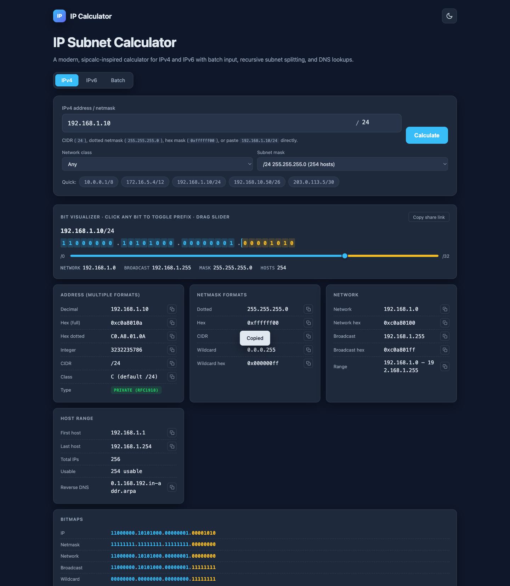

# Lab 3 — Mobile Connectivity — Bluetooth, NFC, Hotspot and Cellular Configuration

> **Course:** CompTIA Certified A+ Training (Core 1 and Core 2) (TGS-2024048317)  
> **Topic 01:** Mobile Devices — Core 1, 13% of Core 1  
> **Exam objective:** Configure and troubleshoot mobile connection methods including Bluetooth pairing, NFC, hotspot tethering and cellular data settings (Core 1 objectives 1.3 and 1.4).

## Goal

Using your own mobile device, you work through the full configuration sequence for each connection method, deliberately break each one, and record the symptom and the fix. The output is a connectivity troubleshooting flowchart covering all four methods.

## What you'll produce

A completed configuration log for four connection methods and a troubleshooting flowchart mapping symptoms to fixes.

## Tools and equipment

Android or iOS device, a second Bluetooth device, a laptop, IP Calculator (https://alfredang.github.io/ipcalculator/)

### Browser tools used in this lab

- **IP Calculator** — <https://alfredang.github.io/ipcalculator/>

*IP Calculator — the panels and fields this lab uses.*

## Safety

- Disconnect mains power and hold the power button for 15 seconds before working inside any machine.
- Wear an anti-static strap connected to an earthed point; hold boards and cards by their edges.
- **Never open a power supply unit or a CRT monitor** — both retain a lethal charge after being unplugged.
- Never puncture, compress or charge a swollen lithium battery; isolate it and follow hazardous disposal procedure.

## Step-by-step

1. On your mobile device, open Settings and record the exact menu path to Bluetooth, hotspot, NFC and mobile data settings.
2. Complete the five-step Bluetooth pairing sequence with a second device: enable Bluetooth, enable pairing mode, discover, enter the PIN or confirm the passkey, then test that data actually flows.
3. Break the pairing by disabling pairing mode on the target device mid-discovery, record the exact symptom, then re-pair and note which step recovered it.
4. Enable the mobile hotspot, connect the laptop to it, and record the SSID, the security type in use and the IP address the laptop receives.
5. Open IP Calculator at https://alfredang.github.io/ipcalculator/ and enter the laptop's hotspot IP address with its netmask in the IPv4 tab.
6. Record from the calculator output the network address, broadcast address, usable host range and total usable hosts, and confirm the hotspot is using a private RFC 1918 range.
7. Enable airplane mode, then selectively re-enable Wi-Fi only, and record which connection methods survive and which do not.
8. Check the cellular data settings and record the APN, the network type currently in use (LTE, 5G) and whether data roaming is enabled.
9. If your device supports NFC, enable it and record the maximum working distance you observe, then compare it against the 4 cm specification.
10. Build the troubleshooting flowchart: for each of 'no Bluetooth pairing', 'hotspot connects but no internet', 'NFC not detected' and 'no cellular data', give the checks in the order you would run them.

## Test it — verification

IP Calculator confirms the hotspot address is in a private range with the correct usable host count; your flowchart gives an ordered check sequence for all four symptoms; and each broken-and-fixed cycle is documented with its symptom.

## Troubleshooting this lab

| Symptom | What to check |
| --- | --- |
| A command returns "command not found" | Re-run the `apt-get install` step at the start of the lab — the playground starts with a minimal package set. |
| The Killercoda terminal has reset | The playground times out when idle. Reopen it and re-run the setup commands from step 1. |
| A browser tool will not load | Check the URL against `labs/tools.md`. All four tools run entirely client-side and need no login. |
| Output differs from the guide | Record what you actually observed — your environment differs from the reference, and explaining the difference is part of the exercise. |

## Review questions

1. State the exam objective this lab maps to, in your own words.
2. Which single step in this lab would you perform first on a real support call, and why?
3. What evidence would you attach to a support ticket to show this work was completed correctly?
4. Name one thing that would make this procedure fail, and how you would recognise it.

## Record your evidence

Complete [worksheet.md](worksheet.md) as you work through this lab and keep it — the Practical Performance assessment mirrors these tasks.

---

[← Labs index](../README.md)  ·  [Learner Guide](../../LG-CompTIA-Certified-A-Training-Core-1-and-Core-2.md)  ·  [Course page](https://www.tertiarycourses.com.sg/wsq-comptia-certified-a-training-core-1-and-core-2.html)
