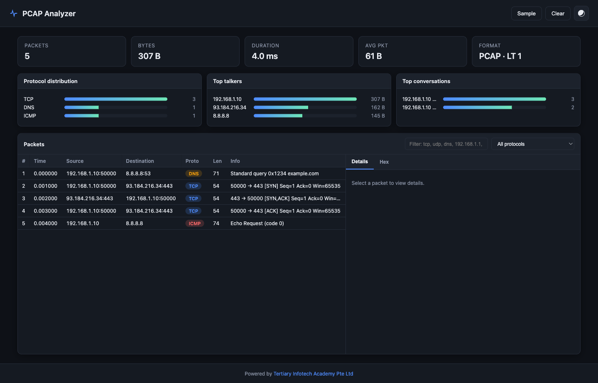

# Lab 28 — Network Fault Diagnosis — Command Line to Packet Level

> **Course:** CompTIA Certified A+ Training (Core 1 and Core 2) (TGS-2024048317)  
> **Topic 05:** Hardware and Network Troubleshooting — Core 1, 28% of Core 1  
> **Exam objective:** Diagnose network faults by working the layers in order, from physical connectivity through addressing and DNS to application behaviour (Core 1 objective 5.7).

## Goal

Network faults are diagnosed layer by layer, because testing at the wrong layer wastes time and misleads. You work a fixed bottom-up sequence with a specific command at each layer, then use packet analysis to resolve what the commands alone cannot.

## What you'll produce

A layered network diagnostic sequence with a command per layer, and a symptom-to-cause map for eight network faults.

## Tools and equipment

Killercoda Ubuntu Playground, PCAP Analyzer, IP Calculator, ping, traceroute, dig, ss, tcpdump

### Browser tools used in this lab

- **IP Calculator** — <https://alfredang.github.io/ipcalculator/>
- **PCAP Analyzer** — <https://alfredang.github.io/pcapanalyzer/>
- **Killercoda Ubuntu Playground** — <https://killercoda.com/playgrounds/scenario/ubuntu>


*IP Calculator — the panels and fields this lab uses.*



*PCAP Analyzer — the panels and fields this lab uses.*


*Killercoda Ubuntu Playground — the panels and fields this lab uses.*

## Safety

- Disconnect mains power and hold the power button for 15 seconds before working inside any machine.
- Wear an anti-static strap connected to an earthed point; hold boards and cards by their edges.
- **Never open a power supply unit or a CRT monitor** — both retain a lethal charge after being unplugged.
- Never puncture, compress or charge a swollen lithium battery; isolate it and follow hazardous disposal procedure.

## Step-by-step

1. Build the diagnostic sequence bottom-up: physical link, IP addressing, default gateway, DNS resolution, then the application itself. Testing out of order produces misleading results.
2. Open the Killercoda Ubuntu playground and install the diagnostic tool set.

   ```bash
   apt-get update -qq && apt-get install -y iproute2 dnsutils traceroute net-tools tcpdump curl
   ```

3. Layer 1 — confirm the interface is physically up and has carrier, since every layer above depends on it.

   ```bash
   ip -brief link show
   ```

4. Layer 2 and 3 — record the interface addresses and identify whether the address is valid, or an APIPA 169.254 address meaning DHCP failed.

   ```bash
   ip -brief addr show
   ```

5. Verify the address and mask in IP Calculator at https://alfredang.github.io/ipcalculator/ and confirm the host sits inside its own subnet's usable range.
6. Layer 3 — confirm a default route exists, then test reachability to the gateway. No default route means no traffic can leave the subnet.

   ```bash
   ip route show && ping -c 3 $(ip route | awk '/default/ {print $3}')
   ```

7. Test reachability beyond the gateway by IP address, which isolates routing from DNS entirely.

   ```bash
   ping -c 3 8.8.8.8
   ```

8. Layer 7 — test DNS resolution separately, because a machine that pings an IP but not a name has a DNS fault and nothing else.

   ```bash
   dig +short www.tertiarycourses.com.sg && cat /etc/resolv.conf
   ```

9. Trace the path to identify where latency is introduced or where the path stops.

   ```bash
   traceroute -m 12 8.8.8.8
   ```

10. Check active connections and listening sockets to confirm the application layer is actually working.

   ```bash
   ss -tunap | head -20
   ```

11. Capture traffic and analyse it in PCAP Analyzer when the commands are inconclusive, since the packets show what the tools only summarise.

   ```bash
   tcpdump -i any -c 100 -w /root/netfault.pcap & sleep 3; curl -s https://example.com > /dev/null; wait; tcpdump -r /root/netfault.pcap -nn | head -20
   ```

12. Build the symptom map for APIPA address, no default gateway, pings IP but not name, high latency, jitter degrading VoIP, port flapping, intermittent wireless and limited connectivity — giving the layer, the test and the fix for each.

## Test it — verification

Every command in the sequence runs successfully on the playground, the sequence tests layers strictly bottom-up, IP Calculator confirms the host address sits within its usable range, and the symptom map assigns a layer and a specific test to all eight faults.

## Troubleshooting this lab

| Symptom | What to check |
| --- | --- |
| A command returns "command not found" | Re-run the `apt-get install` step at the start of the lab — the playground starts with a minimal package set. |
| The Killercoda terminal has reset | The playground times out when idle. Reopen it and re-run the setup commands from step 1. |
| A browser tool will not load | Check the URL against `labs/tools.md`. All four tools run entirely client-side and need no login. |
| Output differs from the guide | Record what you actually observed — your environment differs from the reference, and explaining the difference is part of the exercise. |

## Review questions

1. State the exam objective this lab maps to, in your own words.
2. Which single step in this lab would you perform first on a real support call, and why?
3. What evidence would you attach to a support ticket to show this work was completed correctly?
4. Name one thing that would make this procedure fail, and how you would recognise it.

## Record your evidence

Complete [worksheet.md](worksheet.md) as you work through this lab and keep it — the Practical Performance assessment mirrors these tasks.

---

[← Labs index](../README.md)  ·  [Learner Guide](../../LG-CompTIA-Certified-A-Training-Core-1-and-Core-2.md)  ·  [Course page](https://www.tertiarycourses.com.sg/wsq-comptia-certified-a-training-core-1-and-core-2.html)
