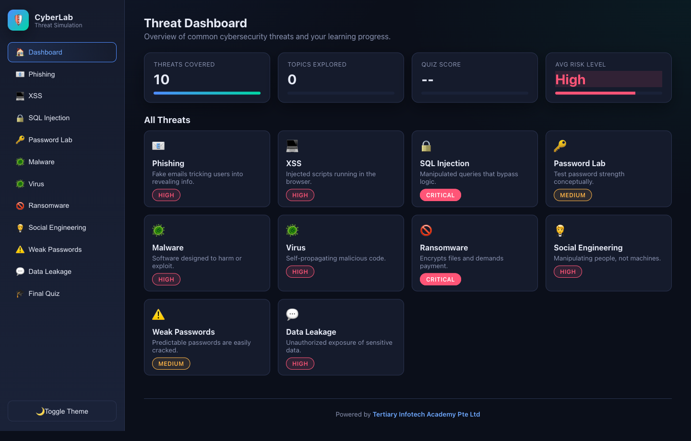

# Lab 38 — Password Strength Analysis and Authentication Policy

> **Course:** CompTIA Certified A+ Training (Core 1 and Core 2) (TGS-2024048317)  
> **Topic 07:** Security — Core 2, 28% of Core 2  
> **Exam objective:** Analyse password strength quantitatively and write an authentication policy grounded in entropy and crack-time evidence (Core 2 objectives 2.2 and 2.6).

## Goal

You use the Cybersecurity Simulator's Password Lab to measure real passwords rather than assert what makes a good one, then write a policy whose every rule is justified by the measured effect on entropy and crack time.

## What you'll produce

A measured password analysis table and an authentication policy with each rule justified by evidence.

## Tools and equipment

Cybersecurity Simulator Password Lab (https://alfredang.github.io/cybersecuritysimulator/), policy template

### Browser tools used in this lab

- **Cybersecurity Simulator** — <https://alfredang.github.io/cybersecuritysimulator/>

*Cybersecurity Simulator — the panels and fields this lab uses.*

## Safety

- Disconnect mains power and hold the power button for 15 seconds before working inside any machine.
- Wear an anti-static strap connected to an earthed point; hold boards and cards by their edges.
- **Never open a power supply unit or a CRT monitor** — both retain a lethal charge after being unplugged.
- Never puncture, compress or charge a swollen lithium battery; isolate it and follow hazardous disposal procedure.

## Step-by-step

1. Open https://alfredang.github.io/cybersecuritysimulator/ and select Password Lab from the top menu.
2. Enter the password 'password' and record the strength indicator, the estimated crack time and the approximate entropy in bits.
3. Enter 'Password1' and record the same three metrics, noting how little a capital letter and a digit actually add.
4. Enter 'P@ssw0rd!' and record the metrics, then note that character substitution on a dictionary word is exactly what cracking tools try first.
5. Enter a 16-character passphrase such as 'correct horse battery staple' and record how the metrics change against the substituted password.
6. Enter a 20-character random string and record the metrics, then compare the entropy against the passphrase to see which strategy wins.
7. Build the analysis table with all five passwords, their length, character set size, entropy in bits and estimated crack time.
8. State the conclusion the evidence supports: length increases entropy far more effectively than character substitution, so a long passphrase beats a short complex password.
9. Review the weak and strong password examples the tool lists, and record the pattern that makes the weak ones weak.
10. Write the authentication policy: minimum length, complexity requirements, expiry rules, reuse prevention, and the account lockout threshold and duration.
11. Justify each policy rule with a measured figure from your table rather than a general assertion.
12. Add the MFA requirement to the policy, stating which factor categories are acceptable and which accounts must use MFA without exception.

## Test it — verification

Your analysis table records the actual entropy and crack time from the tool for all five passwords; the conclusion that length beats substitution is supported by your own figures; and every policy rule cites a measured value.

## Troubleshooting this lab

| Symptom | What to check |
| --- | --- |
| A command returns "command not found" | Re-run the `apt-get install` step at the start of the lab — the playground starts with a minimal package set. |
| The Killercoda terminal has reset | The playground times out when idle. Reopen it and re-run the setup commands from step 1. |
| A browser tool will not load | Check the URL against `labs/tools.md`. All four tools run entirely client-side and need no login. |
| Output differs from the guide | Record what you actually observed — your environment differs from the reference, and explaining the difference is part of the exercise. |

## Review questions

1. State the exam objective this lab maps to, in your own words.
2. Which single step in this lab would you perform first on a real support call, and why?
3. What evidence would you attach to a support ticket to show this work was completed correctly?
4. Name one thing that would make this procedure fail, and how you would recognise it.

## Record your evidence

Complete [worksheet.md](worksheet.md) as you work through this lab and keep it — the Practical Performance assessment mirrors these tasks.

---

[← Labs index](../README.md)  ·  [Learner Guide](../../LG-CompTIA-Certified-A-Training-Core-1-and-Core-2.md)  ·  [Course page](https://www.tertiarycourses.com.sg/wsq-comptia-certified-a-training-core-1-and-core-2.html)
