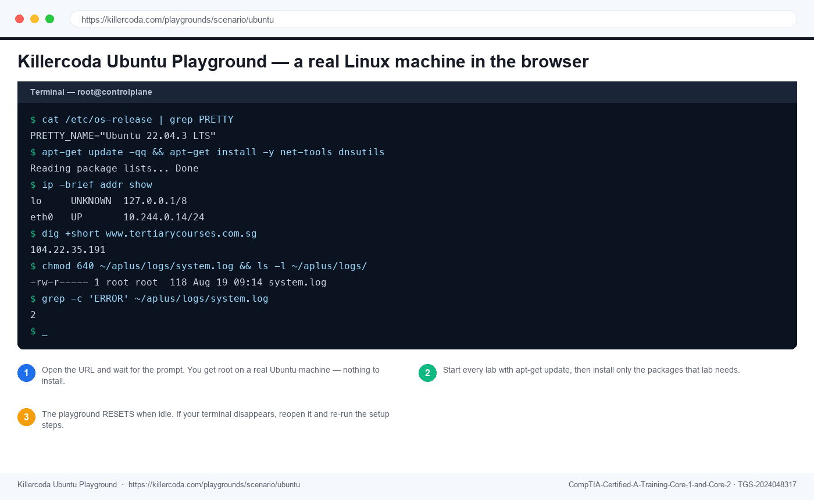

# Lab 52 — Backup Strategy Design and the 3-2-1 Rule

> **Course:** CompTIA Certified A+ Training (Core 1 and Core 2) (TGS-2024048317)  
> **Topic 09:** Operational Procedures — Core 2, 21% of Core 2  
> **Exam objective:** Design a backup strategy specifying types, rotation, retention and off-site copy, and justify it against a stated recovery objective (Core 2 objective 4.3).

## Goal

You design a backup strategy for a small business, choosing the backup types and rotation that meet a stated recovery point and recovery time objective — and then prove the design meets them by working the restore arithmetic rather than assuming it does.

## What you'll produce

A complete backup strategy with schedule, rotation scheme, retention policy and a restore-time calculation proving it meets the objectives.

## Tools and equipment

Backup strategy template, Killercoda Ubuntu Playground, backup type reference

### Browser tools used in this lab

- **Killercoda Ubuntu Playground** — <https://killercoda.com/playgrounds/scenario/ubuntu>

*Killercoda Ubuntu Playground — the panels and fields this lab uses.*

## Safety

- Disconnect mains power and hold the power button for 15 seconds before working inside any machine.
- Wear an anti-static strap connected to an earthed point; hold boards and cards by their edges.
- **Never open a power supply unit or a CRT monitor** — both retain a lethal charge after being unplugged.
- Never puncture, compress or charge a swollen lithium battery; isolate it and follow hazardous disposal procedure.

## Step-by-step

1. Record the two objectives that drive every backup design: the recovery point objective, which is how much data the business can afford to lose, and the recovery time objective, which is how long it can afford to be down.
2. Record the scenario objectives: a small business with a 24-hour RPO and a 4-hour RTO for its file server.
3. Record the 3-2-1 rule and what each element defeats: three copies defeat corruption, two different media defeat media failure, and one off-site copy defeats fire, flood and theft.
4. Compare full, incremental and differential backups on backup time, storage consumed, restore complexity and archive bit behaviour.
5. Work the restore arithmetic for an incremental scheme: a Sunday full plus daily incrementals means restoring Thursday requires the full plus Monday, Tuesday, Wednesday and Thursday — five operations.
6. Work the same arithmetic for a differential scheme: a Sunday full plus daily differentials means restoring Thursday requires only the full plus Thursday — two operations.
7. Choose between them against the 4-hour RTO, and justify the choice on restore time rather than on backup window alone.
8. Record the rotation schemes: grandfather-father-son with daily, weekly and monthly sets, and the tower of Hanoi scheme, and state what each provides.
9. Define the retention policy: how long daily, weekly, monthly and yearly copies are kept, and note that retention may be set by regulation rather than by preference.
10. Specify the off-site copy: where it goes, how it gets there, how often, and whether it is encrypted in transit and at rest.
11. Record the ransomware requirement: at least one copy must be offline, air-gapped or immutable, because ransomware encrypts every backup it can reach over the network.
12. Define the backup testing schedule, specifying how often a restore is actually performed and who signs off that it succeeded.

## Test it — verification

Your strategy states both RPO and RTO and the schedule meets them; the restore arithmetic is worked for both incremental and differential; the choice is justified against the 4-hour RTO; and the design includes an offline or immutable copy and a stated restore test schedule.

## Troubleshooting this lab

| Symptom | What to check |
| --- | --- |
| A command returns "command not found" | Re-run the `apt-get install` step at the start of the lab — the playground starts with a minimal package set. |
| The Killercoda terminal has reset | The playground times out when idle. Reopen it and re-run the setup commands from step 1. |
| A browser tool will not load | Check the URL against `labs/tools.md`. All four tools run entirely client-side and need no login. |
| Output differs from the guide | Record what you actually observed — your environment differs from the reference, and explaining the difference is part of the exercise. |

## Review questions

1. State the exam objective this lab maps to, in your own words.
2. Which single step in this lab would you perform first on a real support call, and why?
3. What evidence would you attach to a support ticket to show this work was completed correctly?
4. Name one thing that would make this procedure fail, and how you would recognise it.

## Record your evidence

Complete [worksheet.md](worksheet.md) as you work through this lab and keep it — the Practical Performance assessment mirrors these tasks.

---

[← Labs index](../README.md)  ·  [Learner Guide](../../LG-CompTIA-Certified-A-Training-Core-1-and-Core-2.md)  ·  [Course page](https://www.tertiarycourses.com.sg/wsq-comptia-certified-a-training-core-1-and-core-2.html)
